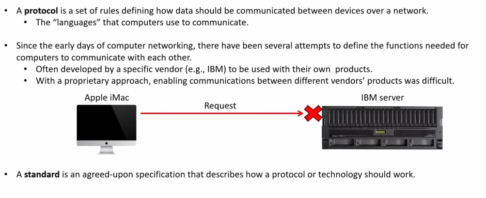
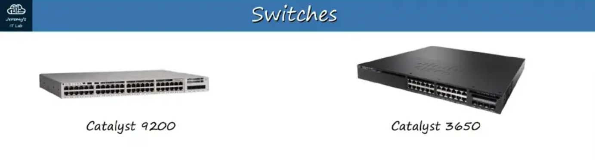
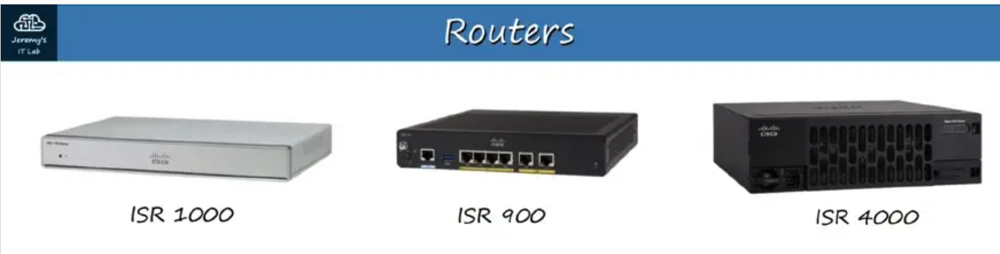
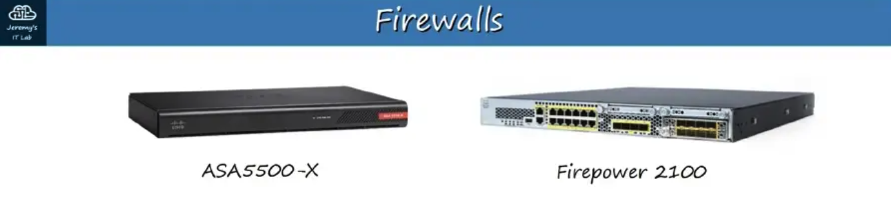
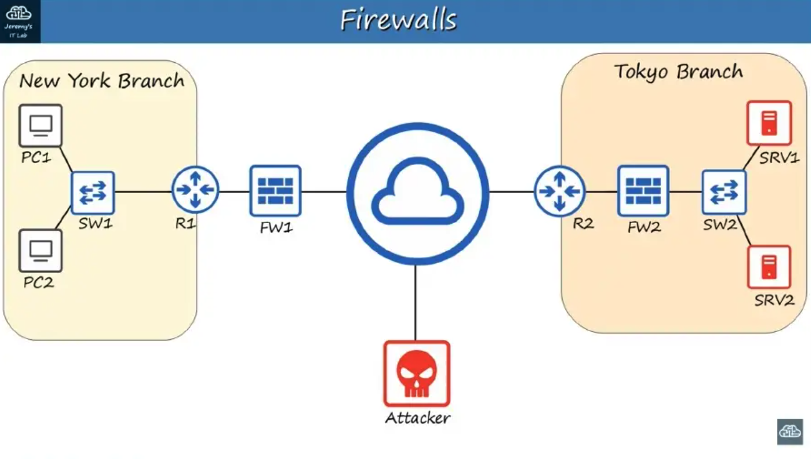

# 1. Networking Devices

## What Is a Network?

A **computer network** is a digital telecommunications network that allows **nodes** to share **resources**.

- A **client** is a device that accesses a service made available by a **server**.
- A **server** is a device that provides functions or services for **clients**.

> **Note:** The same device can be a **client** in some situations and a **server** in others.  
> Example: a **peer-to-peer network**.

## Common Network Devices

### **Switches** (Layer 2)

- Have many network interfaces/ports for **end hosts** to connect to. (**24+**)
- Provide connectivity to hosts within the same **LAN (Local Area Network)**.
- **Do not** provide connectivity between LANs or over the Internet.

### **Routers** (Layer 3)

- Have fewer network interfaces than switches.
- Provide connectivity **between LANs**.
- Send data over the **Internet**.

### **Firewalls** (Can Operate At Layers 3, 4, and 7)

- Specialized hardware network security devices that control traffic entering and exiting a network.
- Can be placed **inside** or **outside** the network.
- Monitor and control network traffic based on configured rules.

- **Next-Generation Firewalls (NGFWs)** when they include more modern and advanced filtering capabilities.
- **Host-based firewalls** are software applications that filter traffic entering and exiting a host machine, such as a PC.

