# 36. CDP and LLDP (Layer 2 Discovery Protocol)

## Intro to Layer 2 Discovery Protocols

- LAYER 2 DISCOVERY PROTOCOL, such as CDP and LLDP share information WITH and DISCOVER information about NEIGHBORING (Connected) DEVICES

- **The Shared Information Includes:**
    - Hostname
    - IP Address
    - Device Type
    - etcetera.

- **CDP** is a Cisco Proprietary Protocol
- **LLDP** is an Industry Standard Protocol (IEEE 802.1AB)

- Because they SHARE INFORMATION about the DEVICES in the NETWORK, they can be considered a security risk and are often NOT used. It is up to the NETWORK ENGINEER / ADMIN to decide if they want to use them in the NETWORK or not.

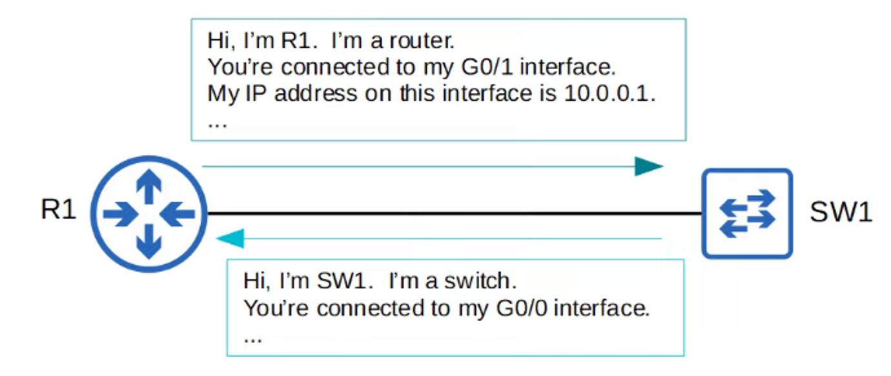

---

## Cisco Discovery Protocol (CDP)

- CDP is a Cisco proprietary protocol
- It is enabled on Cisco devices (routers, switches, firewalls, IP Phones, etc) by DEFAULT

> **Note:** CDP Messages are periodically sent to Multicast MAC ADDRESS `0100.0CCC.CCCC`

- When a DEVICE receives a CDP message, it PROCESSES and DISCARDS the message. It does NOT forward it to other devices.
- By DEFAULT, CDP Messages are sent once every **60 seconds**
- By DEFAULT, the CDP hold-time is **180 seconds.** If a message isn’t received from a neighbor for 180 seconds, the neighbor is REMOVED from the CDP Neighbor Table
- CDPv2 messages are sent by DEFAULT

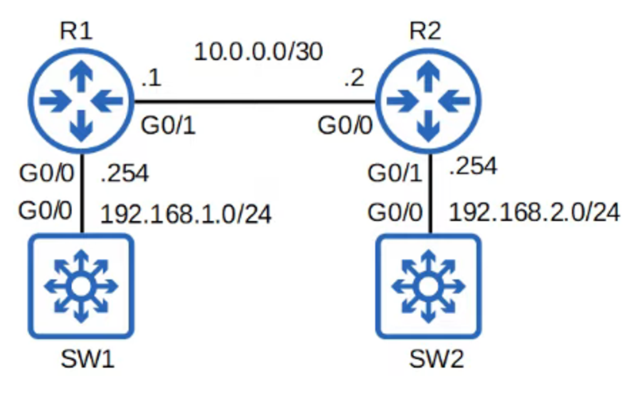

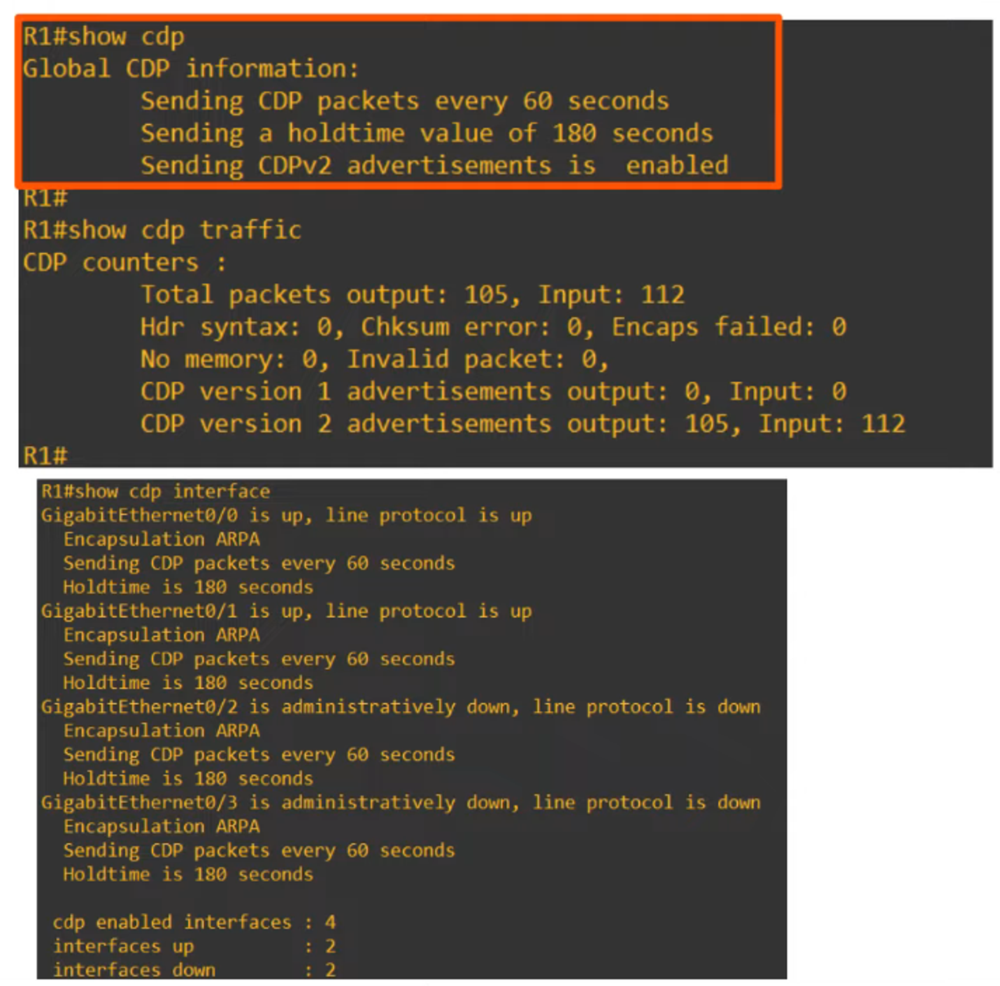

---

## CDP Neighbor Tables

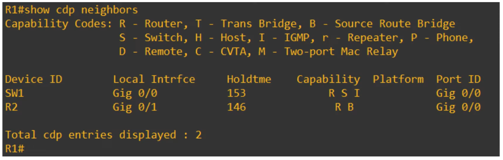

“Device ID” = What devices were DISCOVERED by CDP

“Local Intrface” = What LOCAL device interface the neighbors are connected to

“Holdtime” = Hold-time countdown in seconds (0 = device removed from table)

“Capabilities” = Refers to Capability Codes table (located above output)

“Platform” = Displays the MODEL of the Neighbor Device

“Port ID” = Neighbor ports that LOCAL device is connected to

---

## More Detailed Output

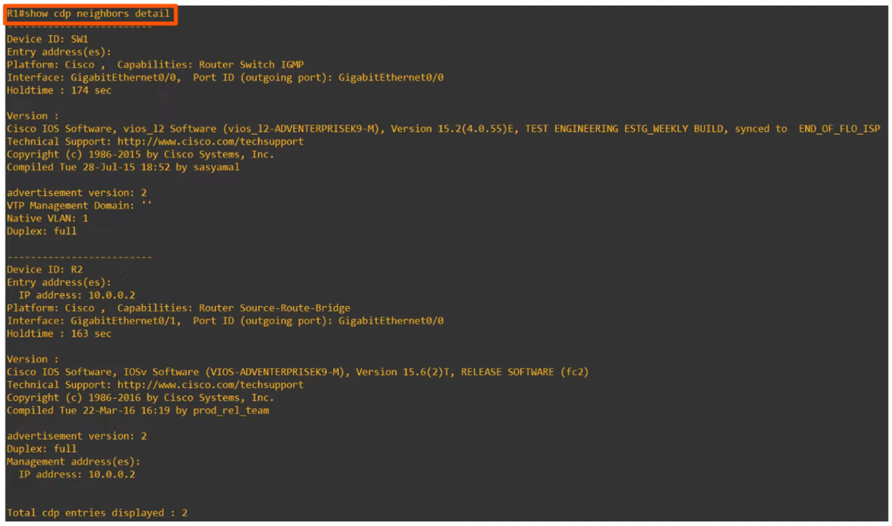

“Version” = shows what version of Cisco’s IOS is running on the device

---

## Show Specific CDP Neighbor Entry

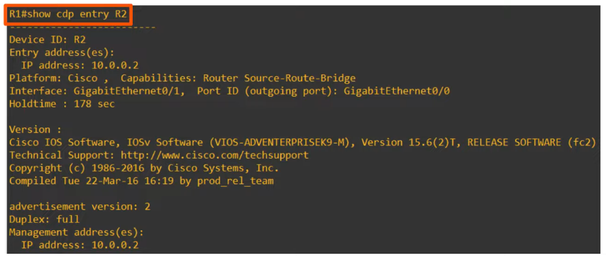

---

## CDP Configuration Commands

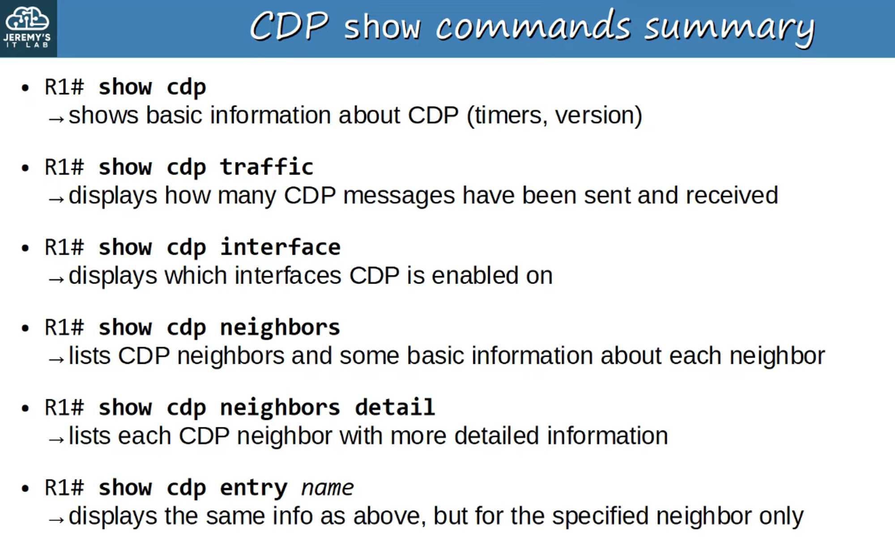

- CDP is GLOBALLY ENABLED, by DEFAULT
- CDP is also ENABLED on each INTERFACE, by DEFAULT
- To ENABLE / DISABLE CDP globally: `R1(config)# [no] cdp run`
- To ENABLE / DISABLE CDP on specific interfaces : `R1(config-if)# [no] cdp enable`
- Configure the CDP timer: `R1(config)# cdp time *seconds*`
- Configure the CDP holdtime: `R1(config)# cdp holdtime *seconds*`
- ENABLE / DISABLE CDPv2: `R1(config)# [no] cdp advertise-v2`

 

---

## Link Layer Discovery Protocol (LLDP)

- LLDP is an INDUSTRY STANDARD PROTOCOL (IEEE 802.1AB)
- It is usually DISABLED on Cisco devices, by DEFAULT, so it must be manually ENABLED
- A device can run CDP and LLDP at the same time

> **Note:** LLDP Messages are periodically sent to Multicast MAC ADDRESS `0180.c200.000E`

- When a DEVICE receives an LLDP message, it PROCESSES and DISCARDS the message. It does NOT forward it to OTHER DEVICES
- By DEFAULT, LLDP Messages are sent once every **30 seconds**
- By DEFAULT, LLDP Holdtime is **120 seconds**
- LLDP has an additional timer called the ‘reinitialization delay’
    - If LLDP is ENABLED (Globally or on an INTERFACE), this TIMER will DELAY the actual initialization of LLDP (**2 seconds,** by DEFAULT)

---

## LLDP Configuration Commands

- LLDP is usually GLOBALLY DISABLED by DEFAULT
- LLDP is also DISABLED on each INTERFACE, by DEFAULT

- To ENABLE LLDP GLOBALLY : `R1(config)# lldp run`

- To ENABLE LLDP on specific INTERFACES (tx): `R1(config-if)# lldp transmit`
- To ENABLE LLDP on specific INTERFACES (rx): `R1(config-if)# lldp receive`

YOU NEED TO ENABLE BOTH TO SEND AND RECEIVE (Unless you want to only enable SEND or RECEIVE LLDP Messages)

 

- Configure the LLDP timer: `R1(config)# lldp timer *seconds*`
- Configure the LLDP holdtime: `R1(config)# lldp holdtime *seconds*`
- Configure the LLDP reinit timer: `R1(config)# lldp reinit *seconds*`

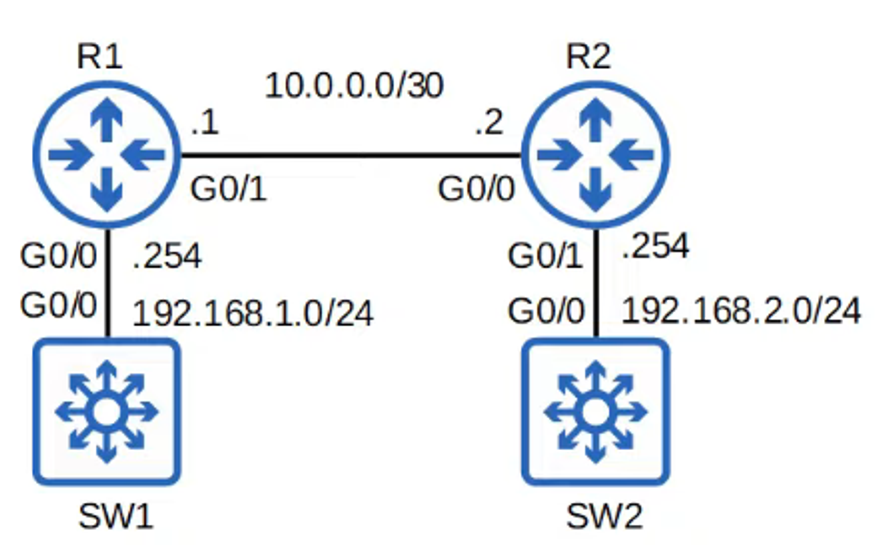

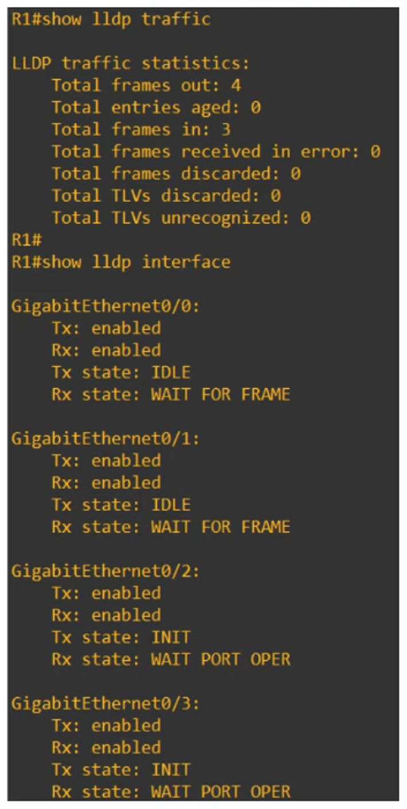

## Show LLDP Status

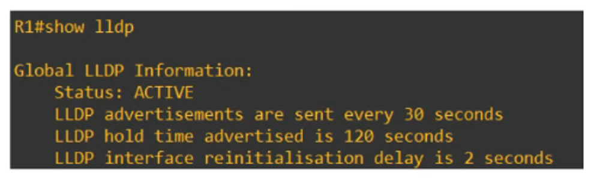

## Show All LLDP Neighbors

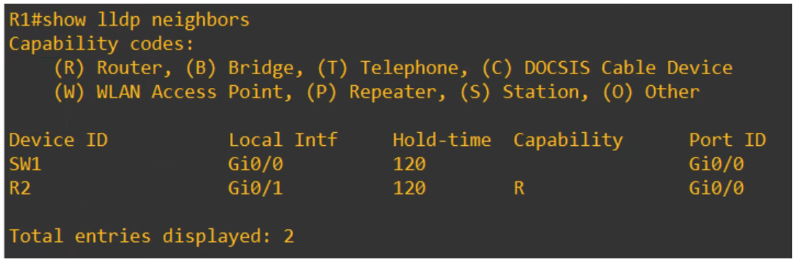

## Show LLDP Neighbors in Detail

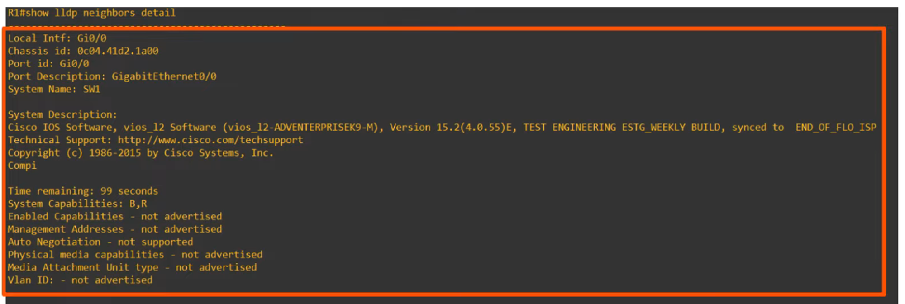

## Show Specific LLDP Device Entry

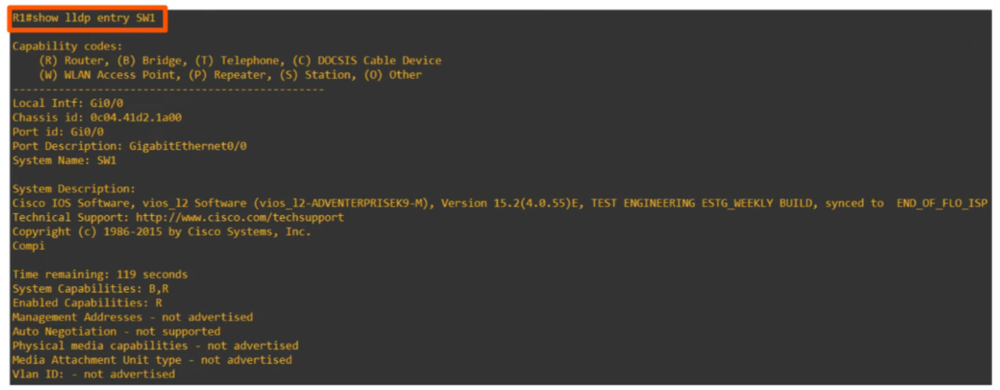

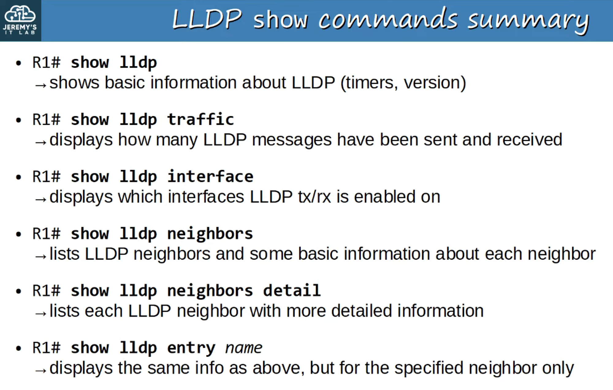
