# 50. DHCP Snooping (Layer 2)

## What Is DHCP Snooping?

- DHCP SNOOPING is a security feature of SWITCHES that is used to filter DHCP messages received on UNTRUSTED PORTS
- DHCP SNOOPING only filters DHCP MESSAGES.
    - Non-DHCP MESSAGES are not affected
- All PORTS are UNTRUSTED, by DEFAULT
    - Usually UPLINK PORTS are configured as TRUSTED PORTS, and DOWNLINK PORTS remain UNTRUSTED
    

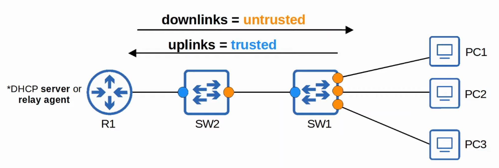

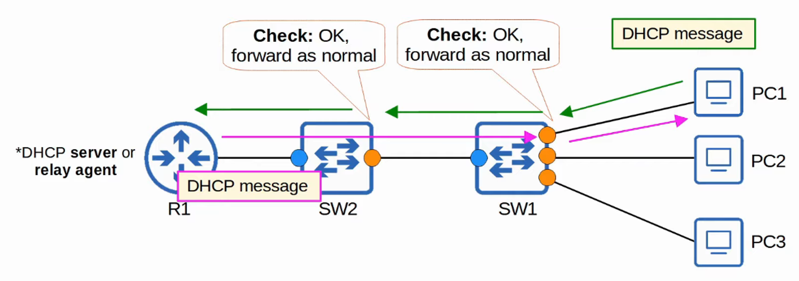

---

## Attacks On DHCP

## DHCP Starvation

- An example of a DHCP-based ATTACK is a DHCP STARVATION ATTACK
- An ATTACKER uses spoofed MAC ADDRESSES to flood DHCP DISCOVER messages
- The TARGET server’s DHCP POOL becomes full, resulting in a DoS to other DEVICES

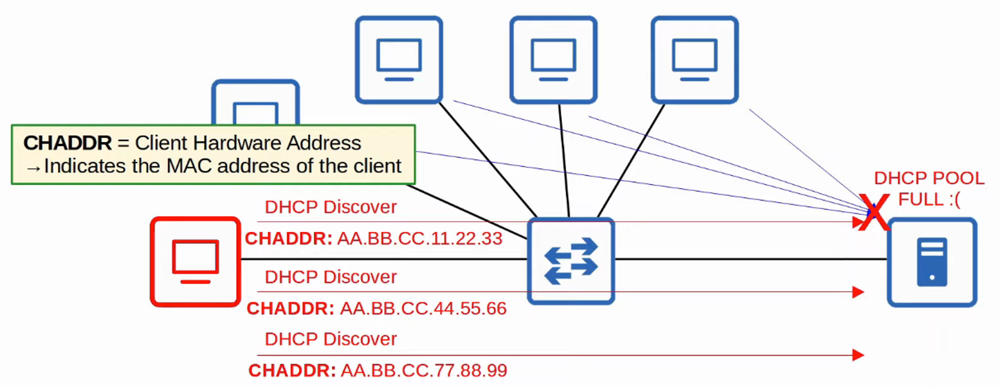

DHCP POISONING (Man-in-the-Middle)

- Similar to ARP POISONING, DHCP POISONING can be used to perform a Man-in-the-Middle ATTACK
- A *spurious DHCP SERVER* replies to CLIENTS’ DHCP Discover messages and assigns them IP ADDRESSES but makes the CLIENTS use the *spurious SERVER’S IP* as a DEFAULT GATEWAY

** CLIENTS usually accept the first DHCP OFFER message they receive

- This will cause the CLIENT to send TRAFFIC to the ATTACKER instead of the legitimate DEFAULT GATEWAY
- The ATTACKER can then examine / modify the TRAFFIC before forwarding it to the legitimate DEFAULT GATEWAY

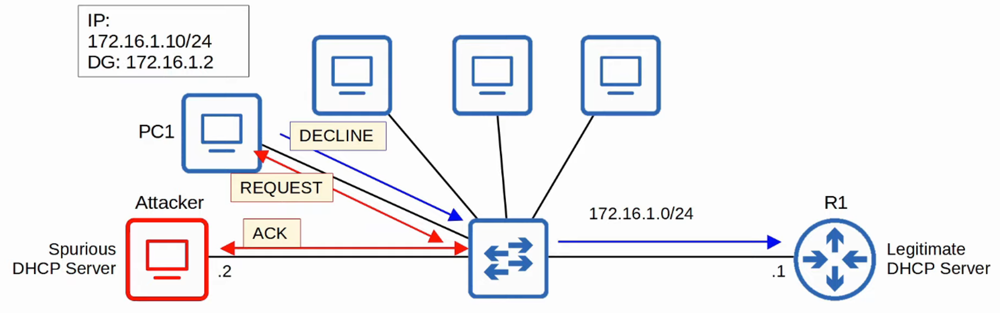

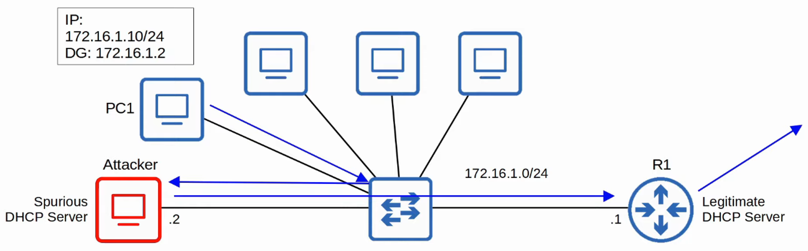

---

## DHCP Messages

- When DHCP SNOOPING filters messages, it differentiates between DHCP SERVER messages and DHCP CLIENT messages

- **Messages Sent By DHCP Servers:**
- Offer
- Ack
    - NAK = Opposite of ACK - used to DECLINE a CLIENT’S REQUEST
- **Messages Sent By DHCP Clients:**
- Discover
- Request
    - RELEASE = Used to tell the SERVER that the CLIENT no longer needs its IP ADDRESS
    - DECLINE = Used to DECLINE the IP ADDRESS offered by a DHCP SERVER

---

## How Does It Work?

- If a DHCP MESSAGE is received on a TRUSTED PORT, forward it as normal without inspection
- If a DHCP MESSAGE is received on an UNTRUSTED PORT, inspect it and act as follows:
    - If it is a DHCP SERVER message, discard it
    - If it as a DHCP CLIENT message, perform the following checks:
        - **Discover / Request Messages :**
            - Check if the FRAME’S SOURCE MAC ADDRESS and the DHCP MESSAGE’S CHADDR FIELDS match.
- Match = Forward
- Mismatch = Discard
        - **Release / Decline Messages:**
            - Check if the PACKET’S SOURCE IP ADDRESS and the receiving INTERFACE match the entry in the *DHCP SNOOPING BINDING TABLE*
- Match = Forward
- Mismatch = Discard
    
- When a CLIENT successfully leases an IP ADDRESS from a SERVER, create a new entry in the *DHCP SNOOPING BINDING TABLE*

---

## DHCP Snooping Configuration

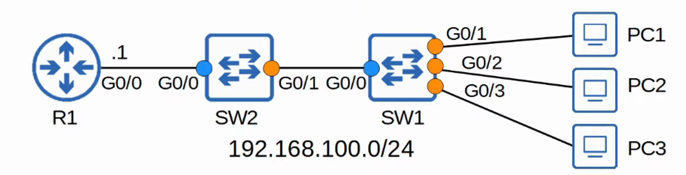

## Switch 2’S Configuration

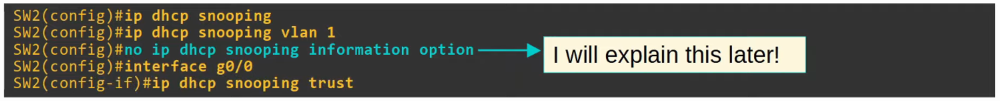

## Switch 1’S Configuration

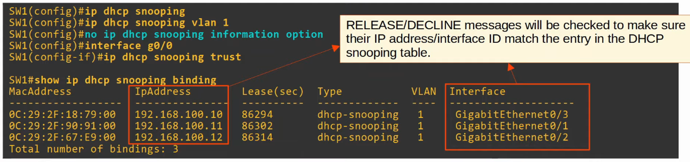

## DHCP Snooping Rate-Limiting

- DHCP SNOOPING can limit the RATE at which DHCP messages are allowed to enter an INTERFACE
- If the RATE of DHCP messages crosses the configured LIMIT, the INTERFACE is `err-disabled`
- Like with PORT SECURITY, the interface can be manually re-enabled, or automatically re-enabled with `errdisable recovery`

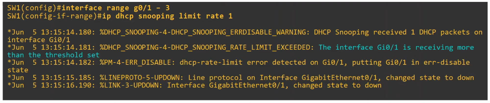

- You wouldn’t set the limit rate to 1 since it’s so low, it would shut the port immediately but this shows how RATE-LIMITING works

`errdisable recovery cause dhcp-rate-limit`

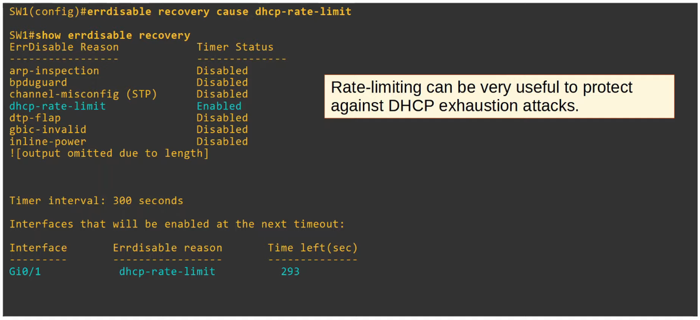

## DHCP Option 82 (Information Option)

- OPTION 82, also known as a ‘DHCP RELAY AGENT INFOMRATION OPTION’ is one of MANY DHCP OPTIONS
- It provides additional information about which DHCP RELAY AGENT received the CLIENT’S message, on which INTERFACE, in which VLAN, etc.
- DHCP RELAY AGENTS can add OPTION 82 to message they forward to the remote DHCP SERVER
- With DHCP SNOOPING enabled, by default Cisco SWITCHES will add OPTION 82 to DHCP messages they receive from CLIENTS, even if the SWITCH isn’t acting as a DHCP RELAY AGENT
- By DEFAULT, Cisco SWITCHES will drop DHCP MESSAGES with OPTION 82 that are received on an UNTRUSTED PORT

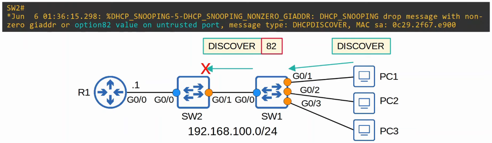

THIS command disables OPTION 82 for SW1 but NOT SW2 

TRAFFIC gets passed to R1 and is DROPPED because of “inconsistent relay information” (packet contains OPTION 82 but wasn’t dropped by SW2)

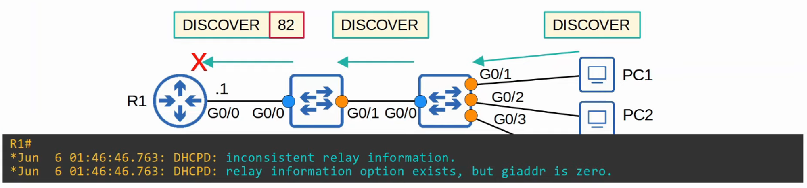

By ENABLING OPTION 82 on both SWITCHES…

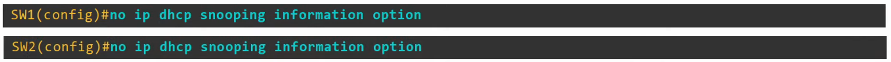

PC1’s DHCP DISCOVER message gets passed, through SW1 and SW2, to R1.
R1 responds with an DHCP OFFER message, as normal

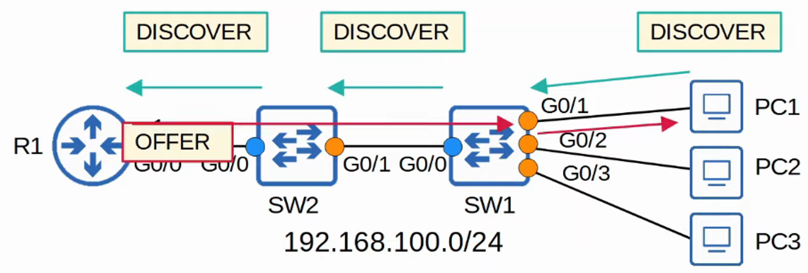

---

## Command Summary

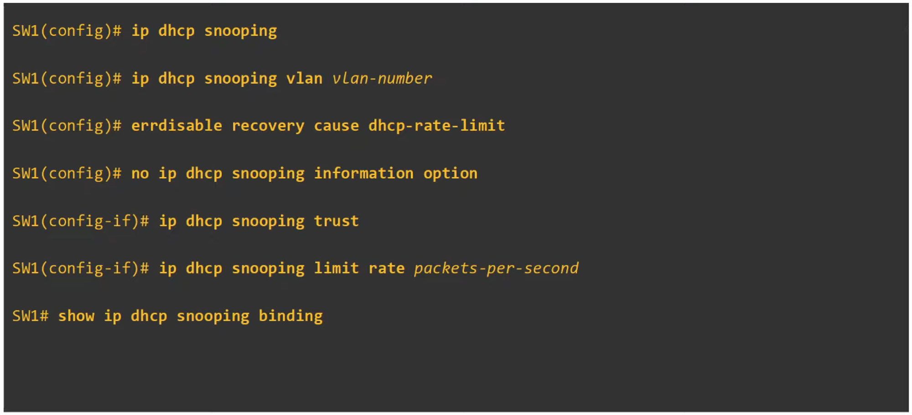
