# 43. Ftp and Tftp

## The Purpose of Ftp / Tftp

- FTP (File Transfer Protocol) and TFTP (Trivial File Transfer Protocol) are INDUSTRY STANDARD PROTOCOLS used to TRANSFER FILES over a NETWORK
- They BOTH use a CLIENT-SERVER model
    - CLIENTS can use FTP / TFTP to COPY files FROM a SERVER
    - CLIENTS can use FTP / TFTP to COPY files TO a SERVER
- As a NETWORK ENGINEER, the most common use for FTP / TFTP is in the process of UPGRADING the OPERATING SYSTEM of a NETWORK DEVICE
- You can use FTP / TFTP to DOWNLOAD the newer version of IOS from a SERVER and then REBOOT the DEVICE with the new IOS image

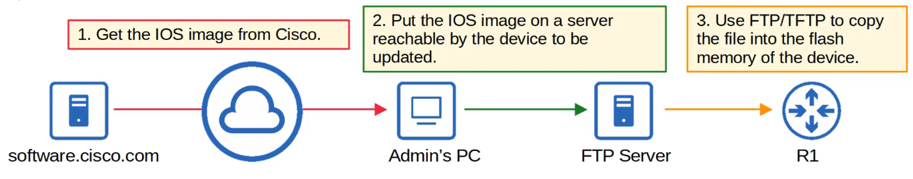

---

## Tftp and Ftp Functions and Differences

## Tftp

- TFTP first standardized in 1981
- Named “Trivial” because it’s SIMPLE and has only basic features compared to FTP
    - Only allows a CLIENT to COPY FILES to / from a SERVER
- Was released after FTP, but not a REPLACEMENT for FTP.
    - It’s another tool to use when LIGHTWEIGHT SIMPLICITY is more important than FUNCTIONALITY
- NO AUTHENTICATION (Username / Password) so SERVERS will respond to ALL FTP REQUESTS
- NO ENCRYPTION. All DATA is sent PLAIN TEXT
- Best used in a CONTROLLED environment to transfer SMALL FILES quickly
- TFTP SERVERS listen on UDP PORT 69
- UDP is CONNECTIONLESS and doesn’t provided RELIABILITY with RETRANSMISSIONS
- However, TFTP has SIMILAR built-in FEATURES within the PROTOCOL itself

## Tftp Reliability

- Every TFTP DATA message is ACKNOWLEDGED
    - If the CLIENT is transferring a FILE TO the SERVER, the SERVER will send ACK messages
    - If the SERVER is transferring a FILE TO the CLIENT, the CLIENT will send ACK messages
- TIMERS are used, and if an EXPECTED message isn’t received in time, the waiting DEVICE will RESEND its previous message.

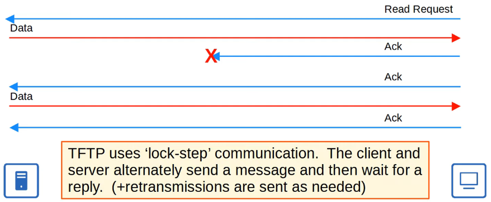

## Tftp “Connections”

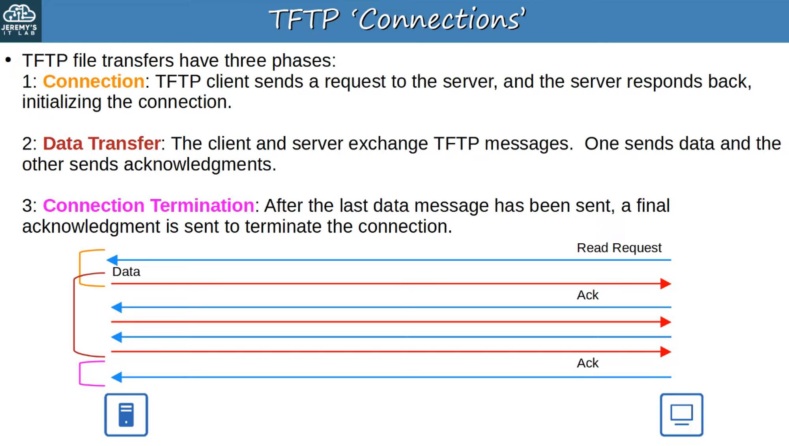

TFTP TID (Not in the CCNA exam)

- When the CLIENT sends the FIRST message to the SERVER, the DESTINATION PORT is UDP 69 and the SOURCE PORT is a random EPHEMERAL PORT
- This “random port” is called a “TRANSFER IDENTIFIER” (TID) and identifies the DATA TRANSFER
- The SERVER then also selects a RANDOM TID to use as a SOURCE PORT when it replies, NOT UDP 69
- When the CLIENT sends the NEXT message, the DESTINATION PORT will be the SERVER’S TID, NOT UDP 69

UDP PORT 69 (TFTP) is only used at the initial request message

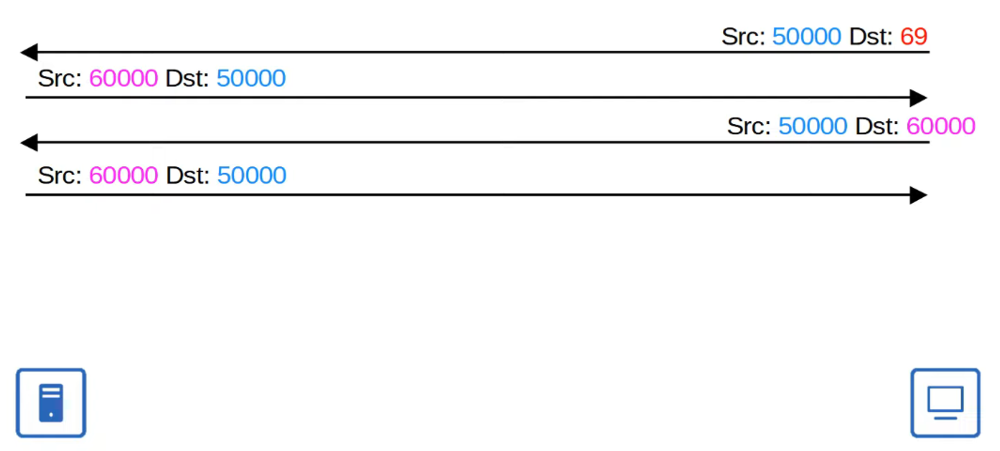

--- 

## Ftp

- FTP was first standardized in 1971
- FTP uses TCP PORTS 20 and 21
- USERNAMES and PASSWORDS are used for AUTHENTICATION, however there is NO ENCRYPTION
- For GREATER security, FTPS (FTP over SSL / TLS) can be used (Upgrade to FTP)
- SSH File Transfer Protocol (SFTP) can also be used for GREATER security (New Protocol)
- **Ftp Is More Complex Than Tftp and Allows Not Only File Transfers But Clients Can Also:**
    - Navigate FILE DIRECTORIES
- Add / Remove Files
- List Files
    - etc…
- The CLIENT sends FTP *commands* to the SERVER to perform these functions

## Ftp Control Connections

- **Ftp Uses Two Types of Connections:**
    - An FTP CONTROL connection (TCP 21) is established and used to send FTP commands and replies
    - When FILES or DATA are to be transferred, separate FTP DATA (TCP 20) connections are established and terminated as needed

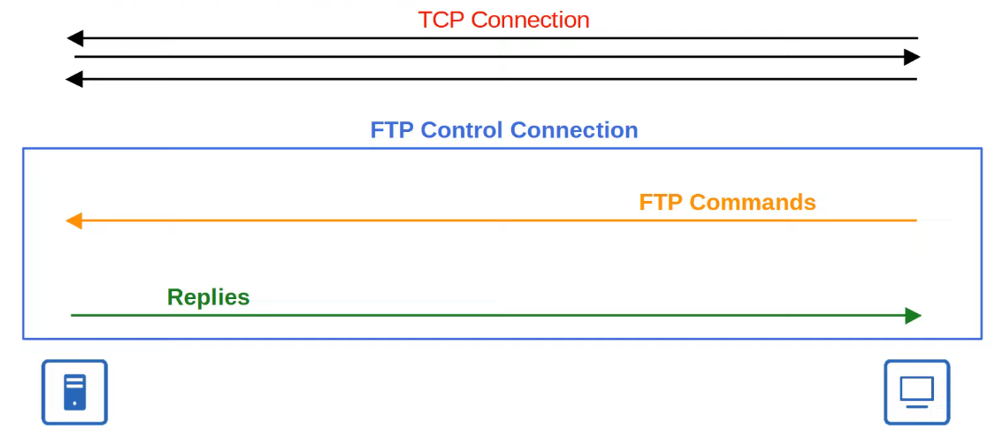

## Active Mode Ftp Data Connections

- The DEFAULT method of establishing FTP DATA connections is ACTIVE MODE in which the SERVER initiates the TCP connection.

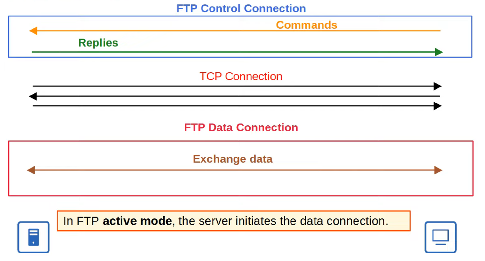

- In FTP PASSIVE MODE, the CLIENT initiates the DATA connection.
    - This is often necessary when the CLIENT is behind a FIREWALL, which could BLOCK the INCOMING CONNECTION from the SERVER

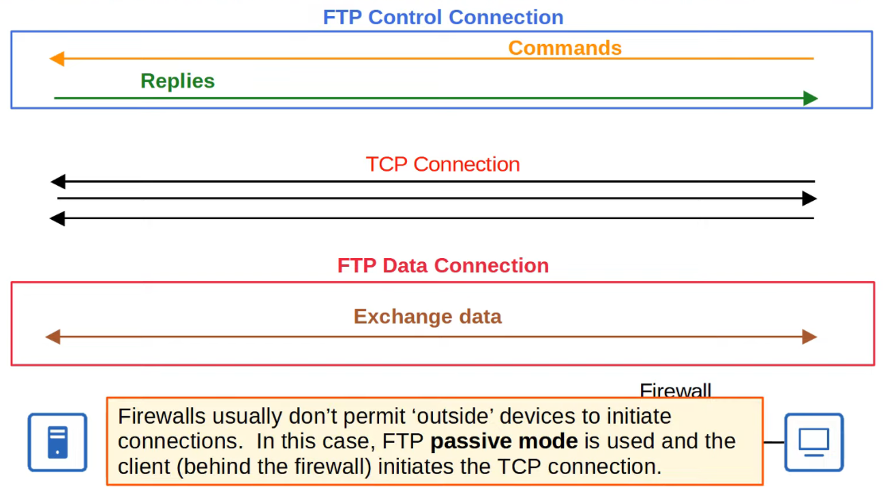

## Ftp Versus Tftp

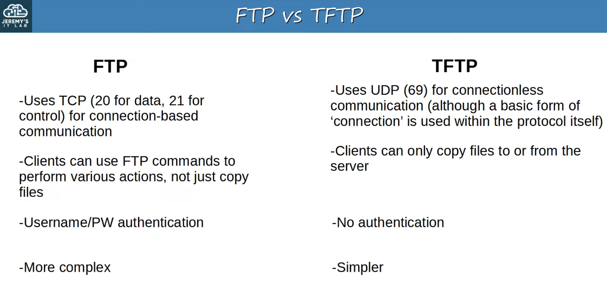

---

## IOS File Systems

- A FILE SYSTEM is a way of controlling how DATA is STORED and RETRIEVED
- You can VIEW the FILE SYSTEM of a Cisco IOS DEVICE with `show file systems`

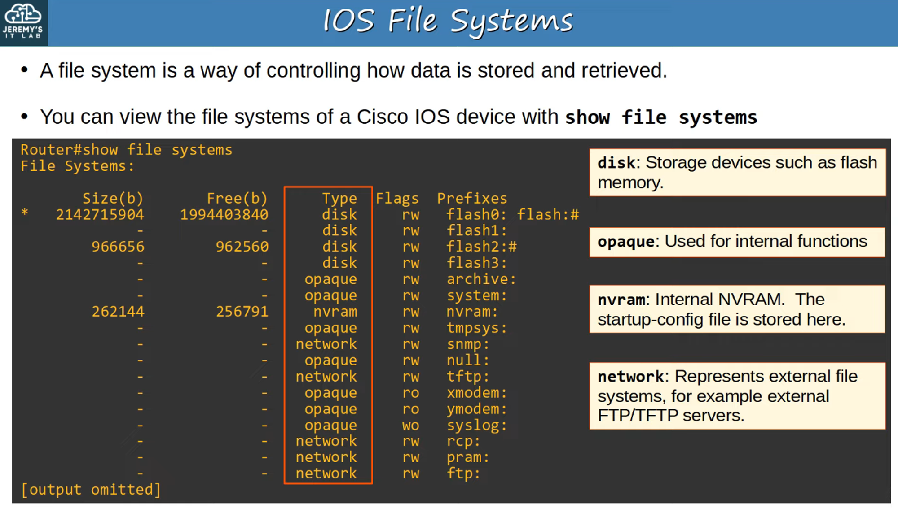

---

## Using Ftp / Tftp in IOS

- You can VIEW the current version of IOS with `show version`

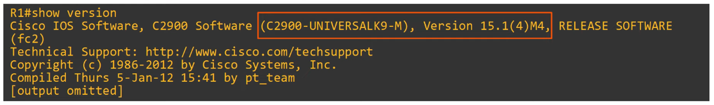

- You can VIEW the contents of flash with `show flash`

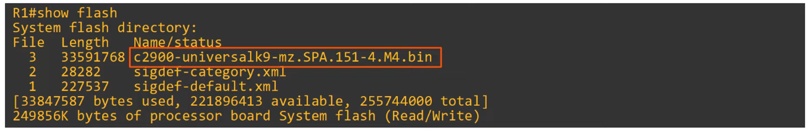

---

## Copying Files With Tftp

## Step 1

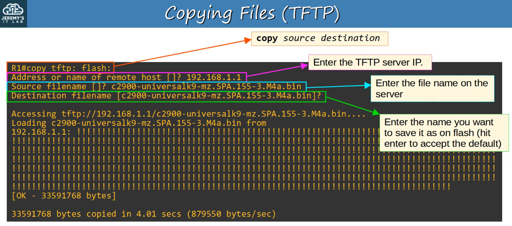

## Step 2

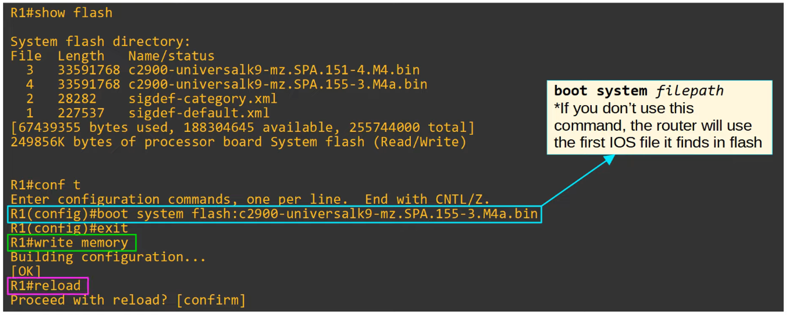

## Step 3

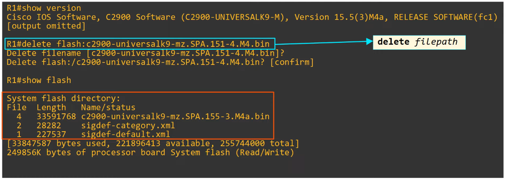

---

## Copying Files With Ftp

## Step 1

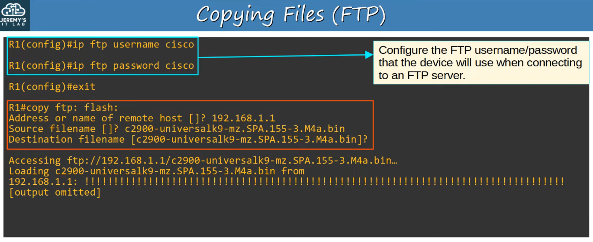

STEP 2 and 3 identical to TFTP above

---

## Command Summary

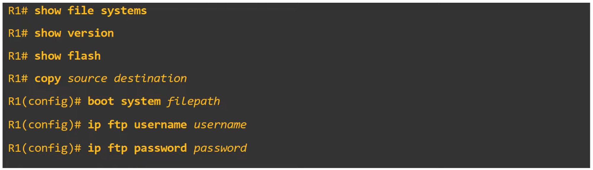
