# 31. Ipv6 : Part 1

## Hexidecimal (Review)

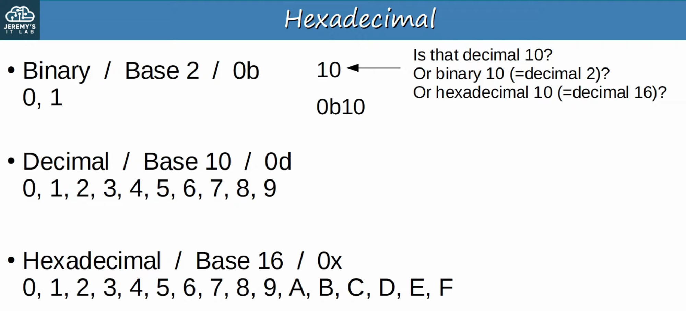

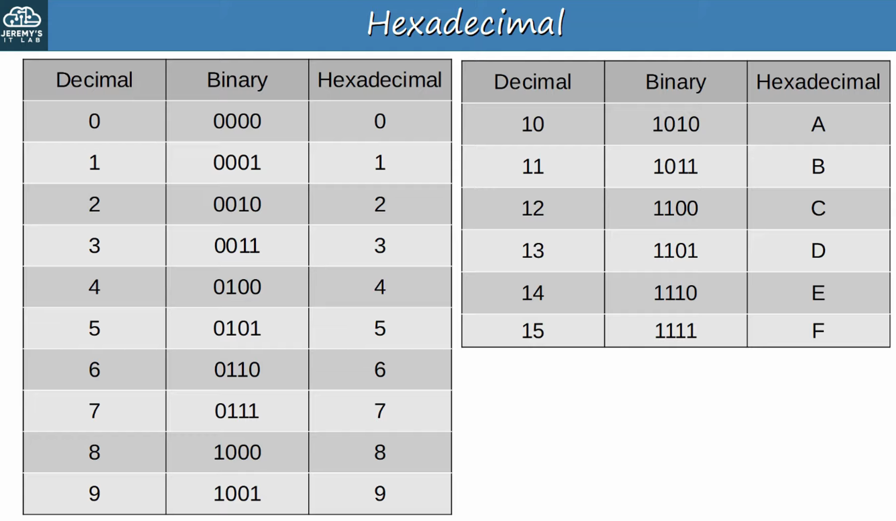

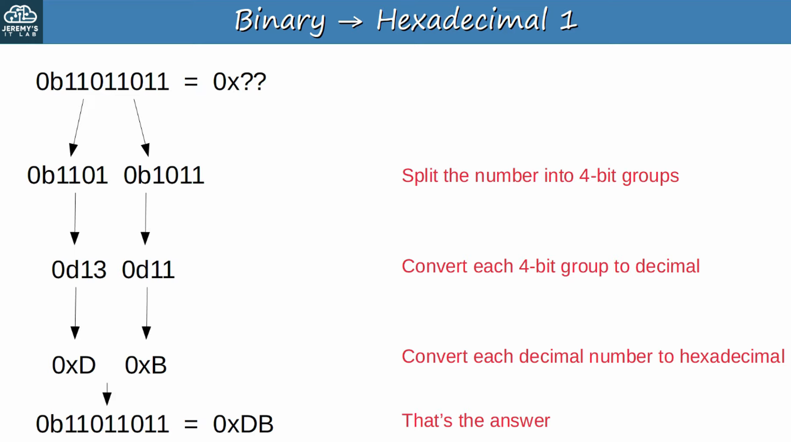

What about the reverse (Hex to Binary) ??? 

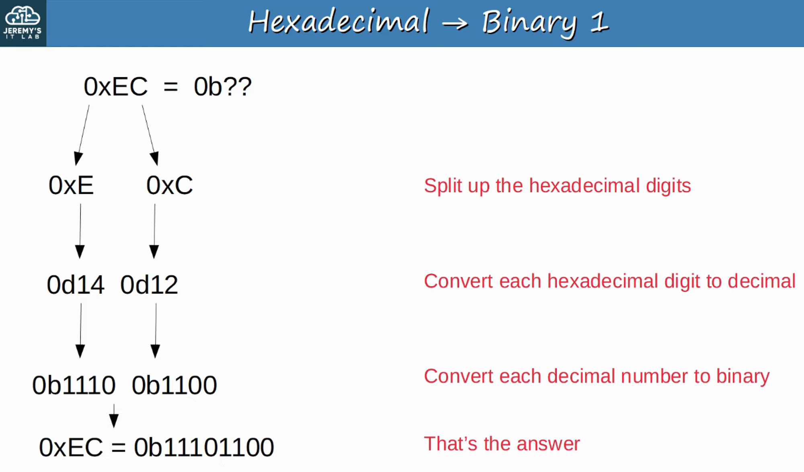

---

## Why Ipv6?

- The **MAIN REASON** is that there are simply not enough IPv4 addresses available
- There are 2^32 IPv4 Addresses available (4,294,967,296)
- When IPv4 was being designed 30 years ago, the creators had NO idea the Internet would be as large as today
- VLSM, Private IPv4 ADDRESSES, and NAT have been used to conserve the use of IPv4 ADDRESS SPACE.
    - These are short-term solutions, however.
- The LONG -TERM solution is IPv6

- IPv4 ADDRESS assignments are controlled by IANA (Internet Assigned Number Authority)
- IANA distributes IPv4 ADDRESS space to various RIRs (Regional Internet Registries), which then assign them to companies that need them.

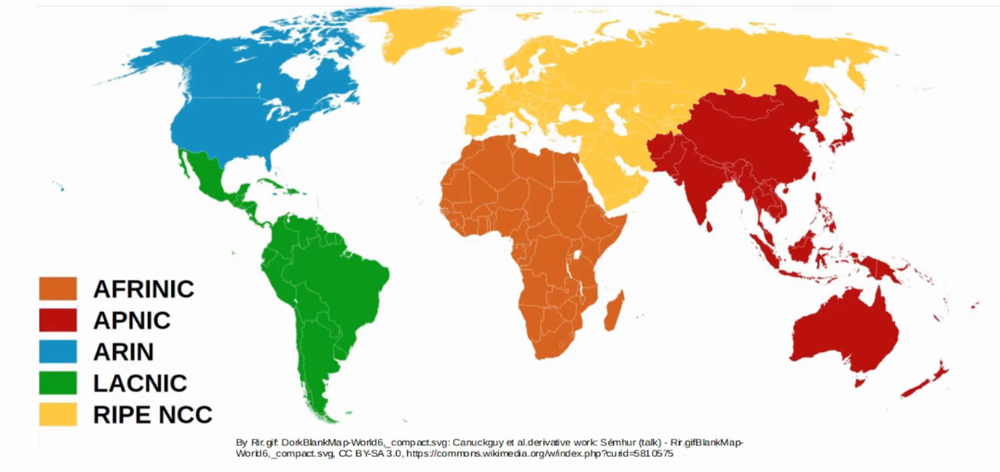

- On September 24th, 2015, ARIN declared exhaustion of the ARIN IPv4 address pool
- On August 21st, 2020, LACNIC announced that it had made its final IPv4 allocation

---

## Basics of Ipv6

- An IPv6 ADDRESS is **128 bits (8 "groups", 16 bits per "group". Groups are separated by ':')**

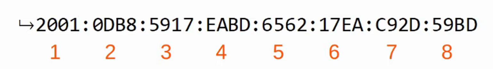

- An IPv6 ADDRESS uses the / prefix number

SHORTENING (Abbreviating) IPv6 ADDRESSES

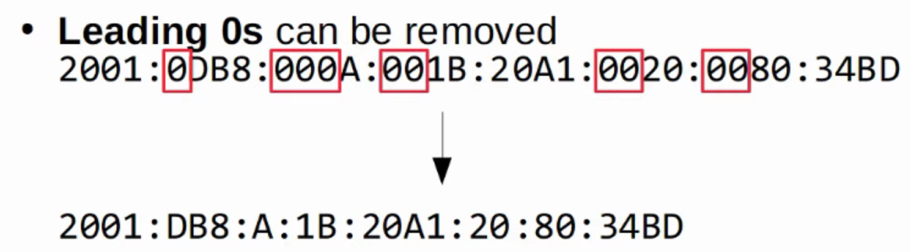

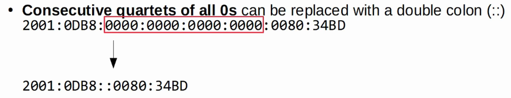

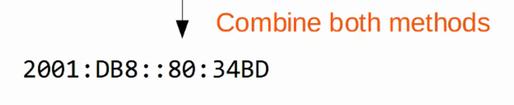

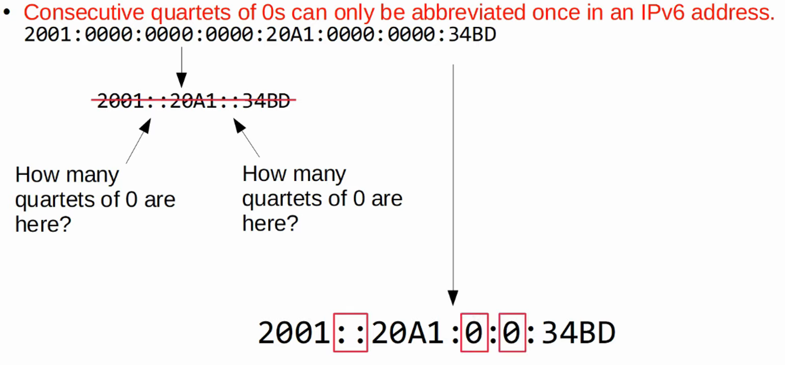

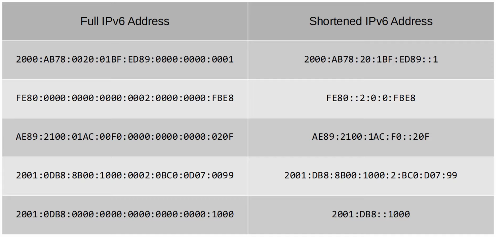

EXPANDING (Abbreviating) IPv6 ADDRESSES

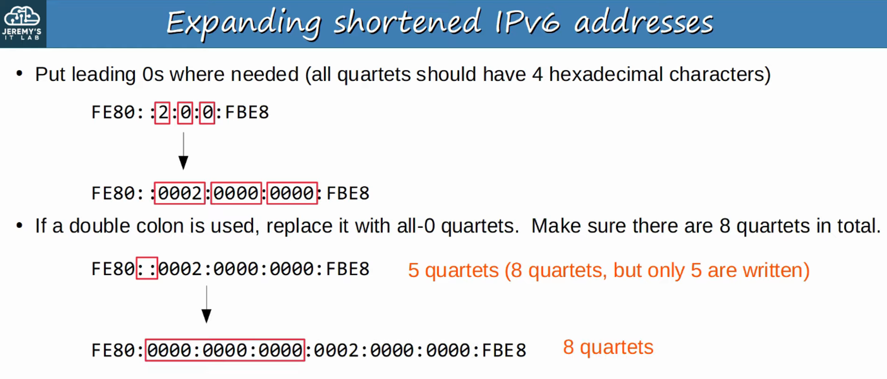

## Finding The Ipv6 Prefix (Global Unicast Addresses)

- Typically, an Enterprise requesting IPv6 ADDRESSES from their ISP will receive a /48 BLOCK
- Typically, IPv6 SUBNETS use a /64 PREFIX LENGTH
- That means an Enterprise has 16 bits to use to make SUBNETS
- The remaining 64 bits can be used for HOSTS

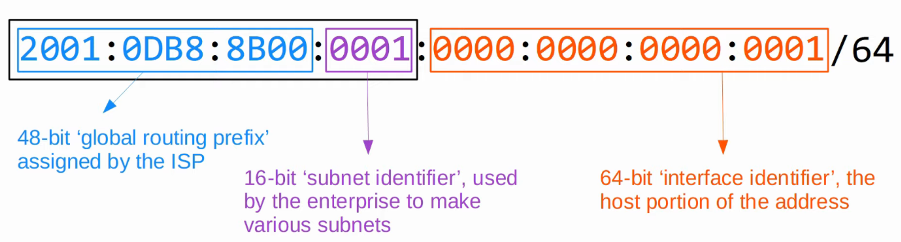

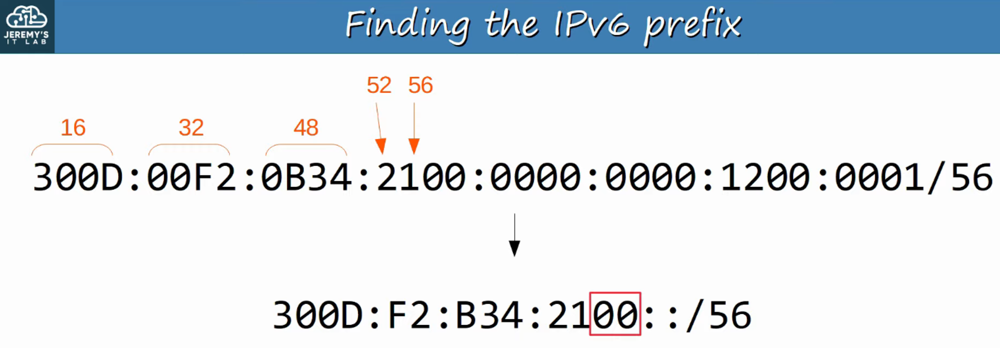

(Each digit is 4 bits / each 4 digit block is 16 bits)

**REMEMBER** : You can only remove the LEADING ZEROS !!!

## 2001 : 0db8 : 8b00 : 0001 : Fb89 : 017b : 0020 : 0011  /93

Because 93 lands in the middle of a 4 bit number, we need to convert the last digit to binary and borrow a “bit” from the first binary digit.

:: 017 [B] :: B = 0d11 = 0b1011 = 0b1000 (the first digit is borrowed, the remainder become 0)

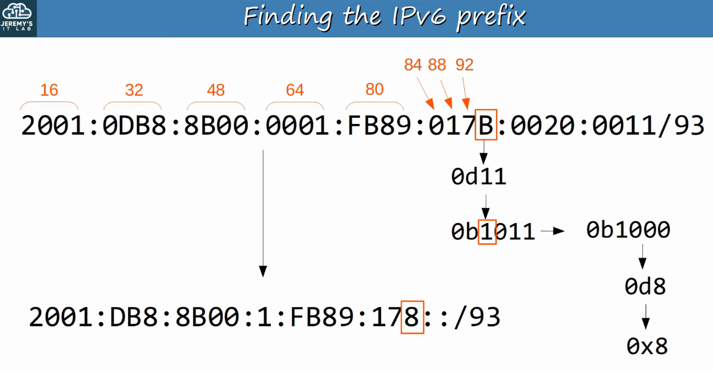

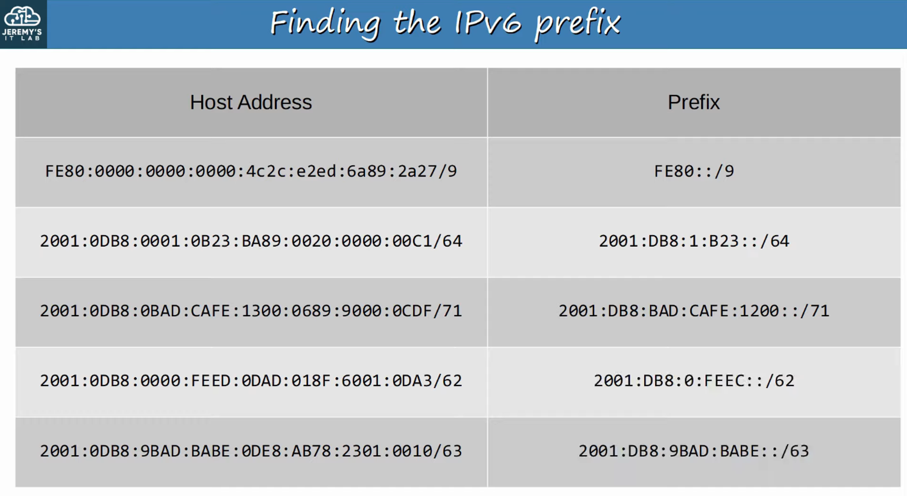

---

## Configuring Ipv6 Addresses

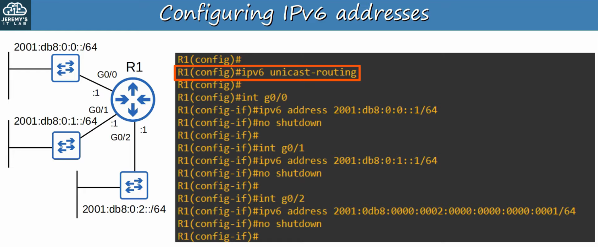

This allows the ROUTER to perform IPv6 ROUTING

> **Note:** R1(config) #ipv6 unicast-routing

Configuring an INTERFACE with an IPv6 Address

> **Note:** R1(config) #int g0/0
R1(config-if) #ipv6 address 2001:db8:0:0::1/64
R1(config) #no shutdown

You can also type out the full address (if necessary)

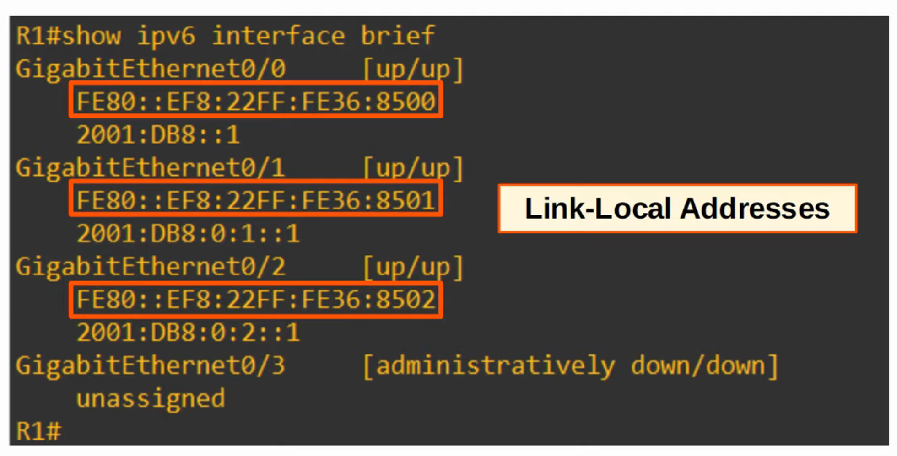

## Note Abbreviated Ipv6 Addresses Shown

LINK-LOCAL ADDRESSES are automatically added when creating an IPv6 INTERFACE (Covered in IPv6 - PART 2 Lecture)
