# 32. Ipv6 : Part 2

## Ipv6 Address Configuration (Eui-64)

- EUI stands for Extended Unique Identifier
- (Modified) EUI-64 is a method of converting a MAC address (48-bits) into a 64-bit INTERFACE identifier
- This INTERFACE identifier can then become the “HOST portion” of a /64 IPv6 ADDRESS

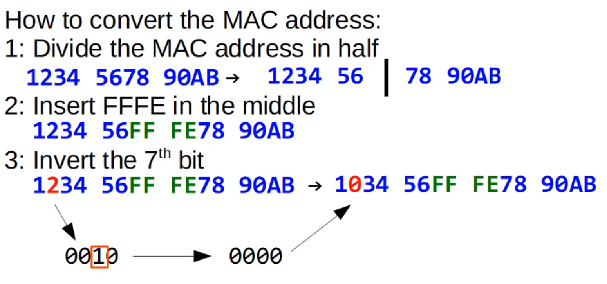

### **Eui-64 Practice**
```
## 782b Cbac 0867 >>> 782b Cb  ||  Ac 0867

## 782b Cbff  Feac 0867 

8 is the 7th bit so 1000 inverted becomes 1010 = A in hex

so the EUI-64 Interface Identifier is :  7A2B CBFF FEAC 0867
```

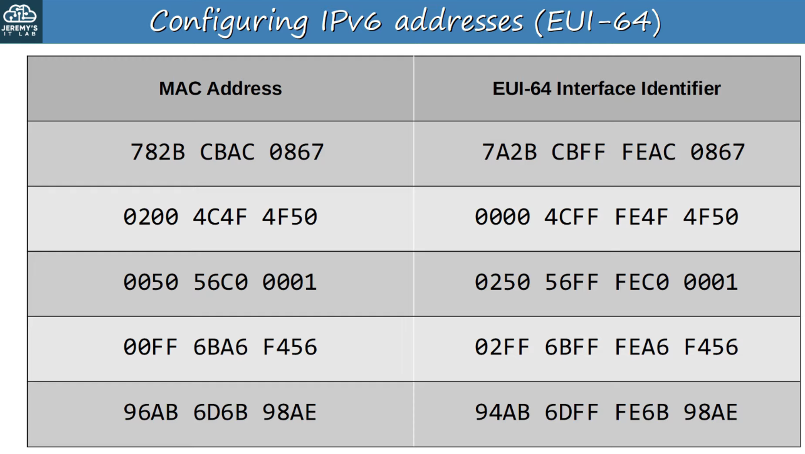

---
## Configuring Ipv6 Addresses With Eui-64

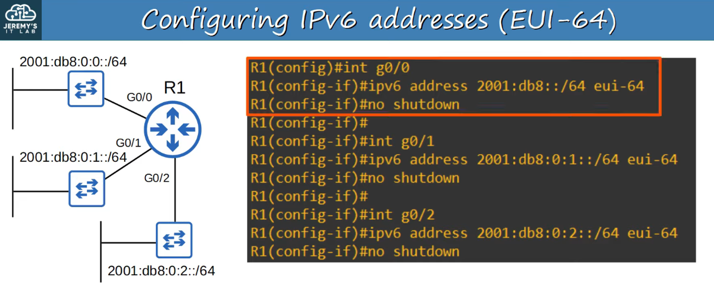

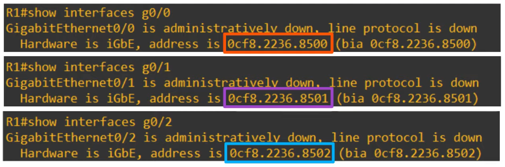

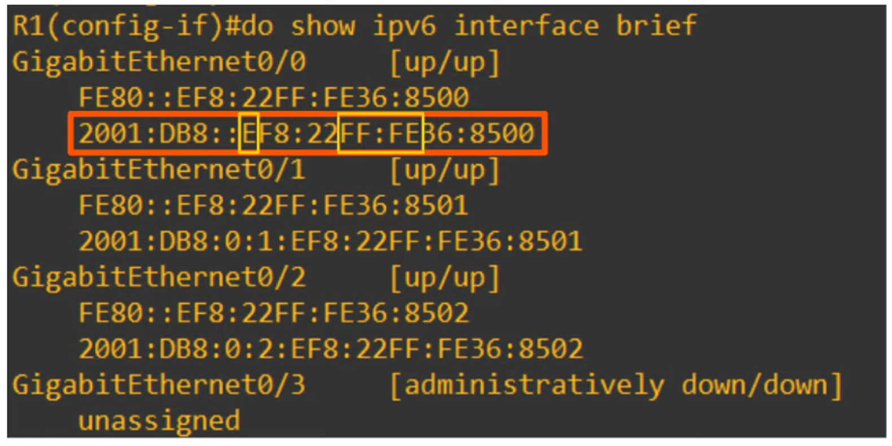

NOTE the “2001:DB8…” Address has “E” changed to “c”. This is the 7th bit getting flipped (1110 to 1100 = 12 = hex ‘C’)

---

## Why Invert The 7th Bit ? 

- **Mac Addresses Can Be Divided Into Two Types:**
    - UAA (Universally Administered Address)
        - Uniquely assigned to the device of the manufacturer
    - LAA (Locally Administered Address)
        - Manually assigned by an Admin (with the mac-address command on the INTERFACE) or protocol. Doesn’t have to be globally unique.
- You can INDENTIFY a UAA or LAA by the 7th bit of the MAC ADDRESS, called the U/L bit (Universal/Local bit)
    - U/L bit set to 0 = UAA
    - U/L bit set to 1 = LAA
- In the context of IPv6 addresses/EUI-64, the meaning of the U/L bit is reversed:
    - U/L bit set to 0 = The MAC address the EUI-64 INTERFACE ID was made from was an LAA
    - U/L bit set to 1 = The MAC address the EUI-64 INTERFACE ID was made from was a UAA

---

## Ipv6 Address Types

### **1) Global Unicast Addresses**

- **Global Unicast** IPv6 ADDRESSES are PUBLIC ADDRESSES which can be used over the INTERNET
- Must REGISTER to use them.
- They are PUBLIC ADDRESSES so need to be GLOBALLY UNIQUE

> **Note:** Originally defined as the 2000 :: /3 block
## (2000:: to 3fff : Ffff : Ffff : Ffff : Ffff : Ffff : Ffff : Ffff)

- NOW defined as ALL ADDRESSES which are not RESERVED for other purposes

Remember THESE THREE PARTS of a GLOBAL UNICAST ADDRESS

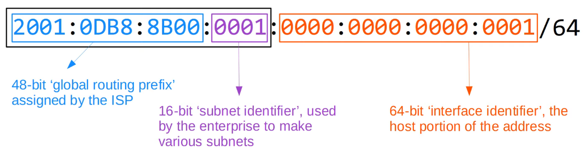

---

### **2) Unique Local Addresses **

- **Unique Local** IPv6 ADDRESSES are PRIVATE ADDRESSES which cannot be used over the internet
- You do NOT need to REGISTER to use them
- Can be used FREELY within INTERNAL NETWORKS
- Do NOT need to be GLOBALLY UNIQUE (*)
- CANNOT be ROUTED over the INTERNET

> **Note:** Uses the ADDRESS block FC00 ::/7
## (Fc00:: to Fdff : Ffff : Ffff : Ffff : Ffff : Ffff : Ffff : Ffff)

- A later UPDATE required the 8th bit to be set to 1 so the FIRST TWO DIGITS must be FD

(*) The GLOBAL ID should be UNIQUE so that ADDRESSES don’t overlap when companies MERGE

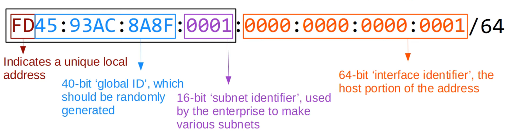

---

### **3) Link-Local Addresses**

- **Link-Local** IPv6 ADDRESSES are AUTOMATICALLY generated on IPv6-enabled INTERFACES
- Use command `R1(config-if)# ipv6 enable` on an interface to enable IPv6 on an INTERFACE

> **Note:** Uses the ADDRESS block FE80::/10
## (Fe80:: to Febf : Ffff : Ffff : Ffff : Ffff : Ffff : Ffff : Ffff)

- The STANDARD states that the 54-bits AFTER FE80/10 should be ALL 0’s so you won’t see Link-Local ADDRESSES beginning with FE9, FEA, or FEB - ONLY FE8(!)
- The INTERFACE ID is generated using EUI-64 rules
- Link-Local means that these addresses are used for communication within a single link (SUBNET)
    - ROUTER will not route PACKETS with a Link-Local DESTINATION IPv6 ADDRESS
- **Common Uses of Link-Local Addresses:**
    - Routing Protocol Peerings (OSPFv3 uses Link-Local Addresses for Neighbour Adjacencies)
    - NEXT-HOP ADDRESS for STATIC ROUTES
    - Neighbor Discovery Protocol (NDP, IPv6’s replacement for ARP) uses Link-Local ADDRESSES to function
    
    Network using Link-Local Addresses for “next-hop” routing
    
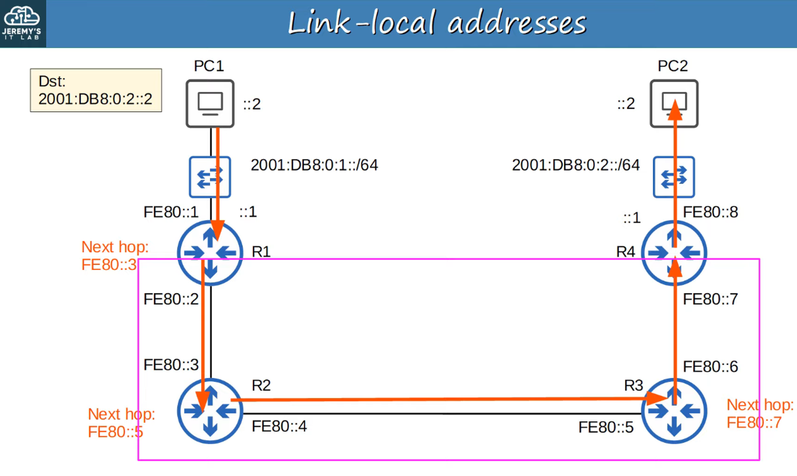
    

---

### **4) Multicast Addresses**

- **Unicast Addresses** are one-to-one
    - ONE SOURCE to ONE DESTINATION
- ***Broadcast*** Addresses are one-to-all
    - ONE SOURCE to ALL DESTINATIONS (within the subnet)
- **Multicast** Addresses are one-to-many
    - ONE SOURCE to MULTIPLE DESTINATIONS (that have joined the specific ***multicast*** group)

> **Note:** IPv6 uses range FF00::/8 for multicast
## (Ff00:: to Ffff : Ffff : Ffff : Ffff : Ffff : Ffff : Ffff : Ffff)

- **IPv6 doesn’t use Broadcast** (there IS NO “Broadcast Address” in IPv6!)

## You Must Know The Multicast Address for Each Router Type

NOTE that the IPv6 and IPv4 Addresses share the same last digit

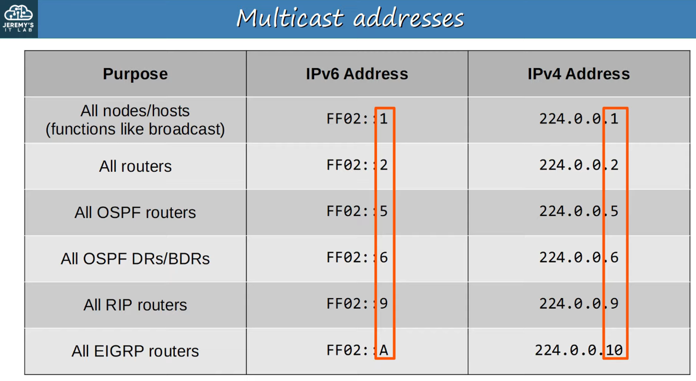

## Multicast Address Scopes

- IPv6 defines multiple MULTICAST ‘scopes’ which indicate how far the PACKET should be forwarded
- The ADDRESS in the previous slide all use the ‘link-local’ scope (FF02), which stays in the LOCAL SUBNET

**IPv6 Multicast Scope Types:**

- **Interface-Local (FF01)**
    - The PACKET doesn’t leave the LOCAL device
    - Can be used to SEND traffic to a SERVICE within the LOCAL device
    
- **Link-Local (FF02)**
    - The PACKET remains in the LOCAL SUBNET
    - ROUTERS will not route the PACKET between SUBNETS

- **Site-Local  (FF05)**
    - The PACKET can be forwarded by ROUTERS
    - Should be limited to a SINGLE PHYSICAL LOCATION (not forwarded over a WAN)
- **Organization-Local (FF08)**
    - Wider in scope than Site-Local (an entire company / ORGANIZATION)
- **Global (FF0E)**
    - No boundaries
    - Possible to be ROUTED over the INTERNET

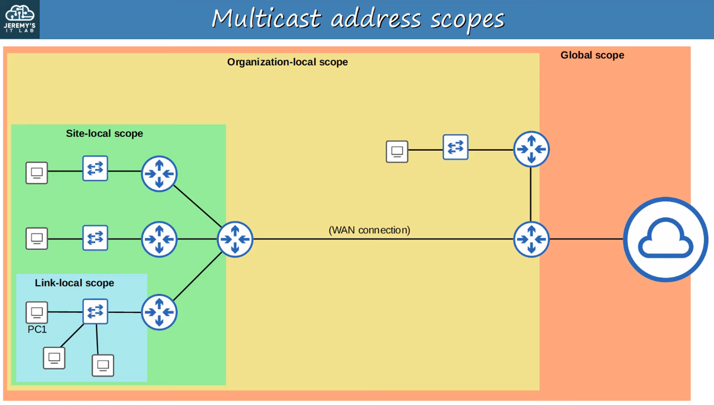

### **5) Anycast Address**

- **ANYCAST is a NEW feature of IPv6**
- ANYCAST is ‘one-to-one-of-many’
- Multiple ROUTERS are configured with the SAME IPv6 ADDRESS
    - They use a ROUTING PROTOCOL to advertise the address
    - When HOSTS sends PACKETS to that DESTINATION ADDRESS, ROUTERS will forward it to the NEAREST ROUTER configured with THAT IP ADDRESS (based on ROUTING METRIC)
- There is NO SPECIFIC ADDRESS range for ANYCAST ADDRESSES.
    - Use a regular UNICAST (Global Unicast, Unique Local) and specify THAT as an ANYCAST ADDRESS
    - `R1(config-if)# ipv6 address 2000:db8:1:1::99/128 anycast`

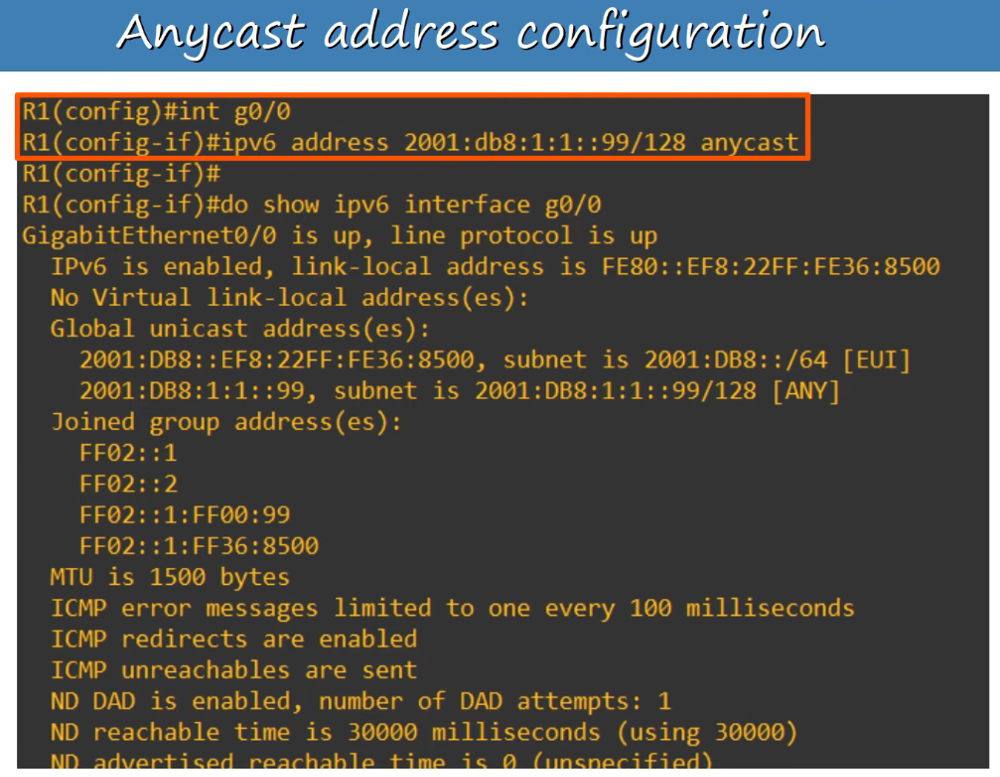

6) OTHER IPv6 ADDRESSES

- The :: Address = The *unspecified* IPv6 ADDRESS
    - Can be used when a DEVICE doesn’t yet know its IPv6 ADDRESS
    - IPv6 DEFAULT ROUTES are configured to ::/0
    - IPv4 equivalent: 0.0.0.0
- The ::1 Address = The Loopback Address
    - Used to test the PROTOCOL STACK on the LOCAL DEVICE
    - Messages sent to THIS ADDRESS are processed within the LOCAL DEVICE but not SENT to other DEVICES
    - IPv4 equivalent : 127.0.0.0 /8  address range
