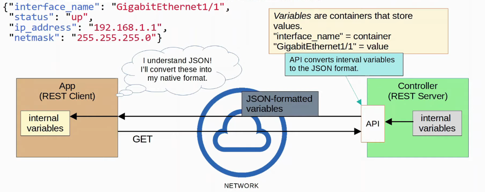
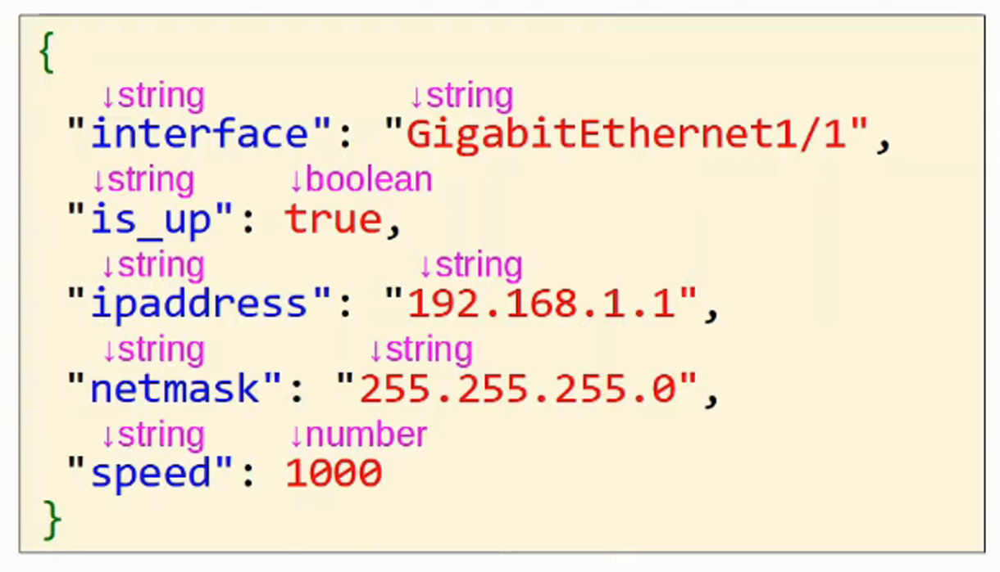
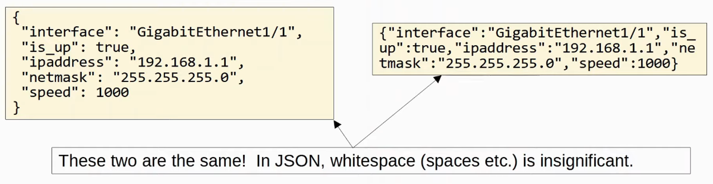
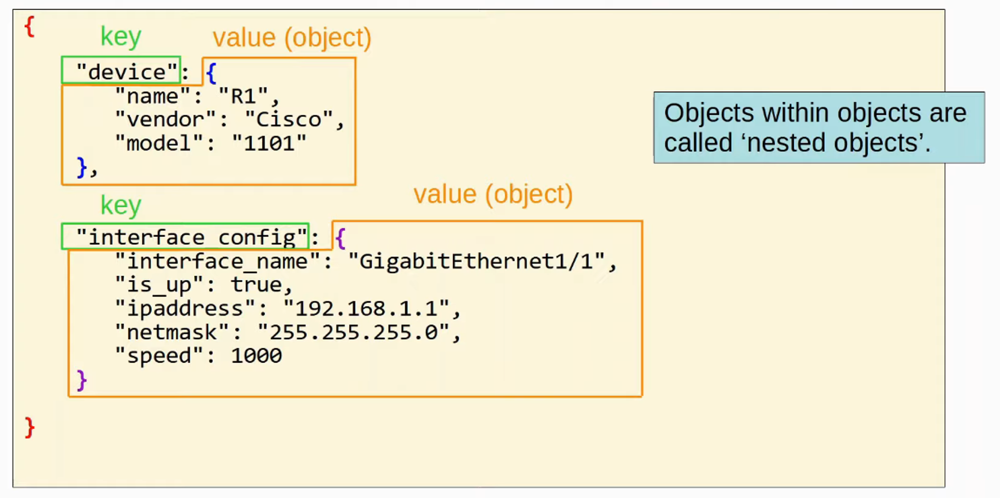
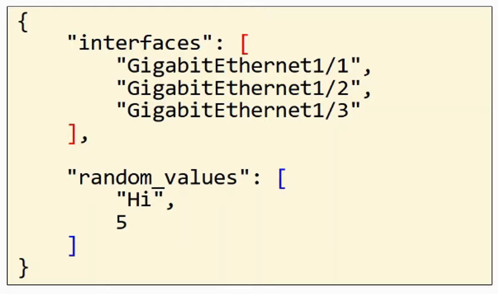
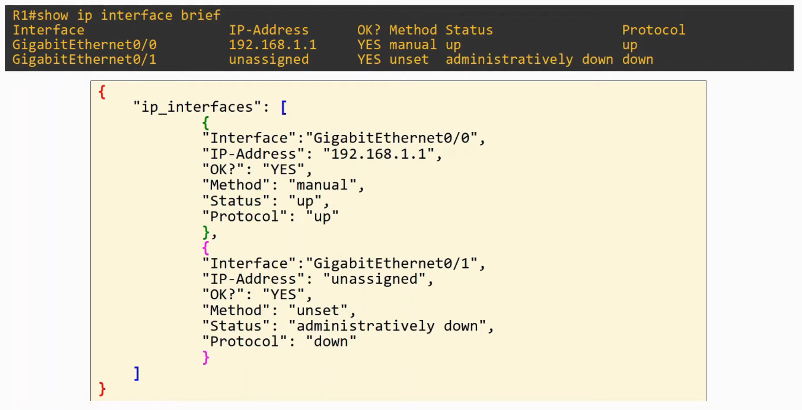
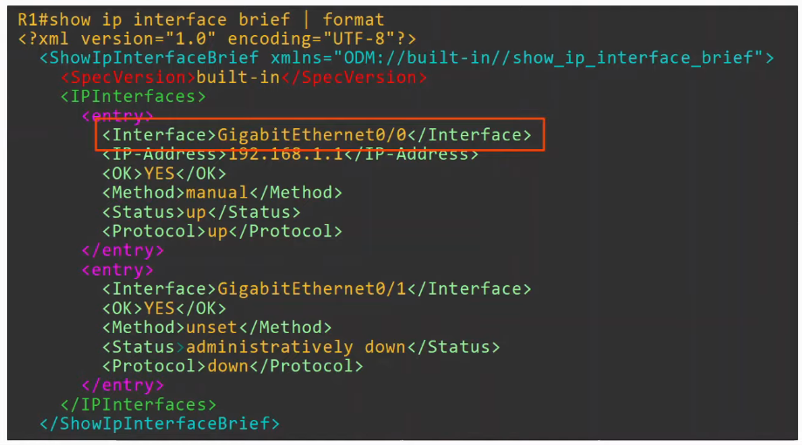
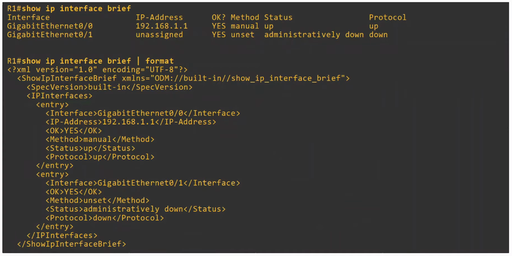
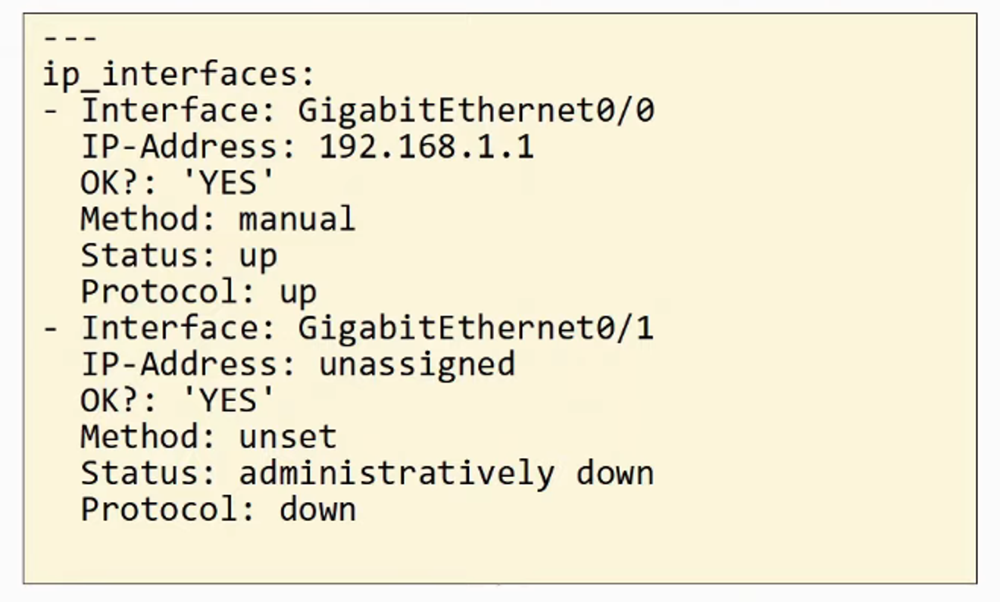
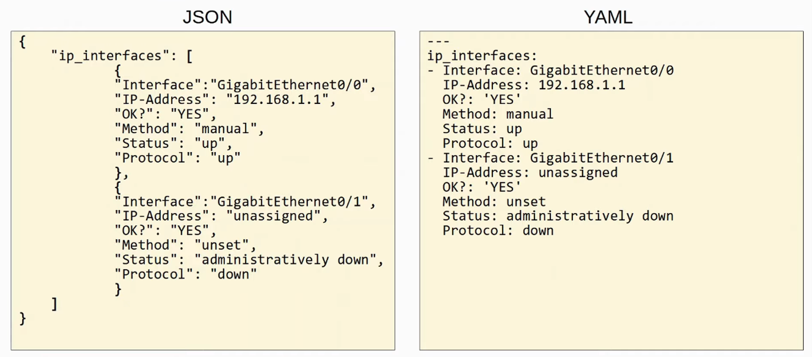

# 60. JSON, XML, and YAML

## Data Serialization

- DATA SERIALIZATION is the process of converting DATA into a standardized format/structure that can be stored (in a file) or transmitted (over a network) and reconstructed later (ie: by a different application)
    - This allows the DATA to be communicated between applications in a way both APPLICATIONS understand.

- DATA SERIALIZATION languages allow us to represent *variables* with text

---

## JSON (Javascript Object Notation)

- JSON (JAVASCRIPT OBJECT NOTATION) **is an open standard FILE FORMAT and DATA INTERCHANGE FORMAT that uses human-readable text to store and transmit data objects

- It is standardized in RFC 8259 (https://datatracker.ietf.org/doc/html/rfc8259)
- It was derived from JavaScript, but it is language-independent and many modern programming languages are able to generate and read JSON data
    - REST APIs often use JSON
- *Whitespace* is insignificant

- JSON can represent FOUR “primitive” DATA Types:
    - String
    - Number
    - Boolean
    - Null

- JSON also has TWO “structured” DATA Types:
    - Object
    - Array

---

### **JSON Primitive Data Types**

- A STRING is a text value. It is surrounded by double quotes “ “
    - “Hello”
    - “Five”
    - “5”

- A NUMBER is a numeric value. It is NOT surrounded by quotes
    - 5
    - 100
    
- A BOOLEAN is a DATA Type that has only TWO possible values, not surrounded by quotes
    - true
    - false

- A NULL value represents the intentional absence of any object value. It is not surrounded by quotes
    - null

---

### **JSON Structured Data Types**

- An OBJECT is an unordered list of *key-value pairs* (variables)
    - Sometimes called a DICTIONARY
    - OBJECTS are surrounded by curly brackets {}
    - The *key* is a STRING
    - The *value* is any valid JSON DATA Type (string, number, boolean, null, object, array)
    - The *key* and *value* are separated by a colon :
    - If there are multiple key-value pairs, each pair is separated by a comma

- An ARRAY is a series of *values* separated by commas
    - Not *key-value pairs*
    - The values do NOT have to be the same DATA Type

---

## XML (Extensible Markup Language)

- XML (EXTENSIBLE MARKUP LANGUAGE) was developed as a MARKUP language, but is now used as a general data serialization language
    - Markup languages (ie: HTML) are used to format text (font, size, color, headings, etc)
    - XML is generally less human-readable than JSON
    - Whitespace is insignificant
    - Often used by REST APIs
    - <key> value </key> (similar to HTML)

---

## YAML (YAML Ain’T Markup Language)

- YAML originally meant *YET ANOTHER MARKUP LANGUAGE* but to distinguish its purpose as a data-serialization language rather than a markup language, it was repurposed to *YAML AINT MARKUP LANGUAGE*
- YAML is used by the network automation tool ANSIBLE (covered later in the course)
- YAML is VERY Human-Readable
- Whitespace **is significant** (unlike JSON and XML)
    - Indentation is very important
- YAML files start with - - - (three dashes)
- - is used to indicate a list
- Keys and Values are represented as key : value

COMPARISON BETWEEN JSON and YAML using the same DATA

