# 52. LAN Architectures

- You have studied various NETWORK technologies: ROUTING, SWITCHING, STP, ETHERCHANNEL, OSPF, FHRPs, SWITCH SECURITY FEATURES, etc.
    - Now, let’s look at some BASIC NETWORK DESIGN / ARCHITECTURE
- There are standard “BEST PRACTICES” for NETWORK DESIGN
    - However there are a few UNIVERSAL “CORRECT ANSWERS”
    - The answer to MOST general questions about NETWORK DESIGN is “IT DEPENDS”
- In the early stages of your NETWORKING career, you probably won’t be asked to DESIGN NETWORKS yourself
- However, to understand the NETWORKS you will be CONFIGURING and TROUBLESHOOTING, it’s important to know some BASICS of NETWORK DESIGN

---

## Common Terminologies

- STAR
    - When several DEVICES all connect to ONE CENTRAL DEVICE, we can draw them in a “STAR” shape like below, so this is often called a “STAR TOPOLOGY”

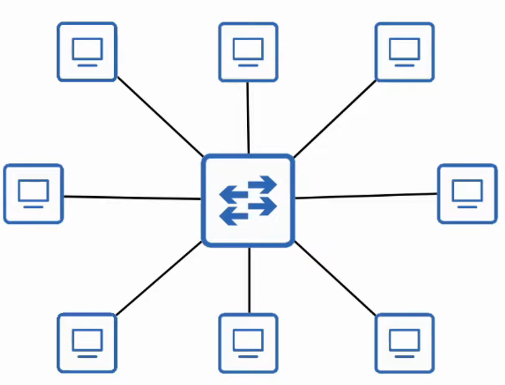

- FULL MESH
    - When each DEVICE is connected to each OTHER DEVICE

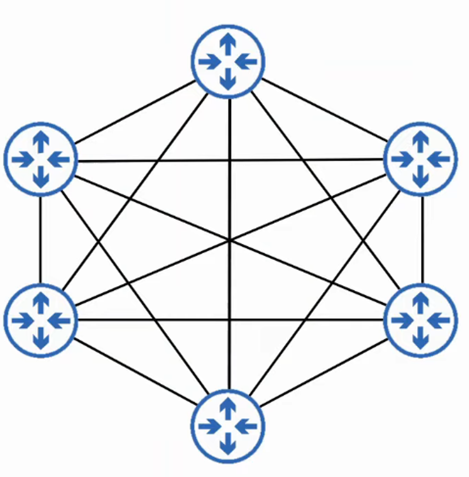

- PARTIAL MESH
    - When SOME DEVICES are connected to each other but not ALL

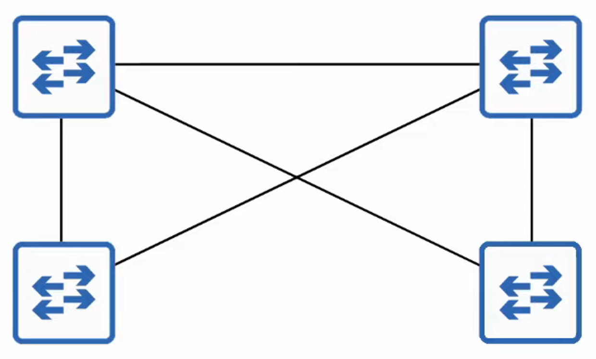

---

## 2-Tier and 3-Tier LAN Architecture

- **The Two-Tier LAN Design Consists of Two Hierarchical Layers:**
- Access Layer
- Distribution Layer
- Also called a “COLLAPSED CORE” DESIGN because it omits a layer that is found in the THREE TIER DESIGN : THE CORE LAYER
- ACCESS LAYER
    - The LAYER that END HOSTS connect to (PCs, Printers, Cameras, etc)
    - Typically, ACCESS LAYER SWITCHES have lots of PORTS for END HOSTS to connect to
    - QoS MARKING is typically done here
    - Security Services like PORT SECURITY, DAI, etc are typically performed here
    - SWITCHPORTS might be PoE-Enabled for Wireless APs, IP Phones, etc.
- DISTRIBUTION LAYER
    - Aggregates connections from the ACCESS LAYER SWITCHES
    - Typically is the border between LAYER 2 and LAYER 3
    - Connects to services such as Internet, WAN, etc
    - Sometimes called AGGREGATION LAYER

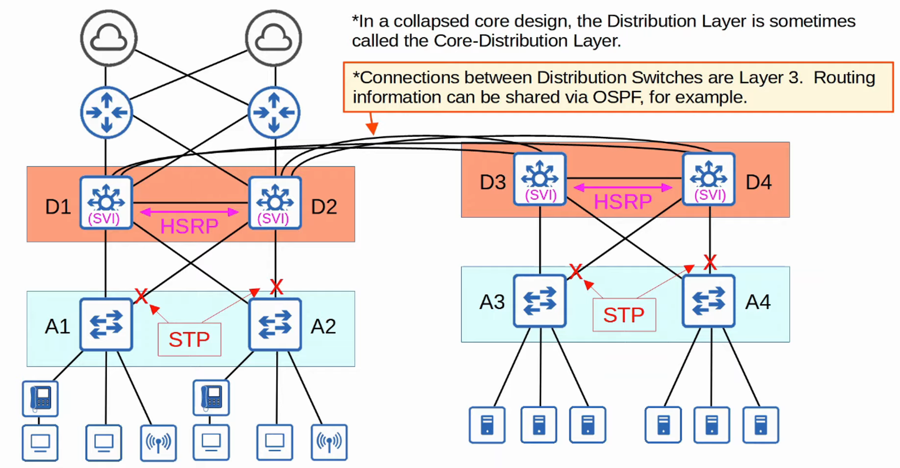

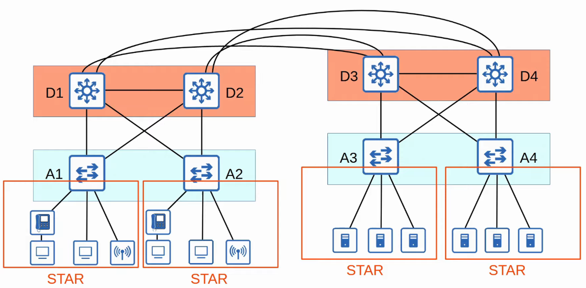

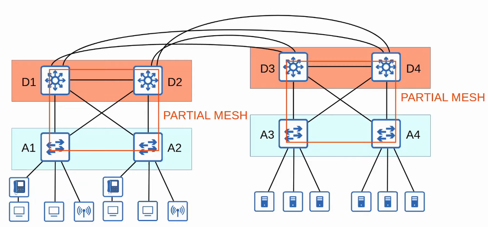

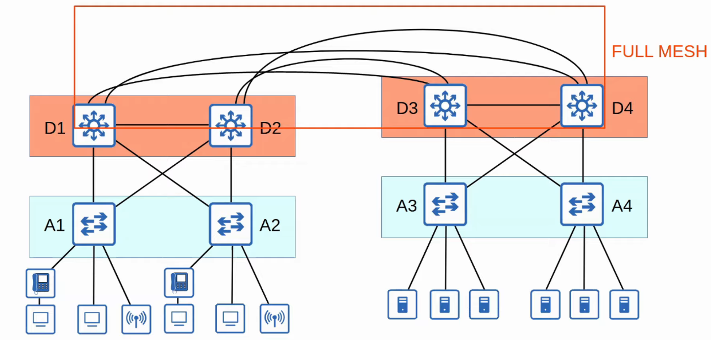

---

## Three-Tier Campus LAN Design

- In large NETWORKS with many DISTRIBUTION LAYER SWITCHES (for example in separate buildings), the number of connections required between DISTRIBUTION LAYER SWITCHES grows rapidly

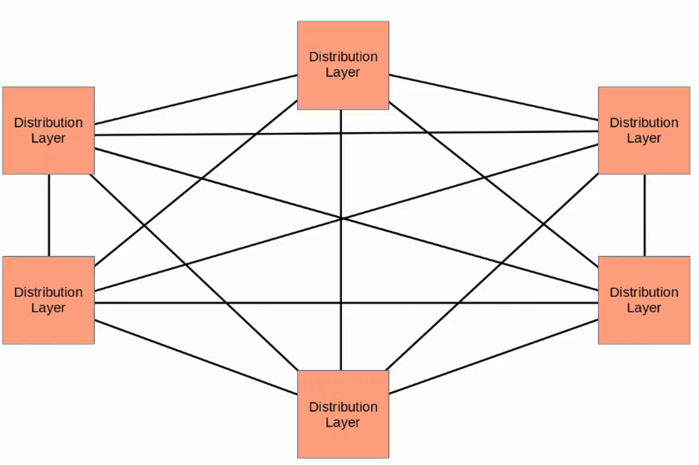

- To help SCALE large LAN NETWORKS, you can add a CORE LAYER.

** Cisco recommends adding a CORE LAYER if there are more than THREE DISTRIBUTION LAYERS in a single location

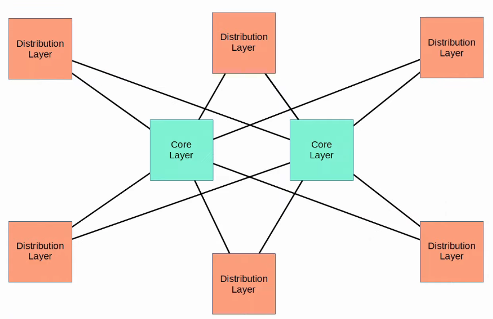

- **The Three-Tier LAN Design Consists of Three Hierarchical Layers:**
- Access Layer
- Distribution Layer
- Core Layer

- **Core Layer:**
    - Connects DISTRIBUTION LAYERS together in large LAN NETWORKS
    - The focus is SPEED (”FAST TRANSPORT”)
    - CPU-INTENSIVE OPERATIONS, such as SECURITY, QoS Markings / Classification, etc. should be avoided at this LAYER
    - Connections are all LAYER 3. NO SPANNING-TREE!
    - Should maintain connectivity throughout the LAN even if DEVICES FAIL
    
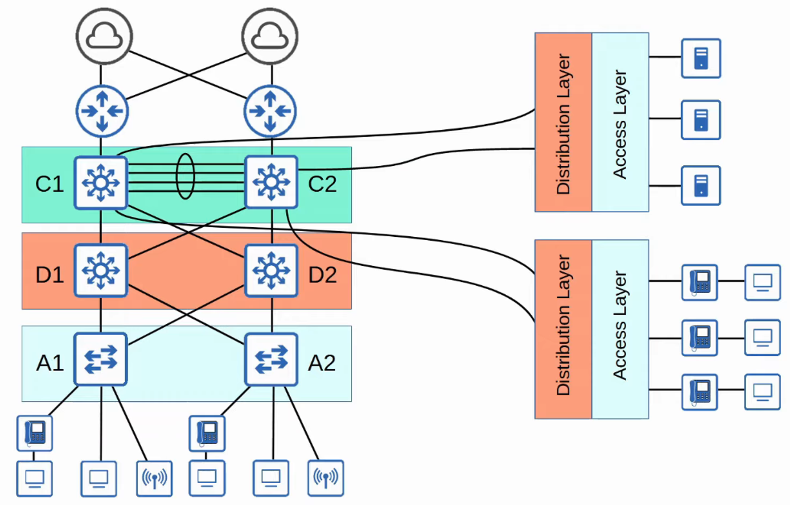
    

---

## Spine-Leaf Architecture (Data Center)

- CISCO ACI ARCHITECTURE (Application Centric Infrastructure) uses this architecture
- DATA CENTERS are dedicated spaces / buildings used to STORE COMPUTER SYSTEMS such as SERVERS and NETWORK DEVICES
- Traditional DATA CENTER designs used a THREE-TIER ARCHITECTURE (ACCESS-DISTRIBUTION-CORE) like we just covered
- This worked well when most TRAFFIC in the DATA CENTER was NORTH-SOUTH

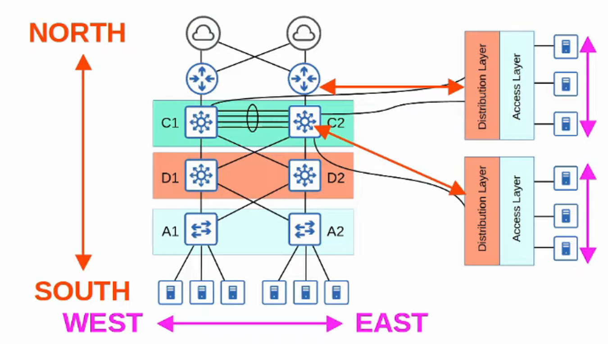

- With the precedence of VIRTUAL SERVERS, applications are often deployed in a DISTRIBUTED manner (across multiple physical SERVERS) which increases the amount of EAST-WEST TRAFFIC in the DATA CENTER
- The traditional THREE-TIER ARCHITECTURE led to bottlenecks in the BANDWIDTH as well as VARIABILITY in the SERVER-TO-SERVER latency depending on the PATH the TRAFFIC takes
- To SOLVE this, SPINE-LEAF ARCHITECTURE (also called CLOS ARCHITECTURE) has become prominent in DATA CENTERS

## Rules for Spine-Leaf Architecture

- Every LEAF SWITCH is connected to every SPINE SWITCH
- Every SPINE SWITCH is connected to every LEAF SWITCH
- LEAF SWITCHES do NOT connect to other LEAF SWITCHES
- SPINE SWITCHES do NOT connect to other SPINE SWITCHES
- END HOSTS (Servers, etc) ONLY connect to LEAF SWITCHES

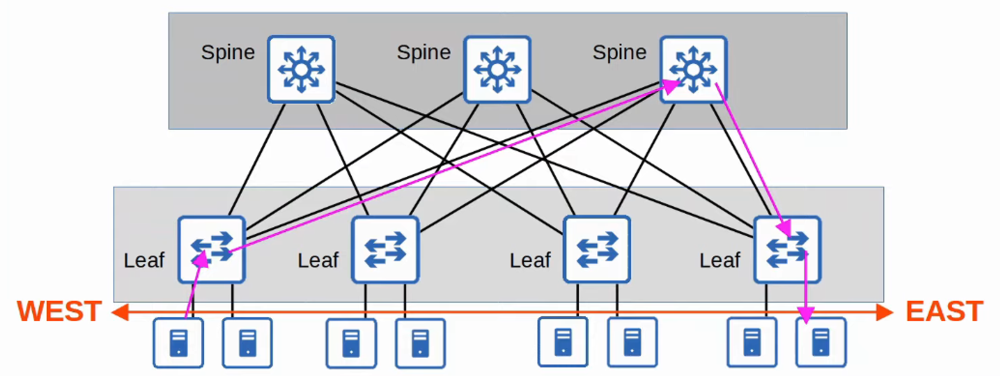

- The PATH taken by TRAFFIC is randomly chosen to balance the TRAFFIC LOAD among the SPINE SWITCHES
- Each SERVER is separated by the same number of “HOPS” (except those connected to the same LEAF) providing CONSISTENT LATENCY for EAST-WEST TRAFFIC

---

## Soho (Small Office / Home Office)

- SMALL OFFICE / HOME OFFICE (SOHO) refers to the office of a small company, or a small home office with few DEVICES
    - Doesn’t have to be an actual home “office”; if your home has a NETWORK connected to the INTERNET it is considered a SOHO NETWORK

- SOHO NETWORKS don’t have complex needs, so all NETWORKING functions are typically provided by a SINGLE DEVICE, often called a “HOME ROUTER” or “WIRELESS ROUTER”
- **The One Device Can Serve As a:**
- Router
- Switch
- Firewall
- Wireless Access Point
- Modem

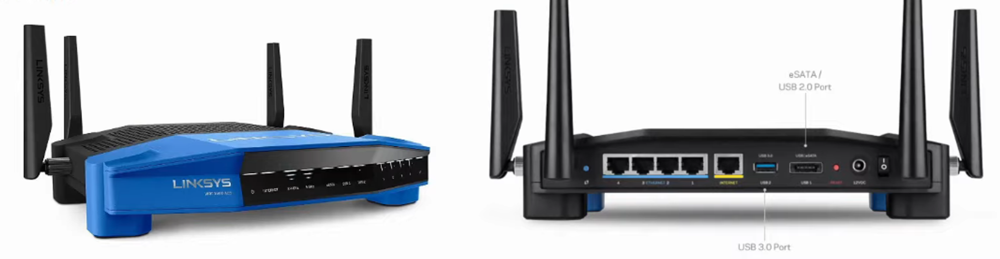

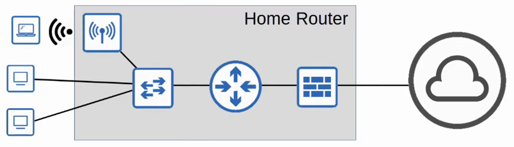
