# 45. NAT (Dynamic): Part 2

## More About Static NAT

- STATIC NAT involves statically configuring one-to-one mappings of PRIVATE IP ADDRESSES to PUBLIC IP ADDRESSES
- When traffic from the INTERNAL HOST is sent to the OUTSIDE NETWORK, the ROUTER will translate the SOURCE ADDRESS

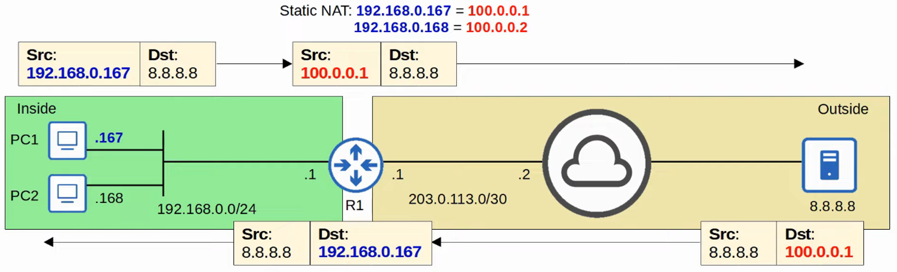

- HOWEVER, this one-to-one mapping also allows EXTERNAL HOSTS to access the INTERNAL HOST via INSIDE GLOBAL ADDRESS

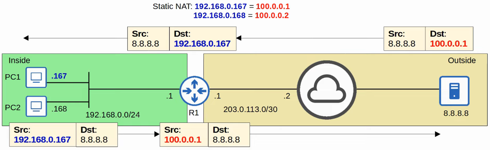

---

## Dynamic NAT

- In DYNAMIC NAT, the ROUTER dynamically maps INSIDE LOCAL ADDRESSES to INSIDE GLOBAL ADDRESSES, as needed
- An ACL is used to identify WHICH traffic should be translated
    - If the SOURCE IP is PERMITTED; the SOURCE IP will be translated
    - If the SOURCE IP is DENIED; the SOURCE IP will NOT be translated
        
        <aside>
> **Note:** However, Packet Traffic will NOT be dropped
        
        </aside>
        
- A NAT POOL is used to define the available INSIDE GLOBAL ADDRESS

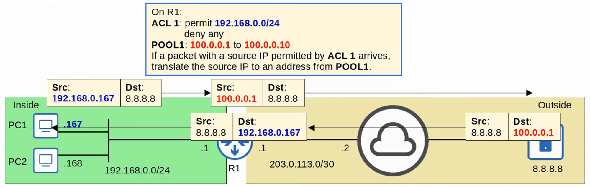

  

- Although they are dynamically assigned, the mappings are still one-to-one (one INSIDE LOCAL IP ADDRESS per INSIDE GLOBAL IP ADDRESS)
- If there are NOT enough INSIDE GLOBAL IP ADDRESSES available (=ALL are being used), it is called ‘NAT POOL EXHAUSTION’
    - If a PACKET from another INSIDE HOST arrives and needs NAT but there are no AVAILABLE ADDRESSES, the ROUTER will drop the PACKET
    - The HOST will be unable to access OUTSIDE NETWORKS until one of the INSIDE GLOBAL IP ADDRESSES becomes available
    - DYNAMIC NAT entries will time out automatically if not used, or you can clear them manually

## NAT Pool Exhaustion

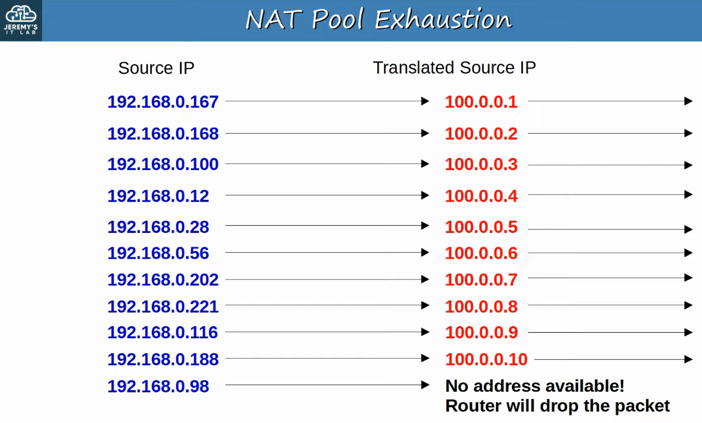

192.168.0.167 TIMES OUT and 192.168.0.98 is assigned it’s TRANSLATED SOURCE IP

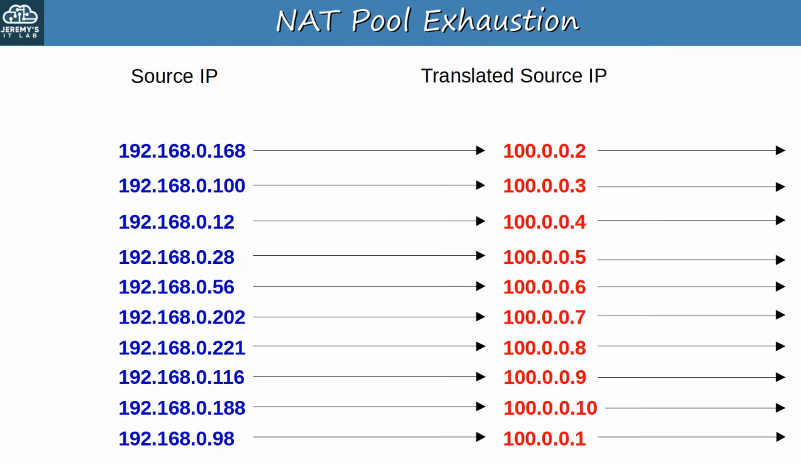

## Dynamic NAT Configuration

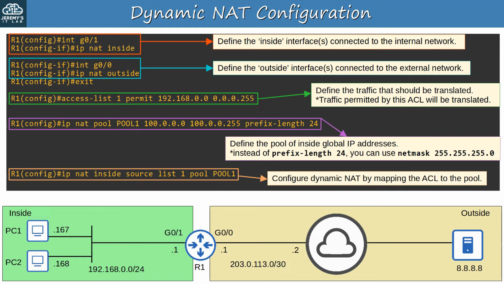

`show ip nat translations`

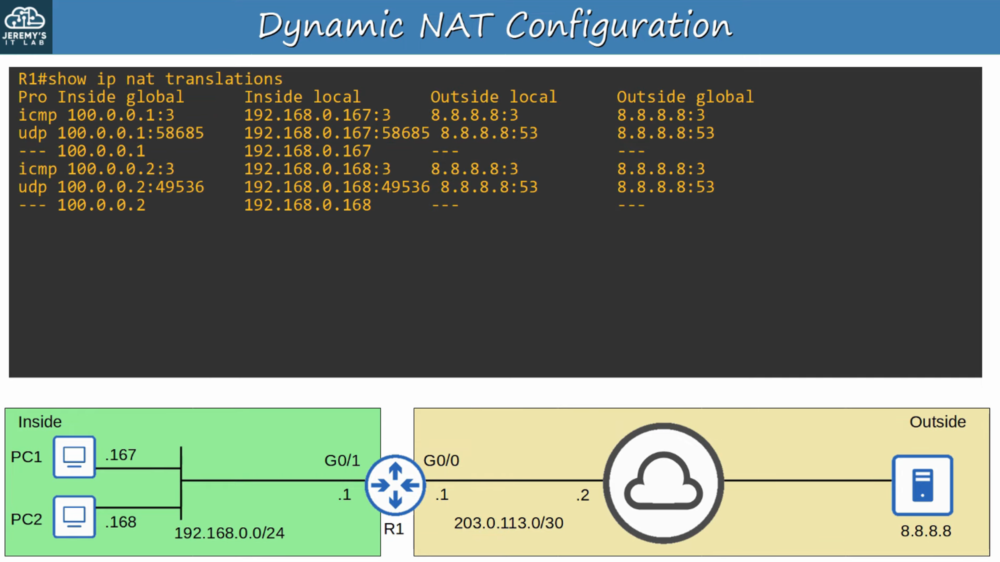

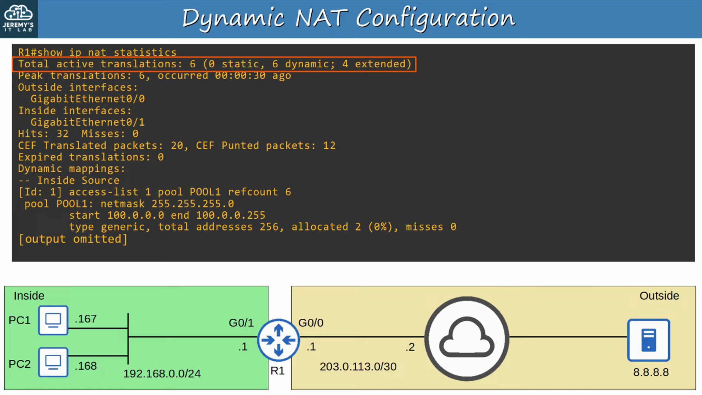

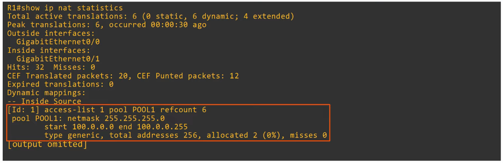

---

## Dynamic Pat (NAT Overload)

- PAT (NAT OVERLOAD) translates BOTH the IP ADDRESS and the PORT NUMBER (if necessary)
- By using a unique PORT NUMBER for each communication flow, a single PUBLIC IP ADDRESS can be used by many different INTERNAL HOSTS
    - PORT NUMBERS are 16 bits = over 65,000 available port numbers
- The ROUTER will keep track of which INSIDE LOCAL ADDRESS is using which INSIDE GLOBAL ADDRESS and PORT

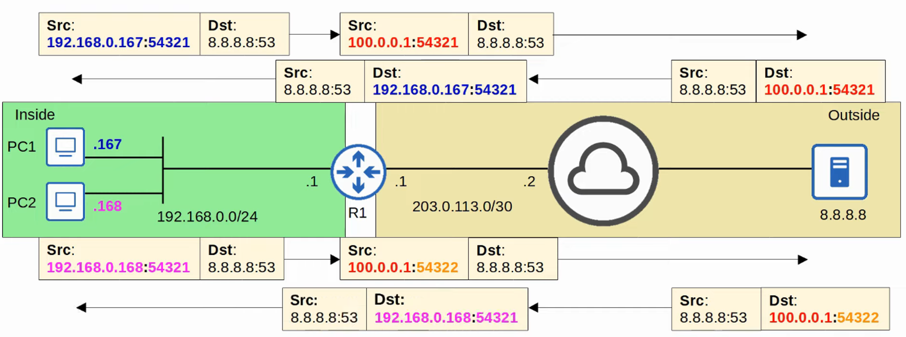

## Pat Configuration (Pool)

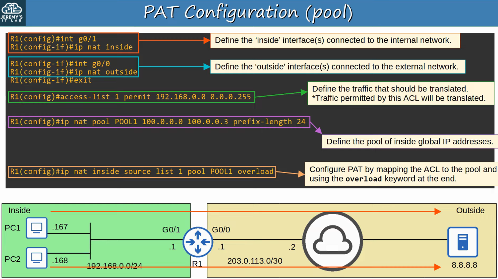

`show ip nat translations`

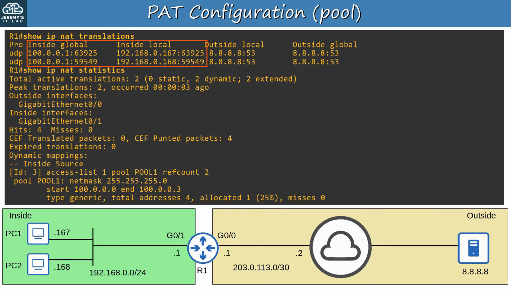

## Pat Configuration (Interface)

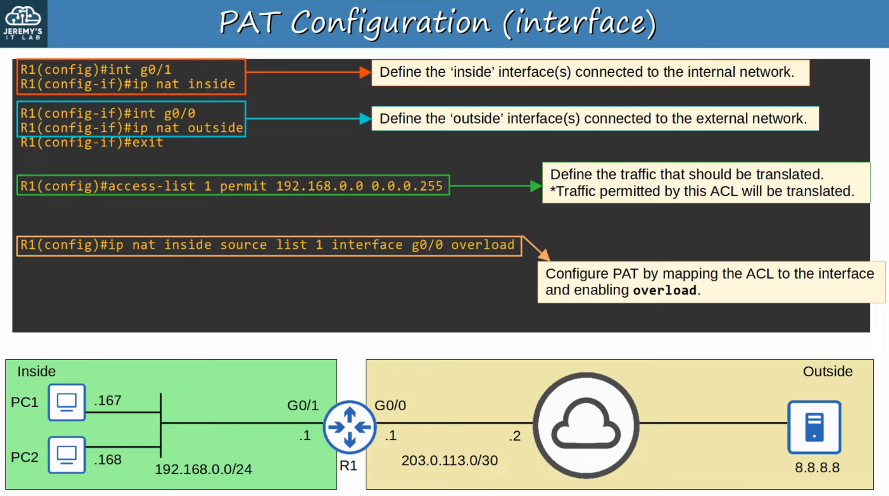

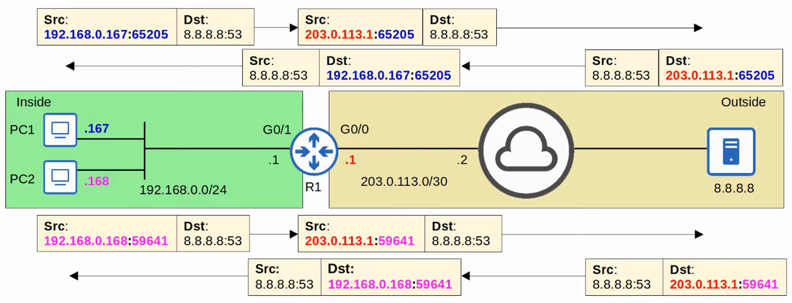

`show ip nat translations`

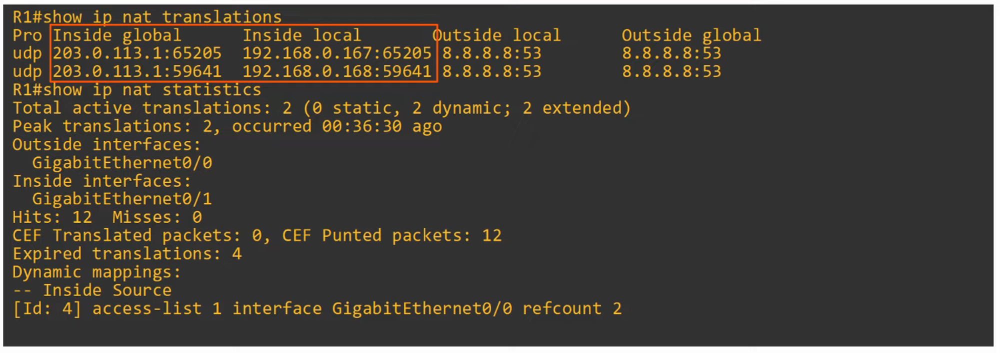

---

## Command Review

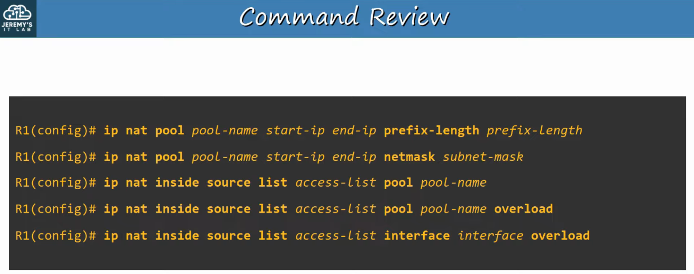
