# 44. NAT (Static): Part 1

## Private Ipv4 Addresses (Rfc 1918)

- IPv4 doesn’t provide enough ADDRESSES for all DEVICES that need an IP ADDRESS in the modern world
- The long-term solution is to switch to IPv6
- **There Are Three Main Short-Term Solutions:**
- Cidr
    - PRIVATE IPv4 ADDRESS
- NAT
- **Rfc 1918 Specifies The Following Ipv4 Address Ranges As Private:**
    
    ```
    10.0.0.0 /8       (10.0.0.0 to 10.255.255.255)             CLASS A 
    172.16.0.0 /12    (172.16.0.0 to 172.31.255.255)           CLASS B
    192.168.0.0 /16   (192.168.0.0 to 192.168.255.255)         CLASS C
    ```
    
- You are free to use these ADDRESSES in your NETWORKS. They don’t have to be GLOBALLY UNIQUE

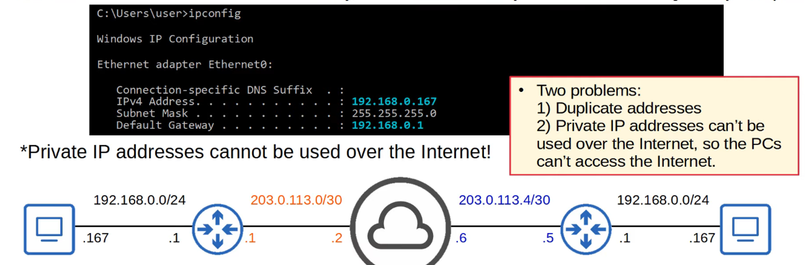

---

## Intro to NAT

- NETWORK ADDRESS TRANSLATION (NAT) is used to modify the SOURCE and / or DESTINATION IP ADDRESSES of packets
- There are various reasons to use NAT, but the MOST common reason is to ALLOW HOSTS with PRIVATE IP ADDRESSES to communicate with other HOSTS over the INTERNET
- For the CCNA you have to understand SOURCE NAT and how to configure it on CISCO ROUTERS

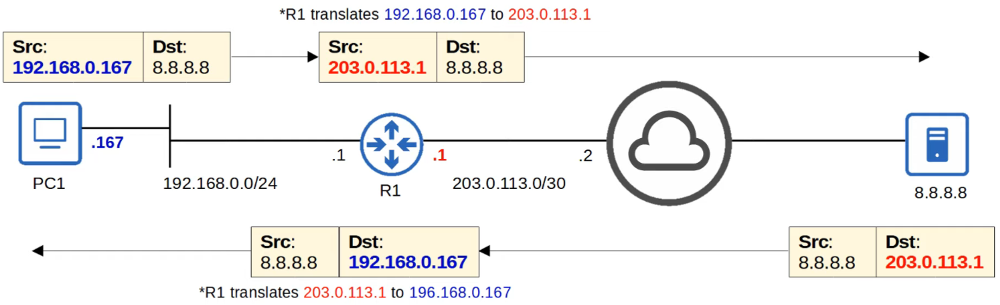

---

## Static NAT

- STATIC NAT involves statically configuring ONE-TO-ONE MAPPINGS of PRIVATE IP ADDRESSES to PUBLIC ADDRESSES

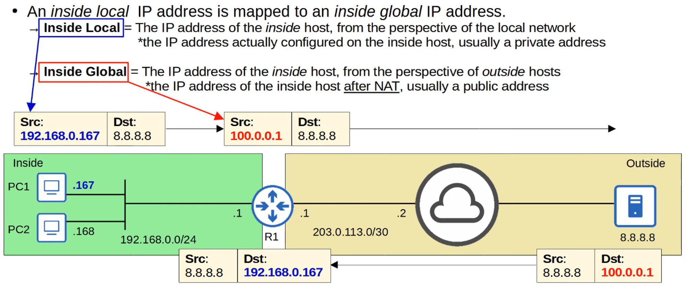

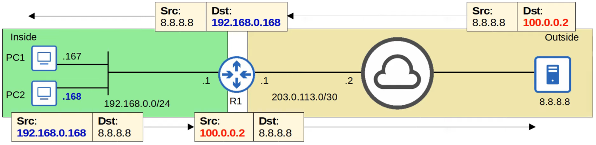

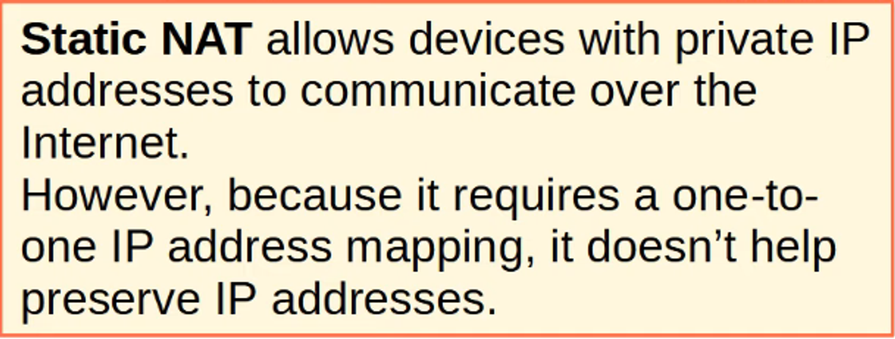

## Private IP Cannot Be Mapped to The Same Global IP

## The Second Mapping Will Be Rejected

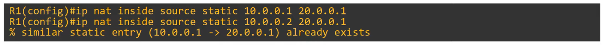

---

## Static NAT Configurations

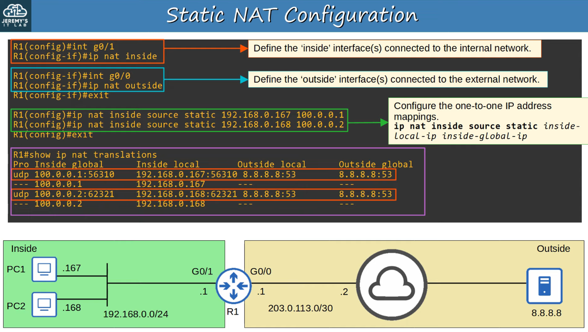

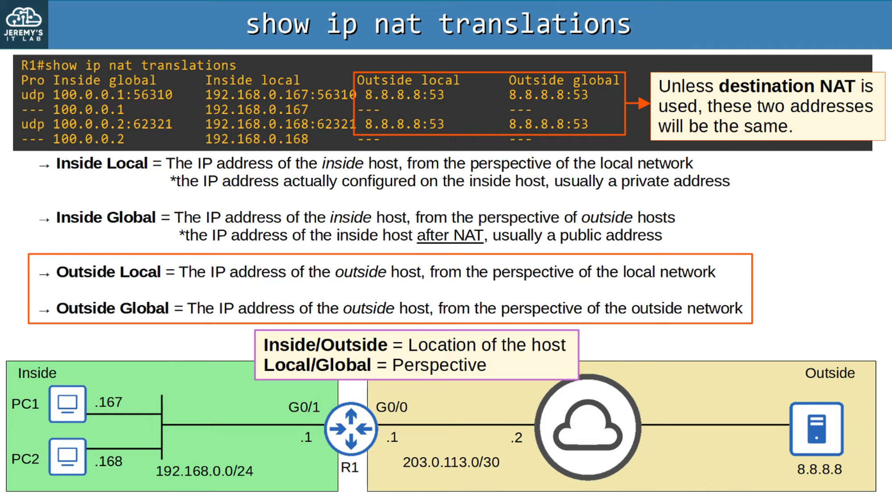

Command `clear ip nat translation`

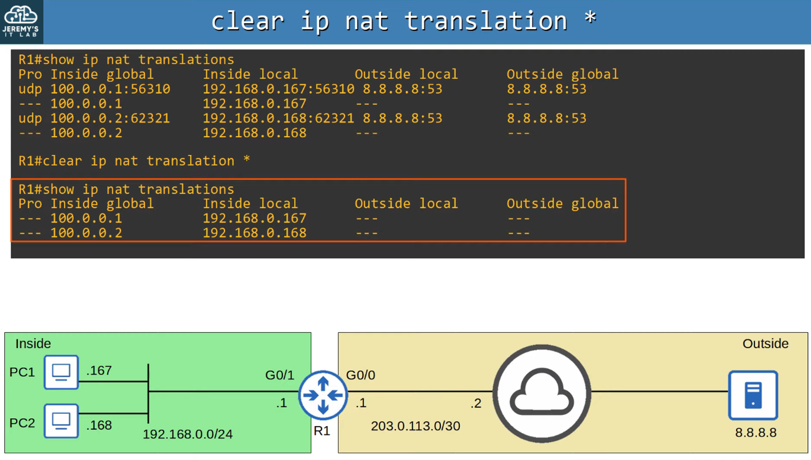

Command `show ip nat statistics`

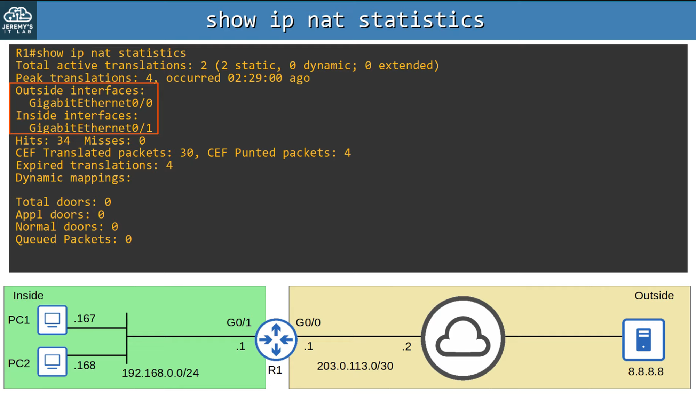

---

## Command Review

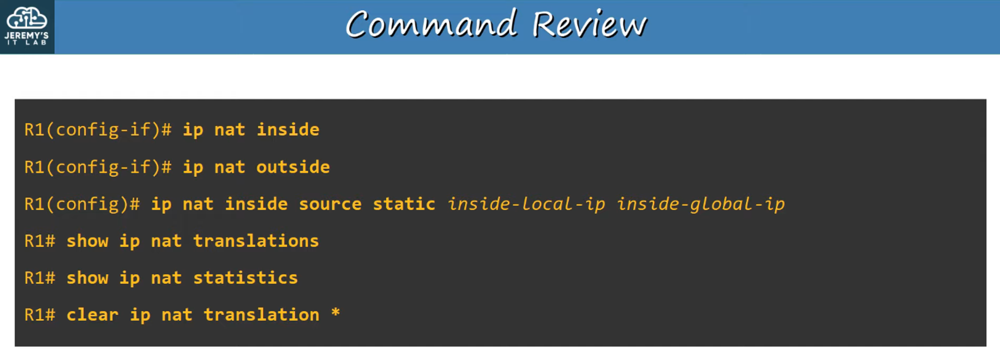
