# 37. NTP

## Why Is Time Important for Network Devices?

- All DEVICES have an INTERNAL CLOCK (ROUTERS, SWITCHES, PCs, etc)
- In CISCO IOS, you can view the time with the `show clock` command

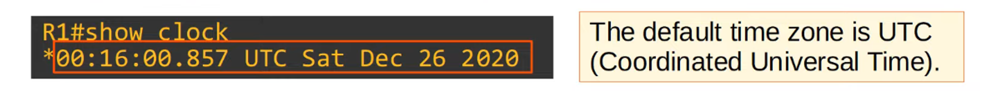

- If you use the `show clock detail` command, you can see the TIME SOURCE

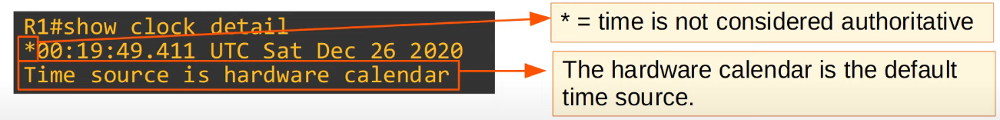

- The INTERNAL HARDWARE CLOCK of a DEVICE will “drift’ over time, so it’s NOT the ideal time source.
- From a CCNA perspective, the most important reason to have accurate time on a DEVICE is to have ACCURATE logs for troubleshooting

- **Syslog**, the protocol used to keep device logs, will be covered in a later video

Command: `show logging`

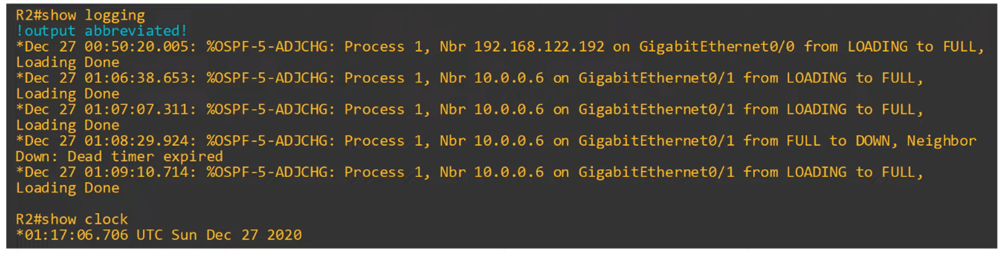

> **Note:** R3’s time stamp is completely different than R2’s !!!

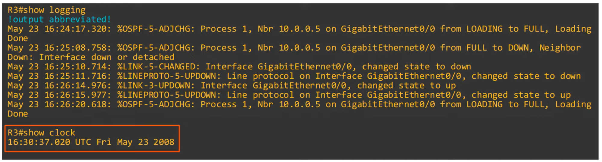

---

## Manual Time Configuration

- You can manually configure the TIME on the DEVICE with the `clock set` command

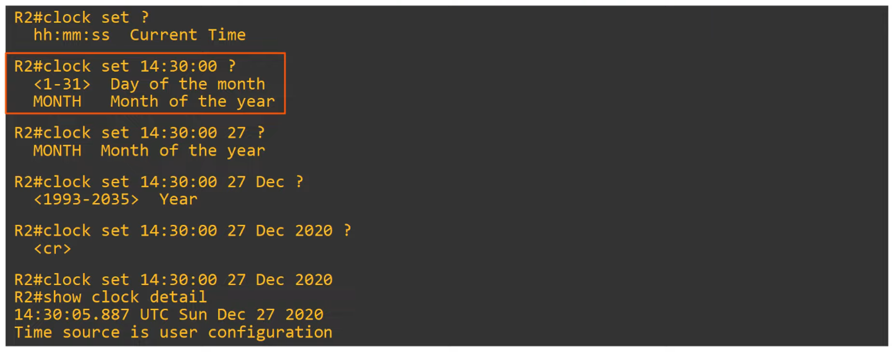

- Although the HARDWARE CALENDAR (built-in clock) is the DEFAULT time-source, the HARDWARE CLOCK and SOFTWARE CLOCK are separate and can be configured separately.

---

## Hardware Clock (Calendar) Configuration

- You can MANUALLY configure the HARDWARE CLOCK with the `calendar set` command

- Typically, you will want to SYNCHRONIZE the ‘clock’ and ‘calendar’
- Use the command `clock update-calendar` to sync the calendar to the clock’s time
- Use the command `clock read-calendar` to sync the clock to the calendar’s time

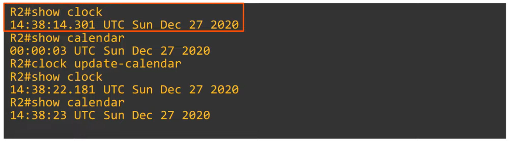

---

## Configuring The Time Zone

- You can configure the time zone with the `clock timezone` command

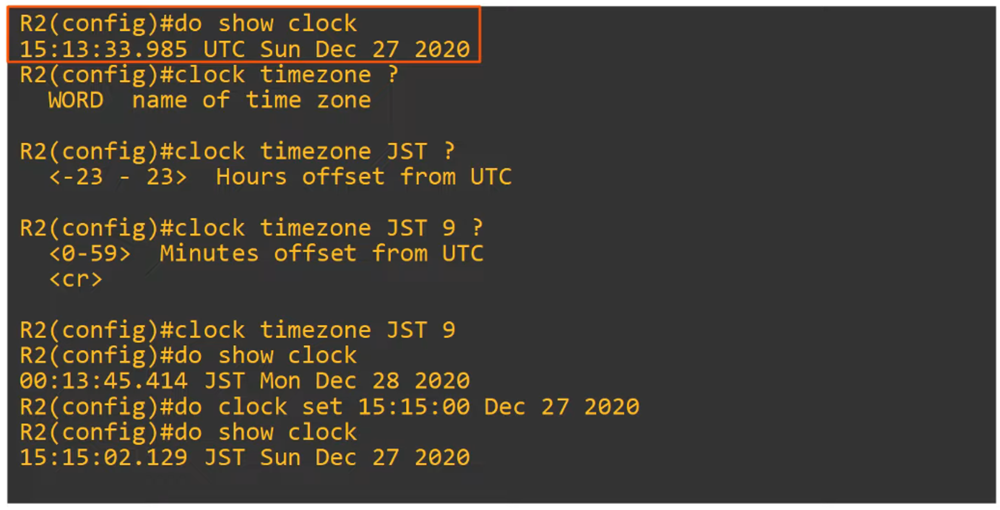

## Daylight Saving Time (Summer Time)

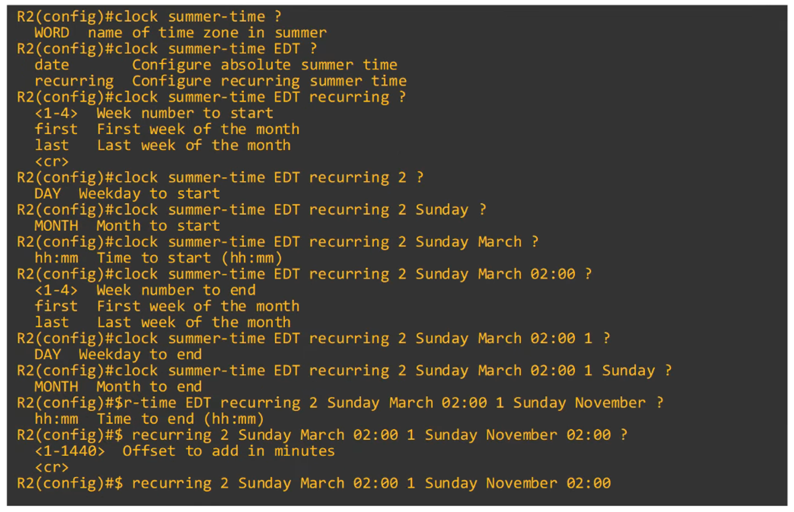

Full command :

`R1(config)# clock summer-time EDT recurring 2 Sunday March 02:00 1 Sunday November 02:00`

This covers the START of Daylight Savings and the end of Daylight Savings
---

## Summary of Commands

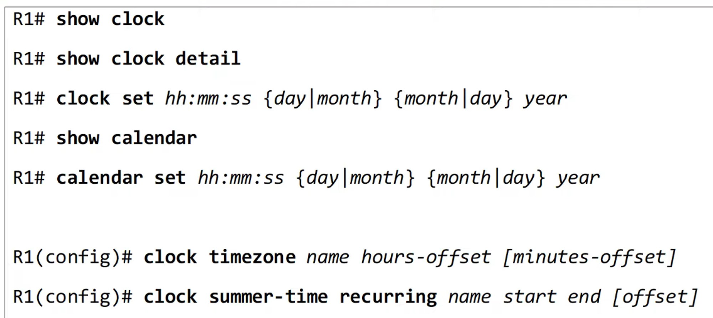

---

## NTP Basics

- Manually configuring the time on DEVICES is NOT Scalable
- The manually configured clocks will “drift”, resulting in inaccurate time
- NTP (Network Time Protocol) allows AUTOMATIC synchronization of TIME over a NETWORK
- NTP CLIENTS request the TIME from NTP SERVERS
- A DEVICE can be an NTP SERVER and an NTP CLIENT at the same time
- NTP allows accuracy of TIME with ~1 millisecond if the NTP SERVER is in the same LAN - OR within ~50 milliseconds if connecting to the NTP SERVER over a WAN / the INTERNET
- Some NTP SERVERS are ‘better’ than others. The ‘distance’ of an NTP SERVER from the original **reference clock** is called **stratum**

> **Note:** NTP uses UDP port 123 to communicate

## Reference Clock

- A REFERENCE CLOCK is usually a VERY accurate time device like an ATOMIC CLOCK or GPS CLOCK
- REFERENCE CLOCKS are **stratum 0** within the NTP hierarchy
- NTP SERVERS directly connected to REFERENCE CLOCKS are **stratum 1**

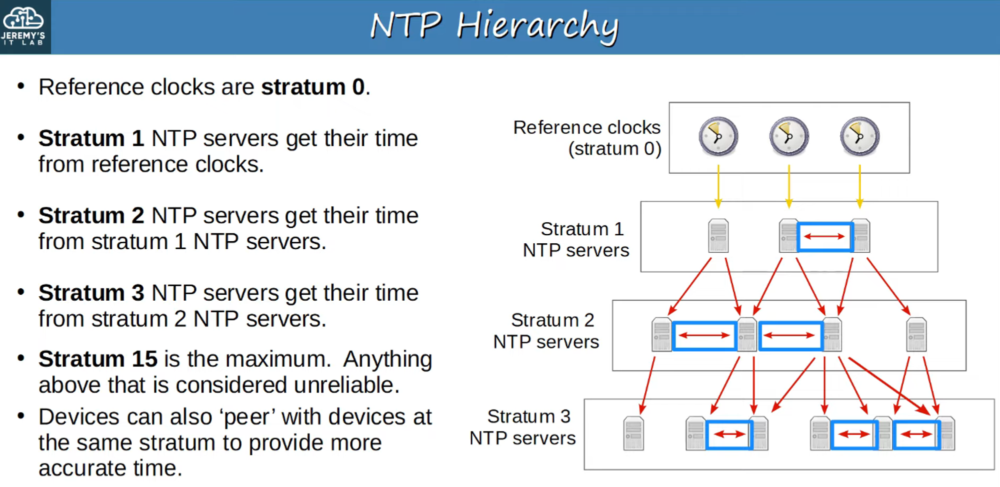

(Peering with Devices is called …)

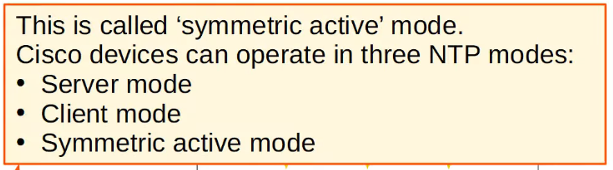

- An NTP CLIENT can SYNC to MULTIPLE NTP SERVERS

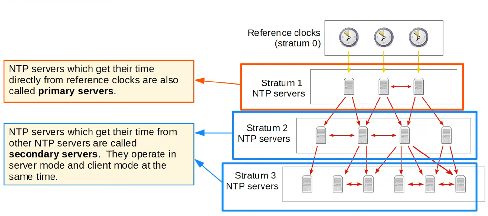

---

## NTP Configuration

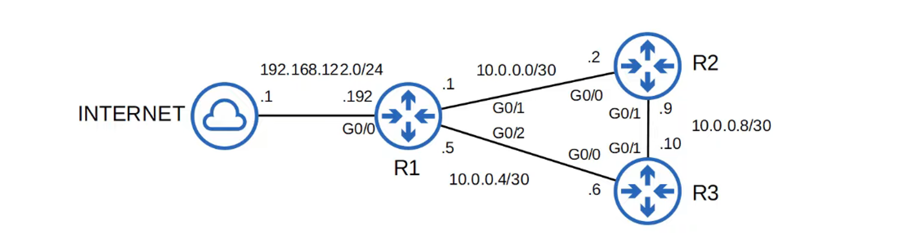

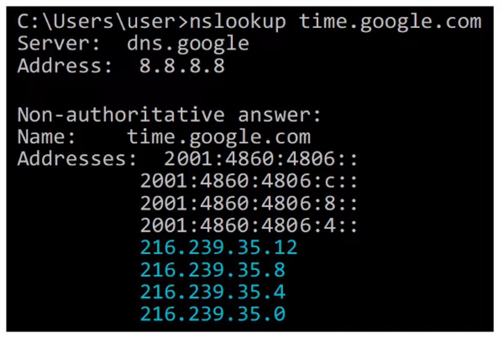

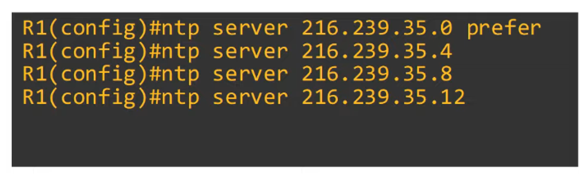

Using key argument “prefer” makes a given server the PREFERRED SERVER

(To show configuration servers)

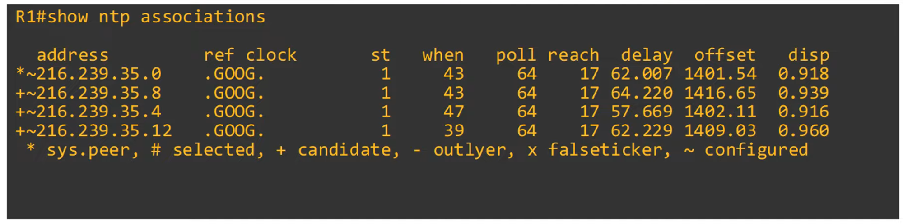

`sys.peer` = This is the SERVER that the current ROUTER (R1) is being synchronized to

`st` = Stratum Tier

(To show NTP Status)

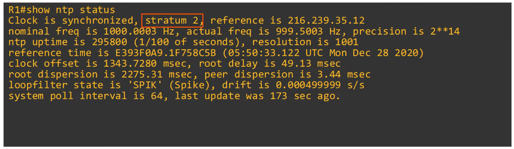

`stratum 2` because it’s synchronizing from Google (stratum 1)

(To show NTP clock details)

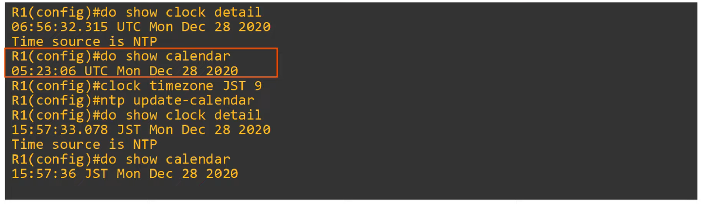

This command configures the ROUTER to update the HARDWARE CLOCK (Calendar) with the time learned via NTP

`R1(config)# ntp update-calendar` 

The HARDWARE CLOCK tracks the DATE and TIME on the DEVICE - even if it restarts, power is lost, etc.

When the SYSTEM is restarted, the HARDWARE CLOCK is used to INITIALIZE the SOFTWARE CLOCK

---

## Configure a Loopback Interface for an NTP Server

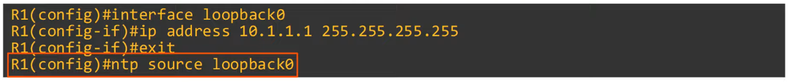

Why configure a LOOPBACK DEVICE on R1 for NTP ?

If one of R1’s ROUTER INTERFACES goes down, it will still be accessible via R3’s ROUTING path

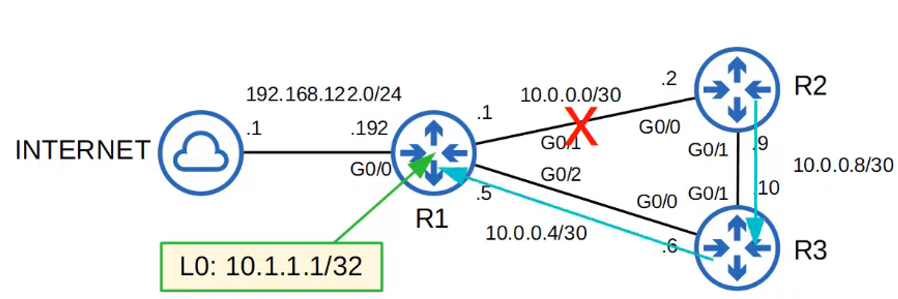

SET NTP SERVER for R2 using the LOOPBACK INTERFACE on R1

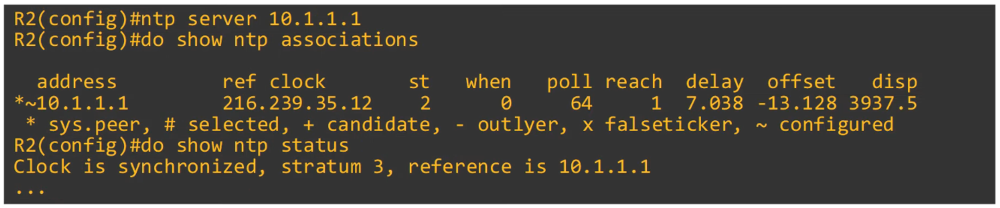

SETTING R3 NTP SOURCE SERVERS using R1 and R2

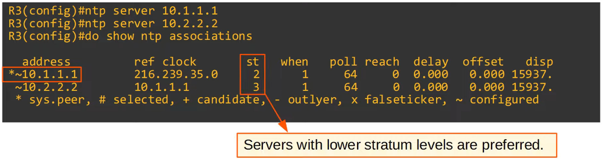

NOTE : R1 has PREFERENCE because it’s STRATUM TIER is HIGHER than R2s

---

## Configuring NTP Server Mode

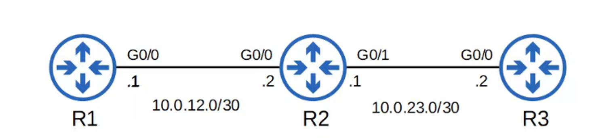

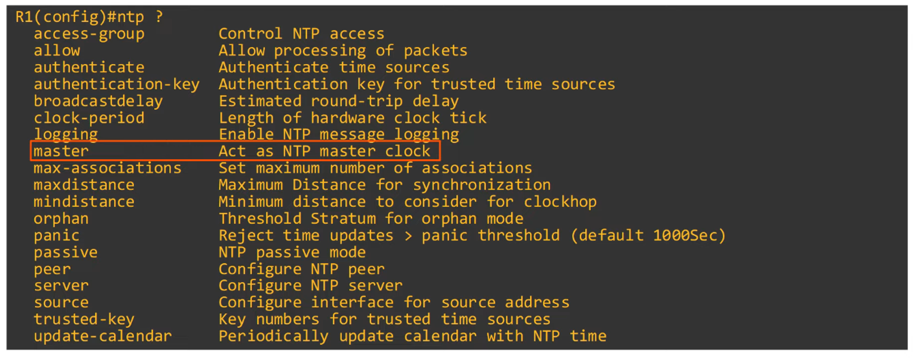

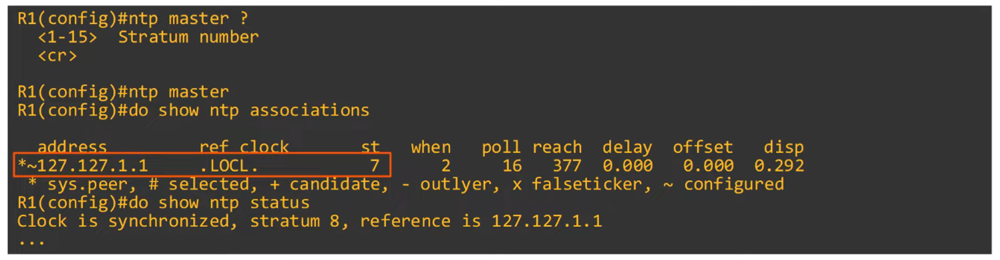

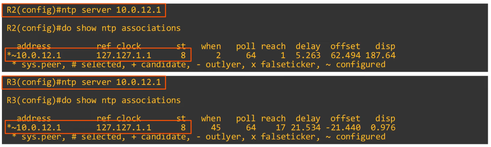

---

## Configuring NTP Symmetric Active Mode

Command to configure NTP SYMMETRIC MODE 
`R2(config)#ntp peer <peer ip address>`

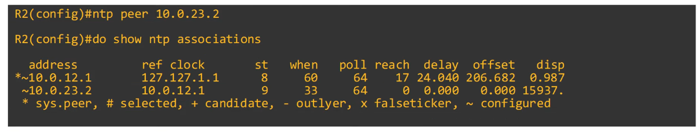

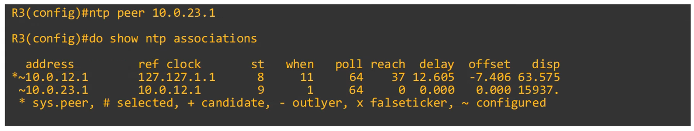

---

## Configure NTP Authentication

- NTP AUTHENTICATION can be configured, although it is OPTIONAL
- It allows NTP CLIENTS to ensure they only sync to the intended SERVERS
- **to Configure NTP Authentication:**
    - `ntp authenticate` (Enables NTP AUTHENTICATION)
    - `ntp authenticate-key *key-number* md5 *key*` (Create the NTP AUTHENTICATION Key(s))
    - `ntp trusted-key *key-number`* (Specify the Trusted Key(s))
    - `ntp server *ip-address* key *key-number`* (Specify which key to use for the server)

 

## Example Configurations

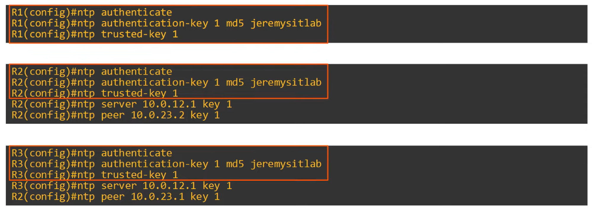

---

## NTP Command Review

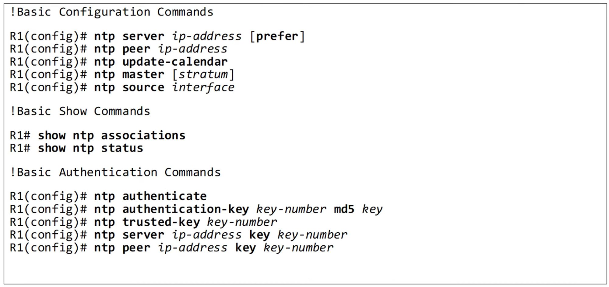
