# 28. OSPF : Part 3 (Igp: Link State)

## Loopback Interfaces

- A LOOPBACK INTERFACE is a virtual INTERFACE in the ROUTER
- It is ALWAYS UP/UP - unless you manually shut it down
- It is NOT dependent on a PHYSICAL INTERFACE
- So, it provides a consistent IP ADDRESS that can be used to REACH / IDENTIFY the ROUTER

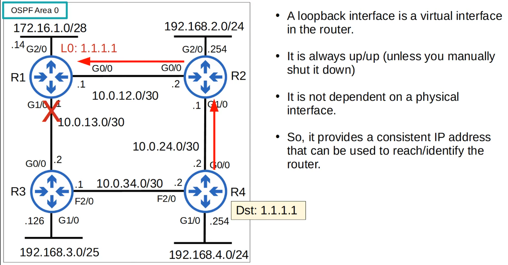

---

## OSPF Network Types

- The OSPF “NETWORK TYPE” refers to the TYPES of connection between OSPF neighbors (Ethernet, etc.)

- **There Are Three Main OSPF Network Types:**

- **Broadcast :**
    - Enabled by DEFAULT on **ETHERNET** and **FDDI** (Fiber Distributed Data Interfaces) INTERFACES

- **Point to Point :**
    - Enabled by DEFAULT on **PPP** (Point-to-Point) and **HDLC** (High-Level Data Link Control) INTERFACES

- **Non-Broadcast :**
    - Enabled by DEFAULT on **FRAME RELAY** and **X.25** INTERFACES

> **Note:** CCNA focuses on BROADCAST and POINT-TO-POINT types

---

## OSPF Broadcast Network Type

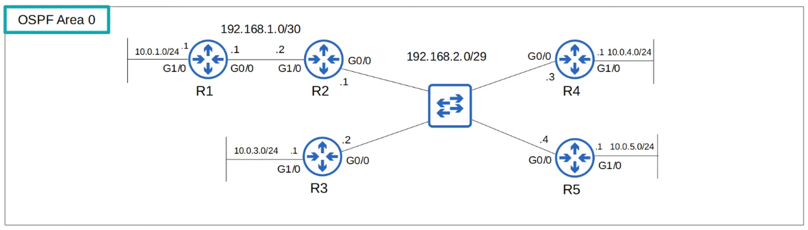

- Enabled on ETHERNET and FDDI interfaces by DEFAULT
- ROUTERS *dynamically discover* neighbors by SENDING / LISTENING for OSPF “Hello” messages using the multicast address 224.0.0.5
- A **DR (DESIGNATED ROUTER)** and **BDR (BACKUP DESIGNATION ROUTER)** must be elected on each subnet (only DR if there are no OSPF neighbors, ie: R1’s G1/0 INTERFACE)
- ROUTERS which aren’t the DR or BDR become a **DROther**

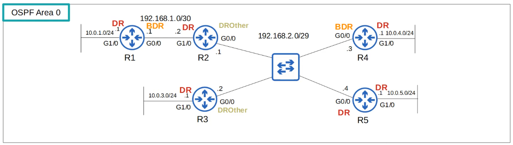

The DR / BDR election order of priority:

1) Highest OSPF INTERFACE PRIORITY

2) Highest OSPF ROUTER ID

“First Place” becomes the DR for the SUBNET

“Second Place” because the BDR

> **Note:** DEFAULT OSPF INTERFACE PRIORITY is “1” on ALL INTERFACES!

The command to change the OSPF PRIORITY of an INTERFACE is :

> **Note:** R2(config-if)# ip ospf priority <priority number>

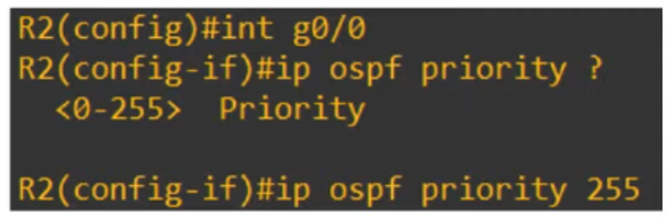

> **Note:** IF an OSPF PRIORITY is set to “0”, the ROUTER CANNOT be the DR / BDR for the SUBNET!

The DR / DBR ELECTION is “non-preemptive”.

Once the DR / DBR are selected, they will keep their role until OSPF is:

- Reset
- Interface fails
- Is shut down
- etc.

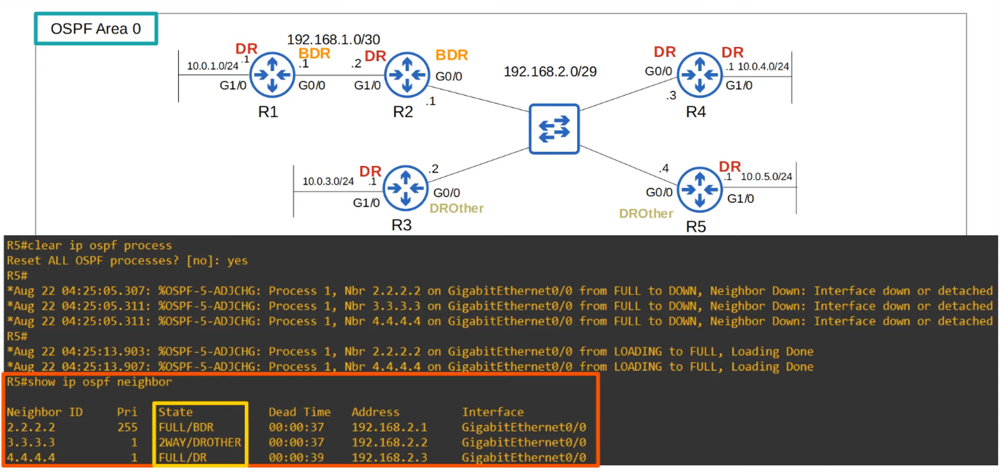

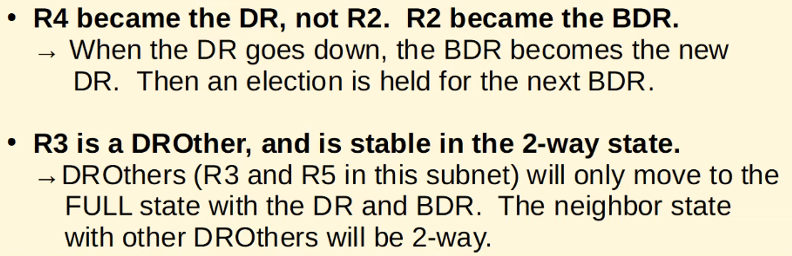

> **Note:** In the BROADCAST NETWORK TYPE, ROUTERS will only form a FULL OSPF ADJACENCY with the DR and the BDR of the SEGMENT!

Therefore, ROUTERS only exchange LSAs with the DR and BDR.

DROthers will NOT exchange LSAs with each other.

ALL ROUTERS will still have the same LSDB but THIS reduces the amount of LSAs flooding the NETWORK

> **Note:** MESSAGES to the DR / BDR are MULTICAST to 224.0.0.6

The DR and BDR will form a FULL ADJACENCY with ALL ROUTERS in the SUBNET

DROthers will form a FULL ADJACENCY ONLY with the DR / BDR !

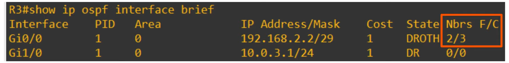

---

## OSPF Point-to-Point Network Type

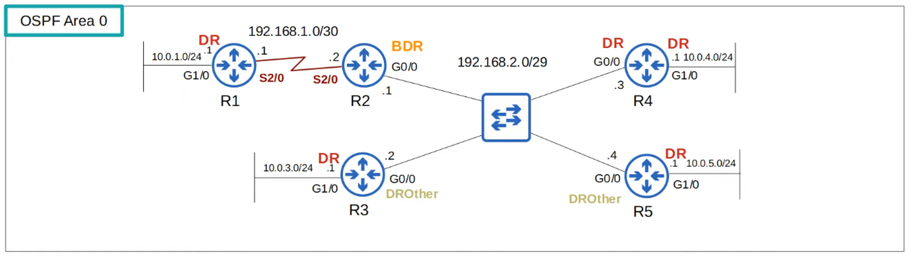

- ENABLED on **SERIAL** INTERFACES using the **PPP** and **HDLC** encapsulations, by DEFAULT
- ROUTERS dynamically discover neighbors by SENDING / LISTENING for OSPF “Hello” messages using the multicast address 224.0.0.5
- A DR and BDR are NOT elected
- These ENCAPSULATIONS are used for “Point-To-Point” connections
    - Therefore, there is no point in electing  a DR and DBR
    - The TWO ROUTERS will form a FULL ADJACENCY with each other

---

## (Aside)

## Serial Interfaces

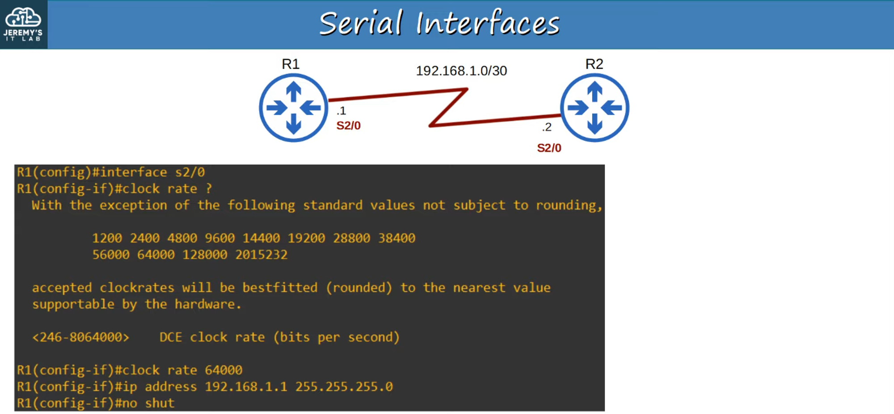

- One side of SERIAL CONNECTION functions as DCE (Data Communications Equipment)
- The OTHER side functions as DTE (Data Terminal Equipment)
- ONLY the DCE side needs to specify the *clock rate* (speed) of the connection

ETHERNET INTERFACES use the “speed” command to configure the operating speed.

SERIAL INTERFACES use the “clock rate” command

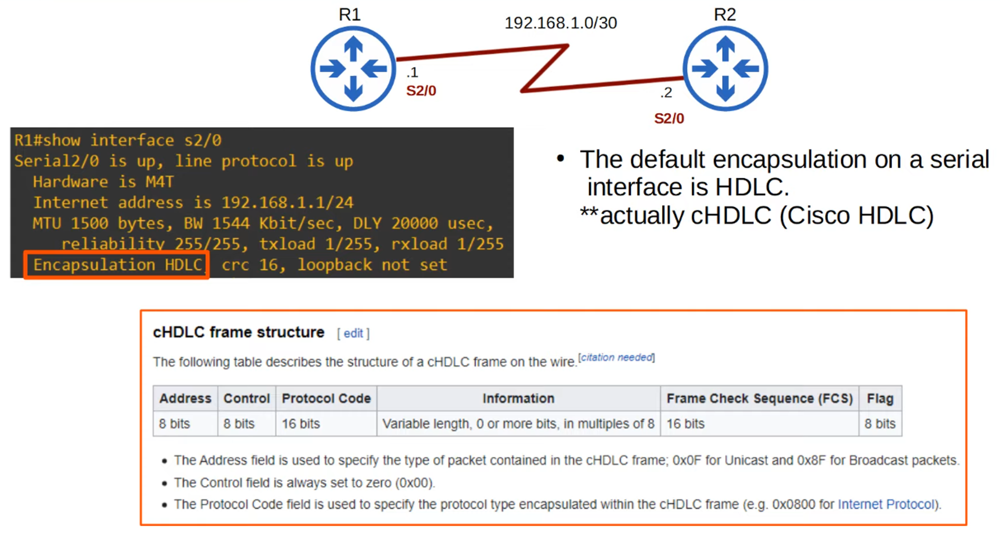

If you change the ENCAPSULATION, it must MATCH on BOTH ENDS or the INTERFACE will go down.

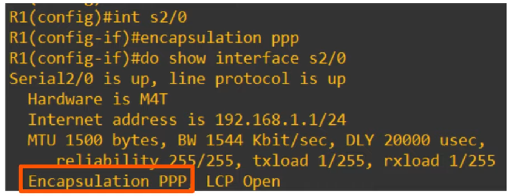

R1 and R2 sharing the SAME Encapsulation Type 

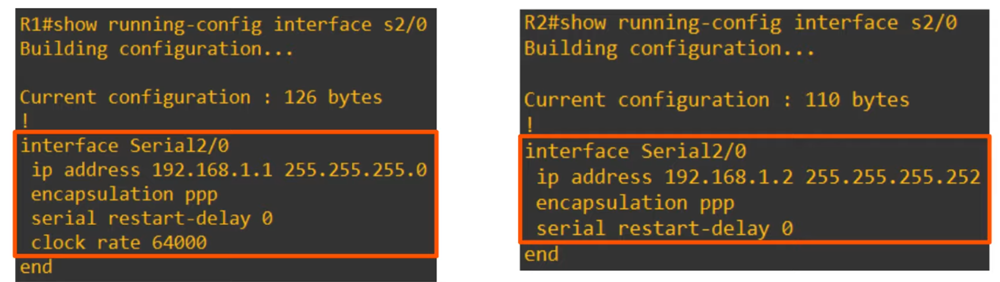

## Serial Interfaces Summary

- The DEFAULT encapsulation is HDLC
- **You Can Configure Ppp Encapsulation With This Command:**
    
    <aside>
> **Note:** R1(config-if)# **encapsulation ppp**
    
    </aside>
    
- One side is DCE, other side is DTE
- **Identify Which Side Is Dce / Dte :**
    
    <aside>
> **Note:** R1# **show controllers** *interface-id*
    
    </aside>
    
- **You Must Configure The Clock Rate On The Dce Side:**
    
    <aside>
> **Note:** R1(config-if)# clock rate *bits-per-second*
    
    </aside>
    

---

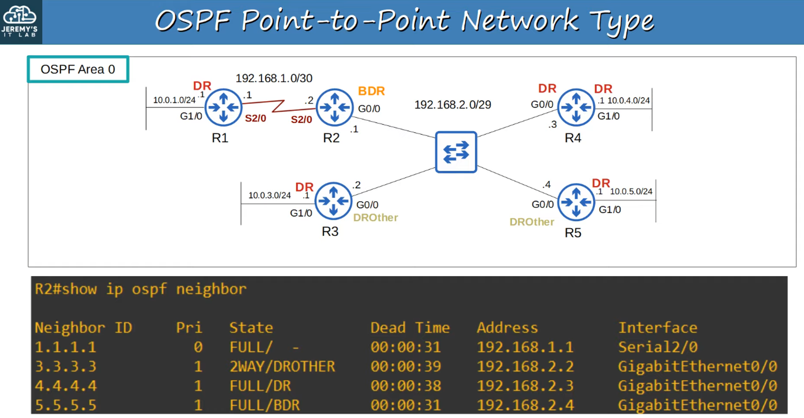

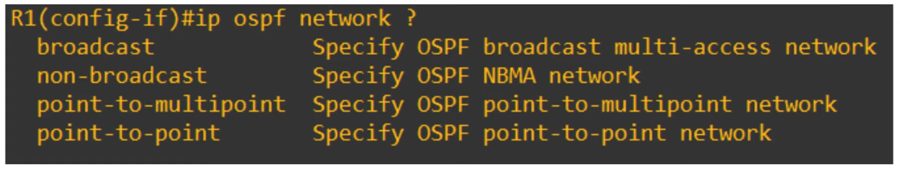

- **You Can Configure The OSPF Network Type On an Interface With :**

> **Note:** R1(config-if)# ip ospf network <network type>

For example, if TWO ROUTES are directly connected with an ETHERNET link, there is no need for a DR / DBR. You can configure the POINT-TO-POINT NETWORK type in this case

NOTE: Not all NETWORK TYPES work on ALL LINK TYPES (for example, a serial link cannot use the BROADCAST NETWORK type)

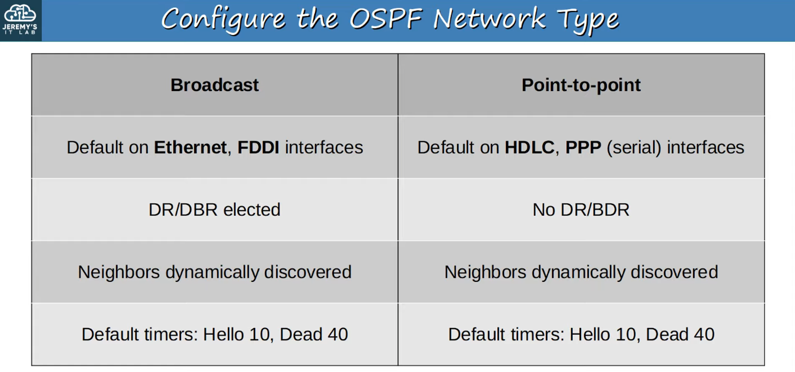

> **Note:** NON-BROADCAST NETWORK type Default Timers : Hello 30, Dead 120

---

## OSPF Neighbour / Adjacency Requirements

### **1) Area Number Must Match**

2) INTERFACES must be in the SAME SUBNET

3) OSPF PROCESS must not be **SHUTDOWN**

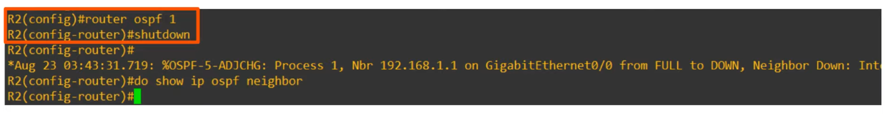

4) OSPF ROUTER ID must be unique

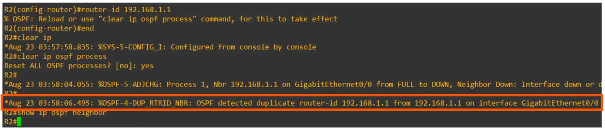

5) HELLO and DEAD Timers must MATCH

6) AUTHENTICATION settings must MATCH

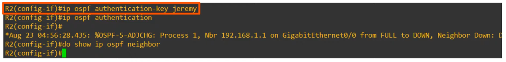

## *** Special Requirements *** 

7) IP MTU settings must MATCH

- IP MTU : Maximum size of an IP Packet that can be sent from an INTERFACE
- If the settings DO NOT match, can still become OSPF Neighbors but OSPF WILL NOT operated properly

8) OSPF NETWORK TYPE must match

- will appear to be working but NEIGHBOR won’t appear in ROUTING information

---

## OSPF Lsa Types

- The OSPF LSDB is made up of LSAs
- **There Are 11 Types of Lsa But There Are Only 3 You Should Be Aware of for The CCNA:**
    - Type 1 (Router LSA)
    - Type 2 (Network LSA)
    - Type 5 (AS External LSA)

## Type 1 (Router Lsa)

- Every OSPF ROUTER generates this type of LSA
- It identifies the ROUTER using it’s ROUTER ID
- It also lists NETWORKS attached to the ROUTER’s OSPF-Activated INTERFACES

TYPE 2 (Network LSA)

- Generated by the DR of EACH “multi-access” NETWORK (ie: the BROADCAST network type)
- Lists the ROUTERS which are attached to the multi-access NETWORK

TYPE 5 (AS-External LSA)

- Generated by ASBRs to describe ROUTES to DESTINATIONS outside of the AS (OSPF Domain)
