# 47. QoS (Quality of Service) : Part 2

## Classification / Marking

- The purpose of QoS is to give certain kinds of NETWORK TRAFFIC priority over other during congestion
- CLASSIFICATION organizes network TRAFFIC (PACKETS) into TRAFFIC CLASSES (CATEGORIES)
- CLASSIFICATION is fundamental to QoS.
    - To give PRIORITY to certain types of TRAFFIC, you have to IDENTIFY which types of TRAFFIC to give PRIORITY to.
- There are MANY methods of CLASSIFYING TRAFFIC
    - An ACL : TRAFFIC which is permitted by the ACL will be given certain TREATMENT, other TRAFFIC will not
    - NBAR (Network Based Application Recognition) performs a *DEEP PACKET INSPECTION,* looking beyond the LAYER 3 and LAYER 4 information up to LAYER 7 to identify the specific kinds of TRAFFIC
    - In the LAYER 2 and LAYER 3 HEADERS there are specific FIELDS used for this purpose
- The PCP (PRIORITY CODE POINT) FIELD of the 802.1Q Tag (in the ETHERNET HEADER) can be used to identify HIGH / LOW PRIORITY TRAFFIC
    - ** ONLY when there is a dot1q tag!
- The DSCP (DIFFERENTIATED SERVICES CODE POINT) FIELD of the IP HEADER can also be used to identify HIGH / LOW PRIORITY TRAFFIC

---

## Pcp / Cos

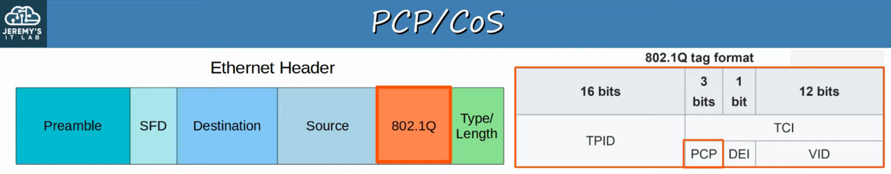

- PCP is also known as CoS (CLASS OF SERVICE)
- It’s use is defined by IEEE 802.1p
- 3 bits = 8 possible values (2^3 = 8)

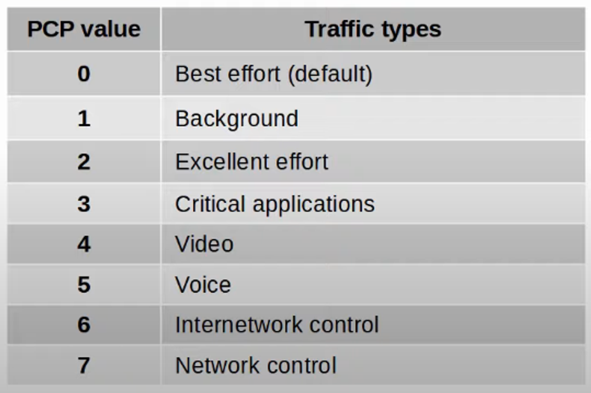

- **Pcp Value 0:**
    - “BEST EFFORT” DELIVERY means there is no guarantee that data is delivered or that it meets ANY QoS Standard. This is REGULAR TRAFFIC - NOT HIGH PRIORITY

- **Pcp Value 3 and 5:**
    - IP PHONES MARK call signaling TRAFFIC (used to establish calls) as PCP3
        - They MARK the actual VOICE TRAFFIC as PCP5

- Because PCP is found in the dot1q header, it can only be used over the following connections:
- Trunk Links
    - ACCESS LINKS with a VOICE VLAN
    
- In the diagram below, TRAFFIC between R1 and R2, or between R2 and EXTERNAL DESTINATIONS will not have a dot1q tag. So, traffic over those links PCP cannot be marked with a PCP value.

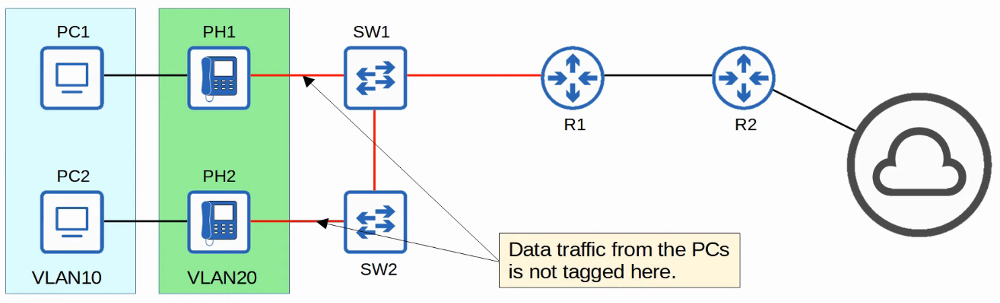

---

## The IP Tos Byte

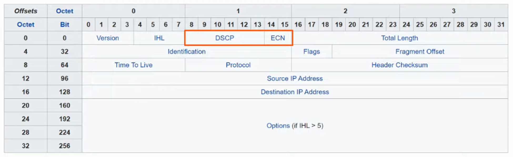

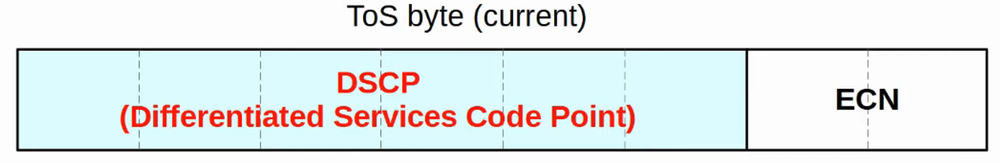

(6 bits for DSCP and 2 bits for ECN)

---

## IP Precedence (Old)

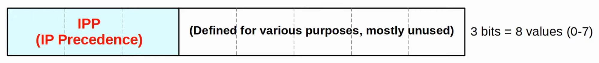

- **Standard Ipp Markings Are Similar to Pcp:**
    - 6 and 7 are reserved to ‘network control traffic’ (ie: OSPF Messages between ROUTERS)
- 5 = Voice
- 4 = Video
- 3 = Voice Signalling
- 0 = Best Effort
- With 6 and 7 reserved, 6 possible values remain
- Although 6 values is sufficient for many NETWORKS, the QoS REQUIREMENTS of some NETWORKS demand more flexibility

---

## Dscp (Current)

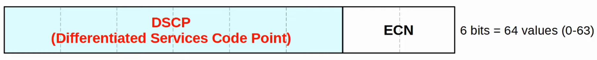

- RFC 2474 (1998) defines the DSCP field, and other ‘DiffServ’ RFCs elaborate on its use
- With IPP updated to DSCP, new STANDARD MARKINGS had to be decided on
    - **By Having Generally Agreed Upon Standard Markings for Different Kinds of Traffic:**
        - QoS DESIGN and IMPLEMENTATION is simplified.
        - QoS works better between ISPs and ENTERPRISES
        - etc.

- **You Should Be Aware of The Following Standard Markings:**
    - DEFAULT FORWARDING (DF) - Best Effort TRAFFIC
    - EXPEDITED FORWARDING (EF) - Low Loss / Latency / Jitter TRAFFIC (usually voice)
    - ASSURED FORWARDING (AF) - A set of 12 STANDARD VALUES
    - CLASS SELECTOR (CS) - A set of 8 STANDARD VALUES, provides backward compatibility with IPP

---

## Df / Ef

## Default Forwarding (Df)

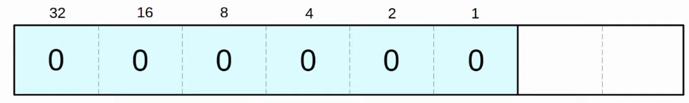

- Used for BEST EFFORT TRAFFIC
- The DSCP marking for DF is 0

## Expedited Forwarding (Ef)

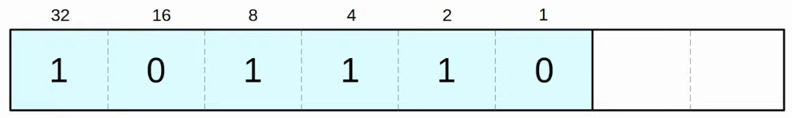

- EF is used for TRAFFIC that requires Low Loss / Latency / Jitter
- The DSCP marking for EF is 46

---

## Assured Forwarding (Af)

- Defines FOUR TRAFFIC CLASSES
- ALL PACKETS in a CLASS have the same PRIORITY
- Within each CLASS, there are THREE LEVELS of DROP PRECEDENCE
    - HIGHER DROP PRECEDENCE = More likely to DROP the PACKET during CONGESTION
    

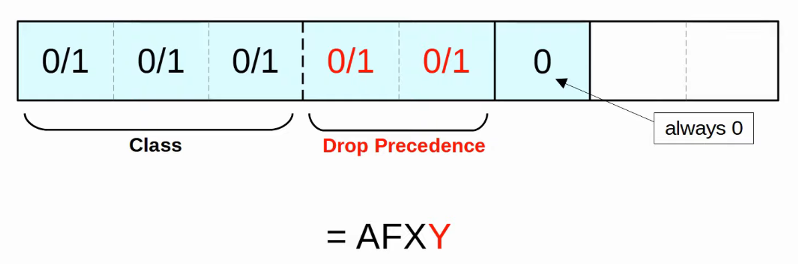

### **Examples**

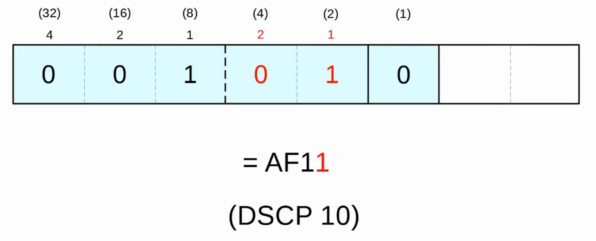

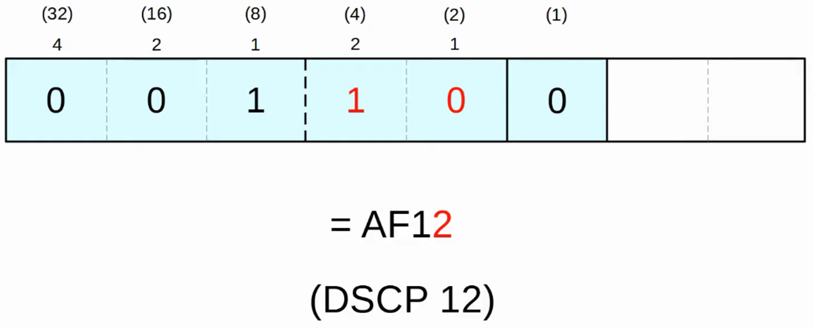

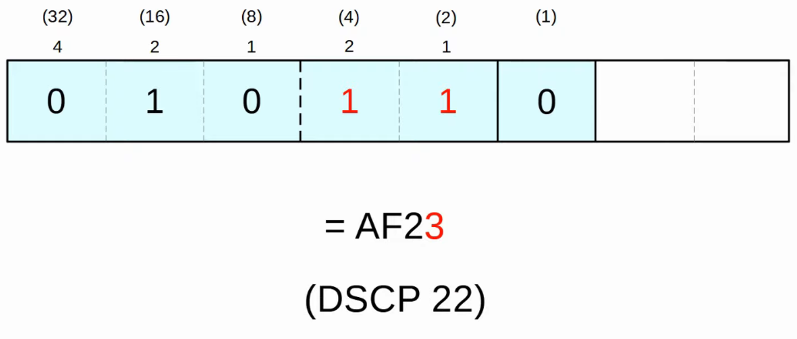

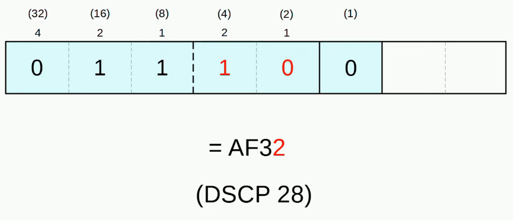

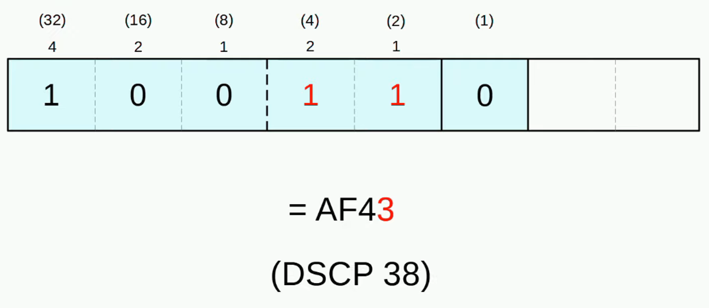

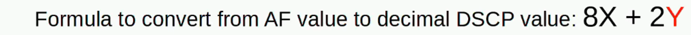

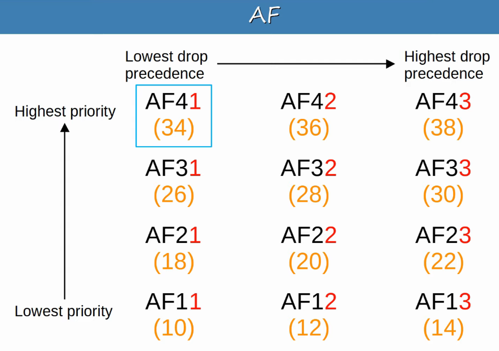

- AF41 gets the BEST TREATMENT (Highest Priority / Lowest Drop)
- AF13 gets the WORST TREATMENT (Lowest Priority / Highest Drop)

---

## Class Selector (Cs)

- Defines EIGHT DSCP values for backward compatibility with IPP
- The THREE BITS that were added for DSCP are set to 0, and the original IPP bits are used to make 8 values

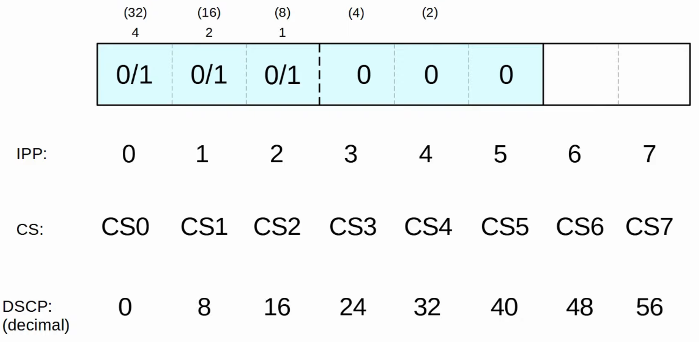

---

## Rfc 4954

- RFC 4954 was developed with help of Cisco to bring ALL of these VALUES together and STANDARDIZE their use

- The RFC offers MANY specific recommendations, but here are a few KEY ones:
- Voice Traffic : Ef
    - INTERACTIVE VIDEO : AF4x
    - STREAMING VIDEO : AF3x
    - HIGH PRIORITY DATA : AF2x
- Best Effort : Df

---

## Trust Boundaries

- The TRUST BOUNDARY of a NETWORK defines where the DEVICE TRUST / DON’T TRUST the QoS MARKINGS of received messages
- **If The Markings Are Trusted:**
    - DEVICE will forward the message without changing the MARKINGS
- **If The Markings Are Not Trusted:**
    - DEVICE will change the MARKINGS according to configured POLICY

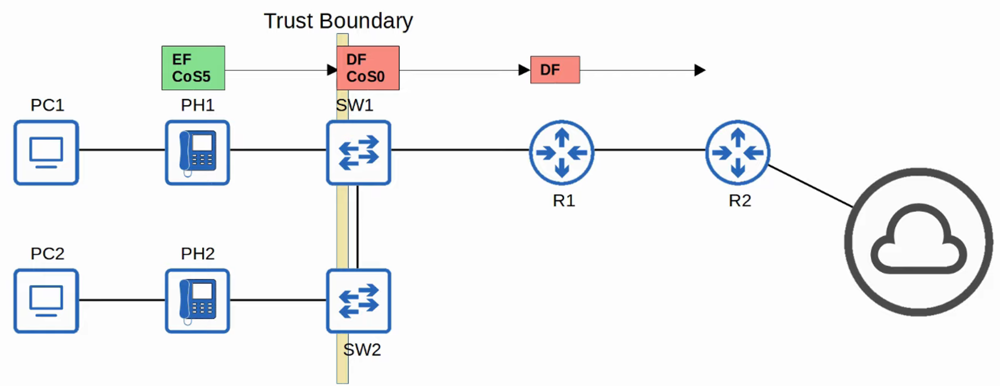

- If an IP PHONE is connected to the SWITCH PORT, it is RECOMMENDED to move the TRUST BOUNDARY to the IP PHONES
- This is done via CONFIGURATION on the SWITCH PORT connected to the IP PHONE
- If a user MARKS their PC’s TRAFFIC with a HIGH PRIORITY, the MARKING will be CHANGED (not trusted)

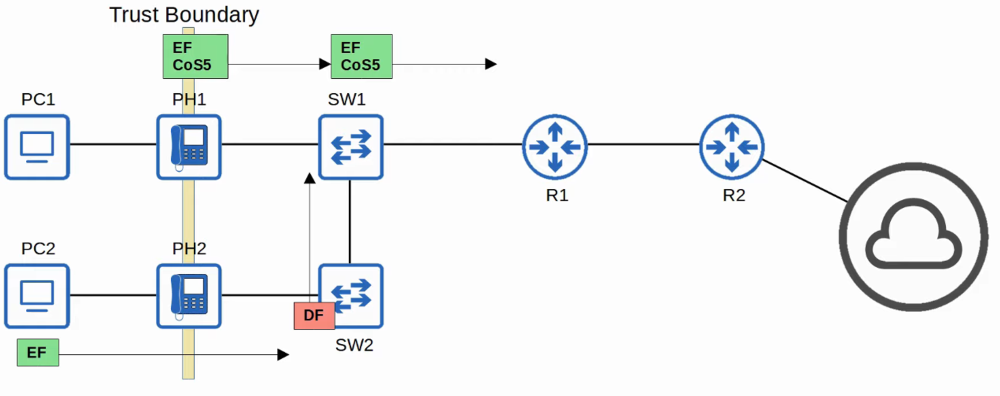

---

## Queuing / Congestion Management

- When a NETWORK DEVICE receives TRAFFIC at a FASTER PACE than it can FORWARD out of the appropriate INTERACE, PACKETS are placed in that INTERFACE’S QUEUE as they wait to be FORWARDED
- When a QUEUE becomes FULL, PACKETS that don’t FIT in the QUEUE are dropped (Tail Drop)
- RED and WRED DROP PACKETS early to avoid TAIL DROP

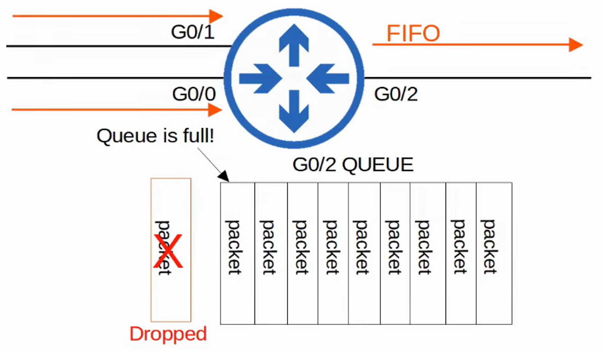

- An essential part of QoS is the use of MULTIPLE QUEUES
    - This is where CLASSIFICATION plays a role.
    - DEVICE can match TRAFFIC based on various factors (like DSCP MARKINGS in the IP HEADER) and then place it in the appropriate QUEUE

- HOWEVER, the DEVICE is only able to forward one FRAME out of an INTERFACE at once SO a *SCHEDULER*, is used to decide which QUEUE TRAFFIC is FORWARDED from the next
    - *PRIORITZATION* allows the SCHEDULER to give certain QUEUES more PRIORITY than others

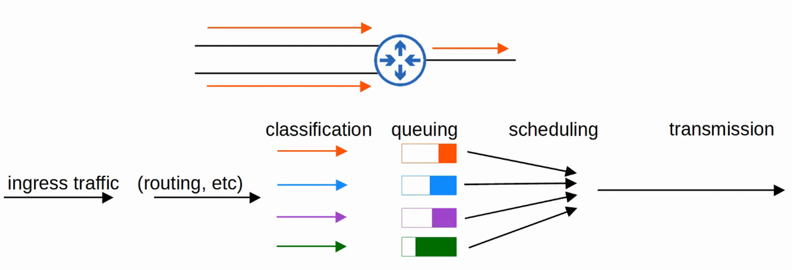

- A COMMON scheduling method is *WEIGHTED ROUND-ROBIN*
- **Round-Robin:**
        - PACKETS taken from each QUEUE in order, cyclically
- **Weighted:**
        - More DATA taken from HIGH PRORITY QUEUES each time the SCHEDULER reaches that QUEUE

---

- CBWFQ (CLASS BASED WEIGHED FAIR QUEUING)
    - Popular method of SCHEDULING
    - Uses WEIGHTED ROUND-ROBIN SCHEDULER while guaranteeing each QUEUE a certain PERCENTAGE of the INTERFACE’S bandwidth during CONGESTION
    

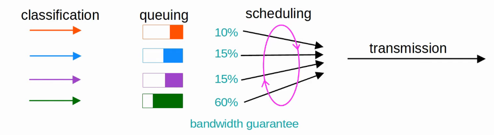

- ROUND-ROBIN SCHEDULING is NOT IDEAL for VOICE / VIDEO TRAFFIC
    - Even if VOICE / VIDEO TRAFFIC receives a guaranteed MINIMUM amount of BANDWIDTH, ROUND-ROBIN can add DELAY and JITTER because even the HIGH PRIORITY QUEUES have to wait their turn in the SCHEDULER

---

- LLQ (LOW LATENCY QUEUING)
    - Designates ONE (or more) QUEUES as *strict priority queues*
    - This means that if there is TRAFFIC in the QUEUE, the SCHEDULER will ALWAYS take the next PACKET from that QUEUE until it is EMPTY
    - This is VERY EFFECTIVE for reducing the DELAY and JITTER of VOICE / VIDEO TRAFFIC
    - HOWEVER, LLQ has a DOWNSIDE of potentially starving other QUEUES if there is always TRAFFIC in the DESIGNATED *STRICT PRIORITY QUEUE*
        - POLICING can control the AMOUNT of TRAFFIC allowed in the *STRICT PRIORITY QUEUE* so that it can’t take all of the link’s BANDWIDTH
    

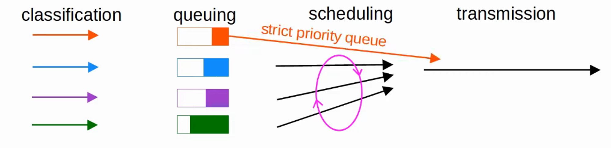

 

---

## Shaping / Policing

- TRAFFIC SHAPING and POLICING are both used to control the RATE of TRAFFIC
- SHAPING
    - Buffers TRAFFIC in a QUEUE if the TRAFFIC RATE goes over the CONFIGURED RATE

- POLICING
    - DROPS TRAFFIC if the TRAFFIC RATE goes over the CONFIGURED RATE
        - POLICING also has the option of RE-MARKING the TRAFFIC, instead of DROPPING
    - “BURST” TRAFFIC over the CONFIGURED RATE is allowed for a short period of time
    - This accommodates DATA APPLICATIONS which typically are “bursty” in nature (ie: not constant stream)
    - The amount of BURST TRAFFIC allowed is configurable
    
- In BOTH cases, CLASSIFICATION can be used to ALLOW for different RATES for different KINDS of TRAFFIC
- WHY would you want to LIMIT the RATE that TRAFFIC is SENT / RECEIVED ?

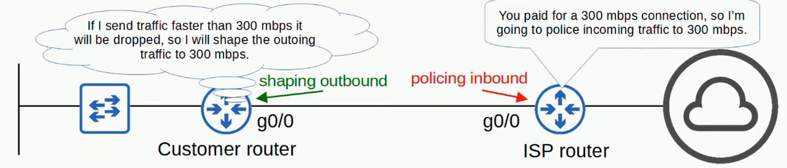
