# 25. Rip and Eigrp (Igp : Dynamic Vector)

## Routing Information Protocol (Rip)

- Routing Information Protocol (Industry Standard)
- is a DISTANCE VECTOR IGP
    - uses Routing-By-Rumor logic to learn/share routes
- Uses HOP COUNT as it’s METRIC (One Router = One Hop)  Bandwidth is irrelevant
- MAX HOP COUNT is 15 (anything more is considered unreachable)
- **Has Three Versions:**
    - RIPv1 and RIPv2; used for IPv4
    - RIPng (RIP Next Generation) used for IPv6
- **Uses Two Message Types:**
- **Request :**
        - To ask RIP-ENABLED neighbour ROUTERS to send their ROUTING TABLE
- **Response:**
        - To SEND the LOCAL router’s ROUTING TABLE to neighbouring ROUTERS

By DEFAULT, RIP-Enabled ROUTERS will share their ROUTING TABLE every 30 seconds

## Ripv1 and Ripv2

## Ripv1:

- Only advertises *classful addresses* (Class A, Class B, Class C)
- Doesn’t support VLSM, CIDR
- Doesn’t include SUBNET MASK information in ADVERTISEMENTS (RESPONSE messages)
    - **Example:**
        - 10.1.1.0/24 will become 10.0.0.0 (Class A Address, so assumed to be /8)
        - 172.16.192.0/18 will become 172.16.0.0 (Class B Address, so assumed to be /16)
        - 192.168.1.40/30 will become 172.168.1.0 (Class C Address, so assumed to be /24)
- Messages are BROADCAST to 255.255.255.255

## Ripv2:

- Supports VLSM, CIDR
- Includes SUBNET MASK information in ADVERTISEMENTS
- Messages are **multicast** to 224.0.0.9
    - Broadcast Messages are delivered to ALL devices on the local network
    - Multicast Messages are delivered only to devices to have joined that specific ***multicast group***

---

## Configuring Rip

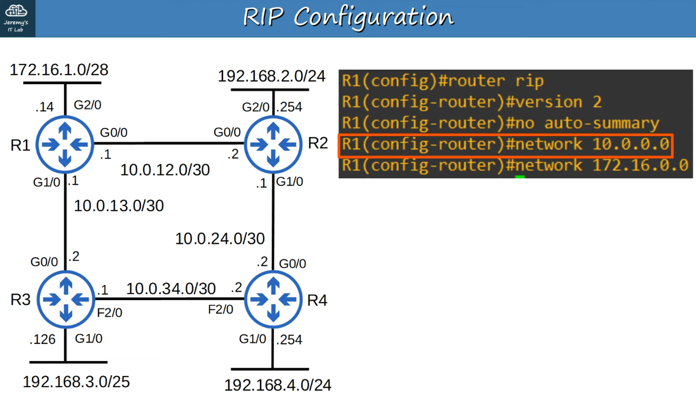

The **“network”** command tells the router to:

- Look for INTERFACES with an IP ADDRESS that is in the specific RANGE
- ACTIVATES RIP on the INTERFACES that fall in the RANGE
- Form ADJACENCIES with connected RIP neighbors
- Advertise the **NETWORK PREFIX of the INTERFACE** (NOT the prefix in the “network” command)

The OSPF and EIGRP **“network”** commands operate in the same way

Because the RIP “network” command is CLASSFUL. It will automatically convert to CLASSFUL networks

- 10.0.0.0 is assumed to be 10.0.0.0/8
- R1 will look for ANY INTERFACES with an IP ADDRESS that matches 10.0.0.0/8 (because it is /8 it only needs to match the FIRST 8 bits)
- 10.0.12.1 and 10.0.13.1 both match SO RIP is ACTIVATED on G0/0 and G0/1
- R1 then forms ADJACENCIES with its neighbors R2 and R3
- R1 ADVERTISES 10.0.12.0/30 and 10.0.13.0/30 (NOT 10.0.0.0/8) to it’s RIP neighbors

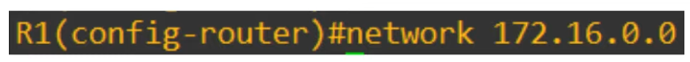

- Because the “network” command is CLASSFUL, 172.16.0.0 is assumed to be 172.16.0.0/16
- R1 will look for ANY INTERFACES that match 172.16.0.0/16
- 172.16.1.14 matches, so R1 will ACTIVATE RIP on G2/0
- There are NO RIP neighbors connected to G2/0 so no NEW ADJACENCIES are formed
    - Although there are NO RIP neighbors, R1 will still send ADVERTISEMENTS out of G2/0.
    - This is unnecessary traffic, so G2/0 should be configured as a **passive interface**

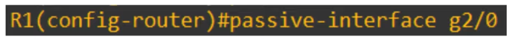

- the “passive-interface” command tells the ROUTER to stop sending RIP advertisements out of the specified interface (G2/0)
- However, the ROUTER will continue to ADVERTISE the network prefix of the interface (172.16.1.0/28) to it’s RIP neighbors (R2, R3)
- You should ALWAYS use this command on INTERFACES which don’t have any RIP neighbors
- EIGRP and OSPF both have the same passive INTERFACE functionality, using the same command.

---

## How to Advertise a Default Route Into Rip

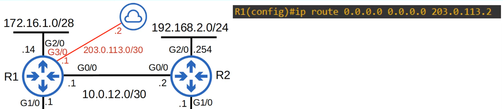

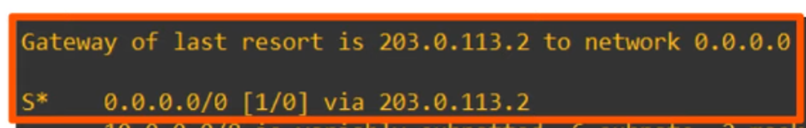

To SHARE this DEFAULT ROUTE with R1’s RIP neighbors, using this command:

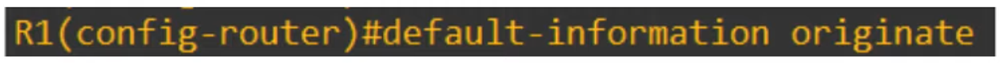

RIP doesn’t care about interface AD cost (RIP cost is 120), only “hops”.

Since both have an equal number of “hops”, both paths appear in the DEFAULT ROUTE (Gateway of Last Resort)

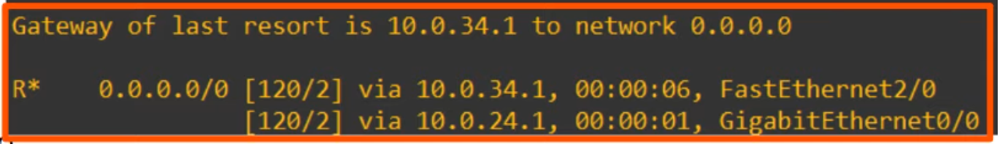

---

“show ip protocols” (for RIP)

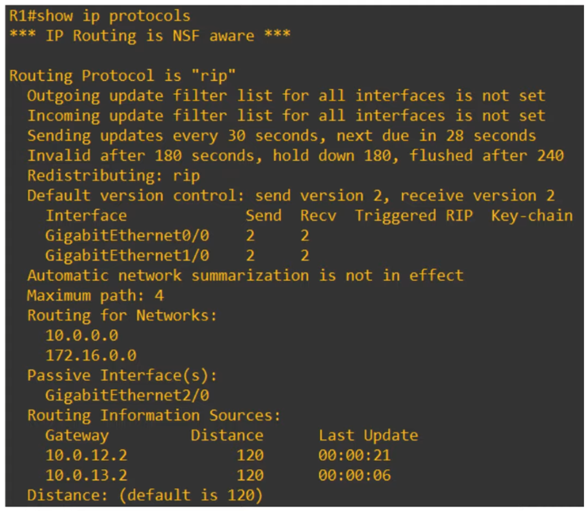

“Maximum path: 4” is the DEFAULT but can be changed with this command:

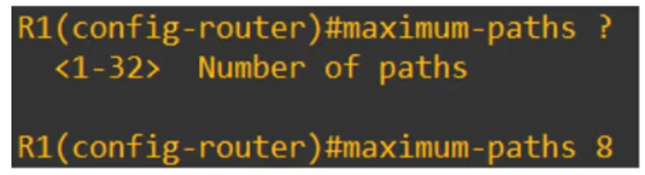

“Distance” (AD) can be changed with this command (DEFAULT is 120)

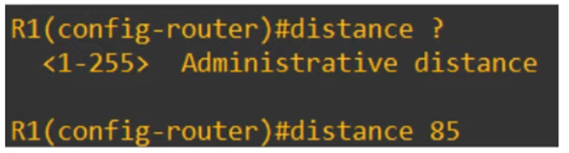

---

## Enhanced Interior Gateway Routing Protocol (Eigrp)

- Enhanced Interior Gateway Routing Protocol
- is a DISTANCE VECTOR IGP
- Was Cisco proprietary, but Cisco has now published it openly so other vendor can implement it on their equipment
- Considered an “advanced” / “hybrid” DISTANCE VECTOR ROUTING PROTOCOL
- Much faster than RIP in reacting to changes in the NETWORK
- Does NOT have the 15 ‘hop count’ limit of RIP
- Sends messages using MULTICAST ADDRESS **224.0.0.10 (Memorize this number)**
- Is the ONLY IGP that can perform **unequal**-cost load-balancing (by DEFAULT, it performs ECMP load-balancing over 4 paths like RIP)

---

## Configuration of Eigrp

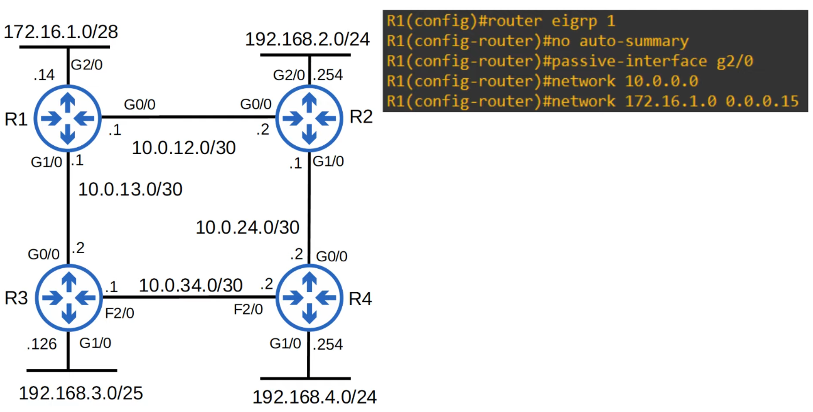

“router eigrp <Autonomous System number>”

- The AS (Autonomous System) number MUST MATCH between ROUTERS or they will NOT form an ADJACENCY and share ROUTE information
- Auto-summary might be ENABLED or DISABLED by DEFAULT; depending on the ROUTER/IOS version. If ENABLED, DISABLE it.
- The **“network”** command will assume a CLASSFUL ADDRESS, if you don’t specify the SUBNET MASK
- EIGRP uses a *wildcard mask* instead of a regular subnet mask

A WILDCARD MASK is an “inverted” SUBNET MASK

- All 1’s in the SUBNET MASK are 0 in the equivalent WILDCARD MASK.
- All 0s in the SUBNET MASK are 1 in the equivalent WILDCARD MASK.

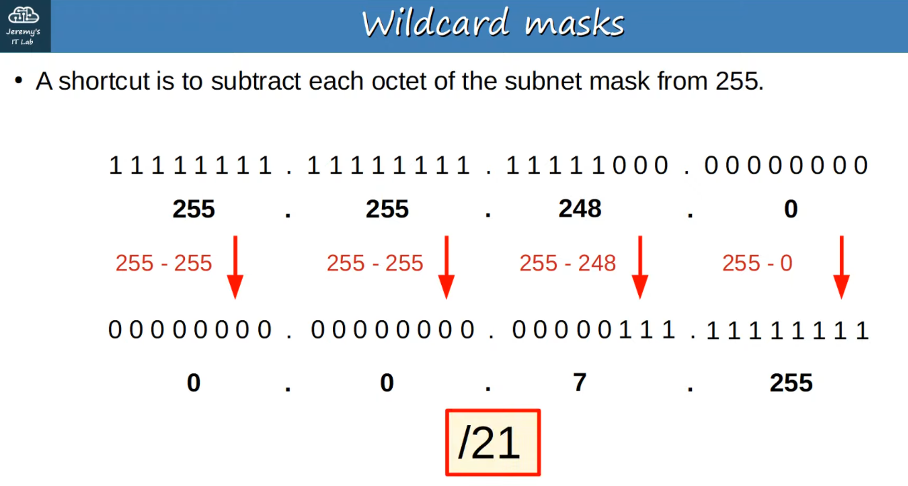

## “0” in The Wildcard Mask = Bits Must Match !

“1” in the WILDCARD MASK = Do not have to match

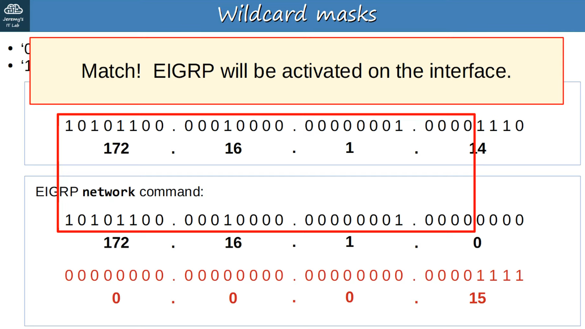

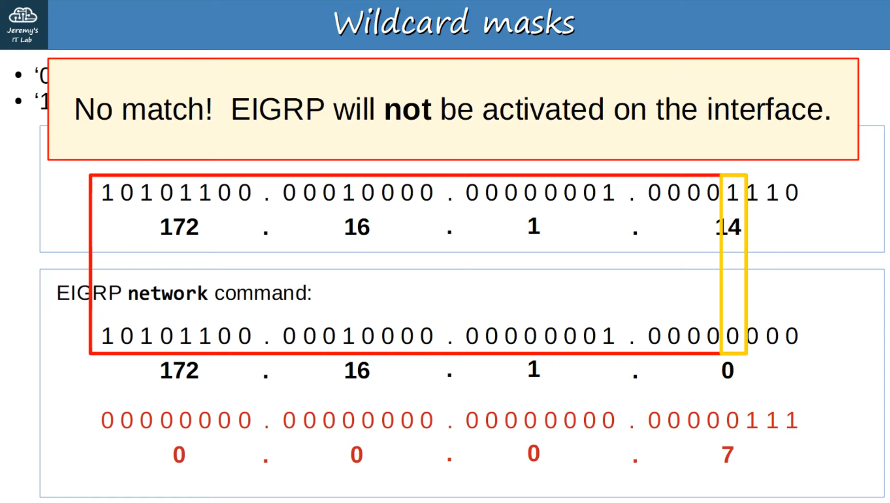

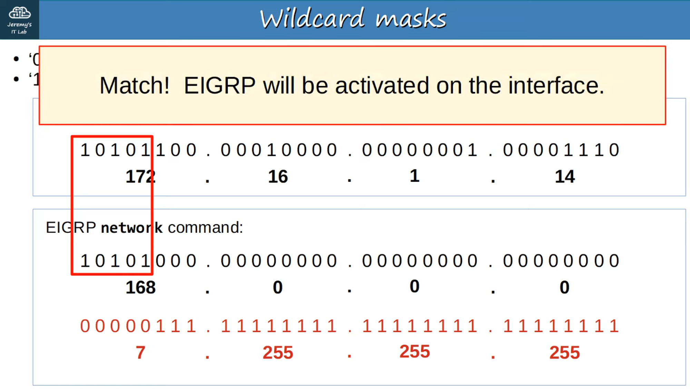

---

“show ip protocols” (for EIGRP)

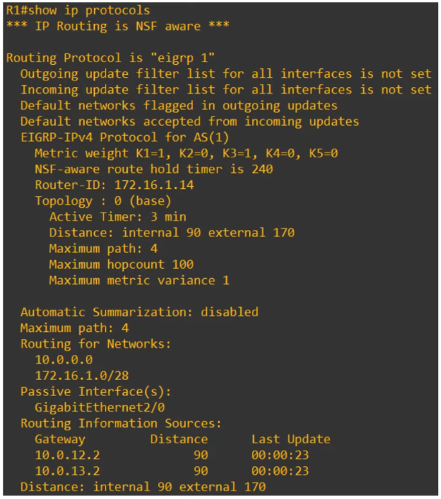

## “Router Id”

ROUTER ID order of priority:

- Manual configuration
- Highest IP ADDRESS on a LOOPBACK INTERFACE
- Highest IP ADDRESS on a PHYSICAL INTERFACE

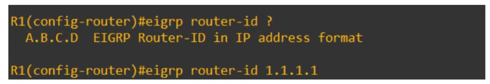

“Distance” (AD)

## Eigrp Has Two Values:

- Internal = 90
- External = 170

## Memorize These Values!

“show ip route” (for EIGRP)

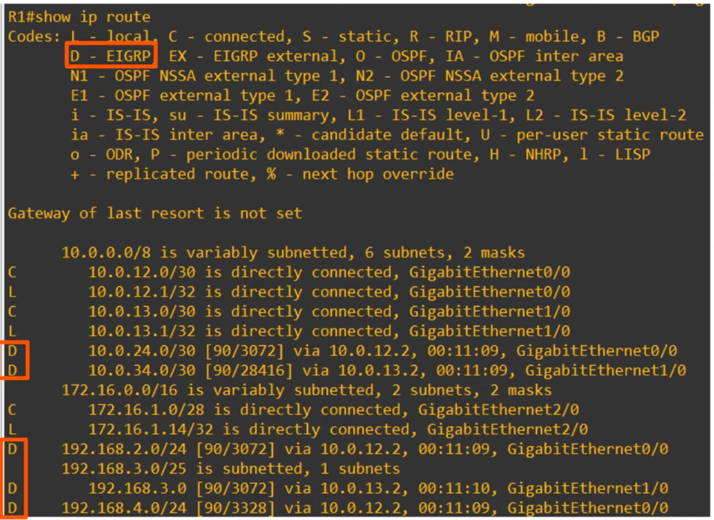

NOTE the large METRIC numbers. This is a DOWNSIDE to EIGRP - even on small networks!

---

## Eigrp Metric

- By DEFAULT, EIGRP uses BANDWIDTH and DELAY to calculate METRIC
- Default “K” values are:
- K1 = 1, K2 = 0, K3 = 1, K4 = 0, K5 = 0

> **Note:** Simplified calculation : METRIC = BANDWIDTH (Slowest Link) + DELAY (of ALL LINKS)

---

## Eigrp Terminology

- **Feasible Distance** = This ROUTER’s METRIC value to the ROUTE’s DESTINATION
- **Reported Distance** (aka **Advertised Distance**) = The neighbor’s METRIC value to the ROUTE’s DESTINATION

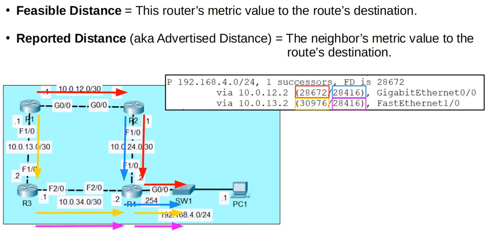

- **Successor =** the ROUTE with the LOWEST METRIC to the DESTINATION (the best route)
- **Feasible Successor** = An alternate ROUTE to the DESTINATION (not the best route) which meets the *feasibility condition*

**FEASIBILITY CONDITION** : A ROUTE is considered a ***Feasible Successor*** if it’s ***Reported Distance*** is LOWER than the Successor ROUTE’s ***Feasible distance***

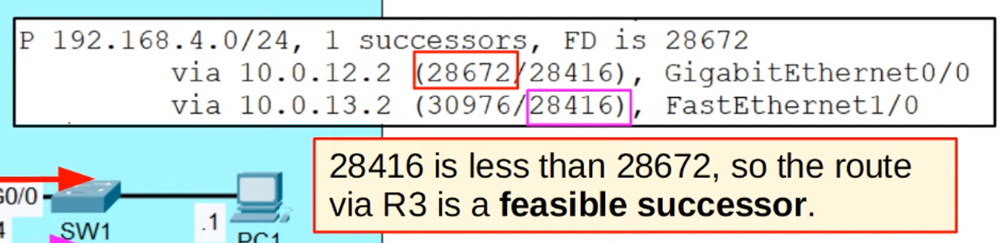

---

## Eigrp : Unequal-Cost Load-Balanced

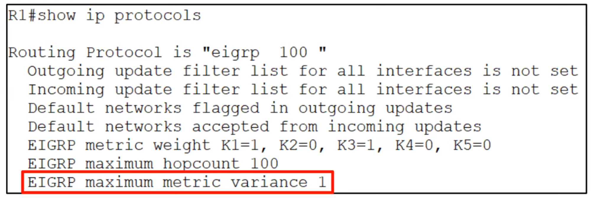

“maximum metric variance 1” = the DEFAULT value

Variance 1 = only ECMP (Equal-Cost Multiple Path) load-balancing will be performed

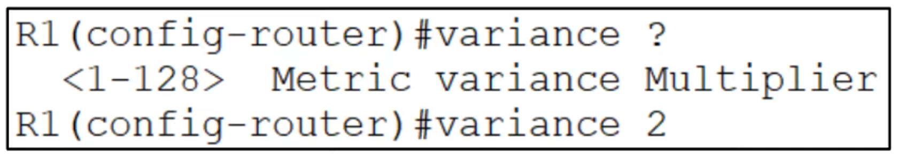

Variance 2 = ***feasible successor*** routes with an FD up to 2x the ***successor*** route’s FD can be used to load-balance

> **Note:** EIGRP will only perform UNEQUAL-COST LOAD-BALANCING over ***feasible successor*** ROUTES. If a ROUTE doesn’t meet the ***feasibility condition***, it will NEVER be selected for load-balancing, regardless of **variance**
