# 22. Rapid Spanning Tree Protocol

*COMPARISON OF STP VERSIONS (Standard vs. Cisco)*

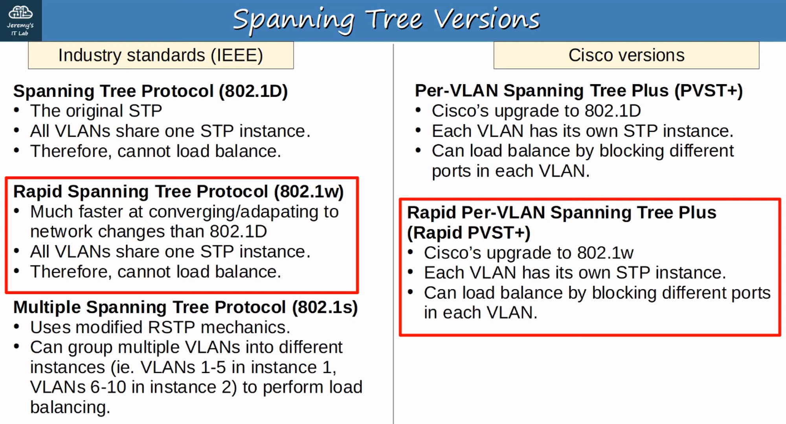

We are only concerned with 802.1w for MOST use cases.

MSTP (802.1s) is more useful for VERY LARGE networks.

## What Is Rapid Per-VLAN Spanning Tree Plus?

> RSTP is not a time-based spanning tree algorithm like 802.1D. Therefore, RSTP offers an improvment over teh 30 seconds or more 802.1D takes to move a link to forwarding. The heart of the protocol is a new bridge-bridge handshake mechanism, which allows ports to move directly to forwarding

---

### **Similarities Between Stp and Rstp**

- RSTP serves the same purpose as STP, blocking specific PORTS to prevent LAYER 2 LOOPS.
- RSTP elects a ROOT BRIDGE with the same rules as STP
- RSTP elects ROOT PORTS with the same rules as STP
- RSTP elects DESIGNATED PORTS with the same rules as STP

---

### **Differences Between Stp and Rstp**

## **Port Costs**

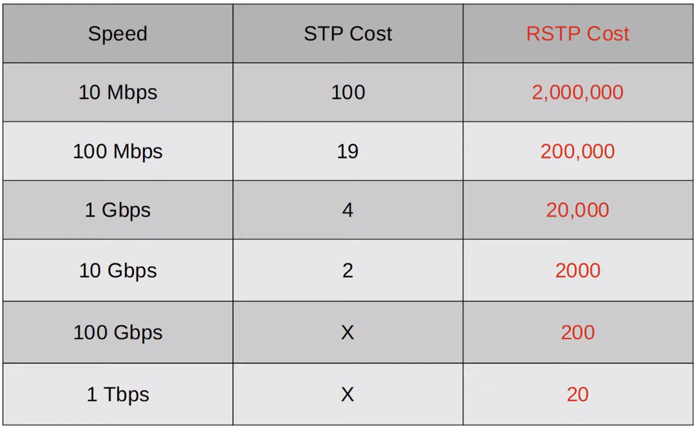

## (Study and Memorize Port Costs of Stp and Rstp)

## Rstp Port States

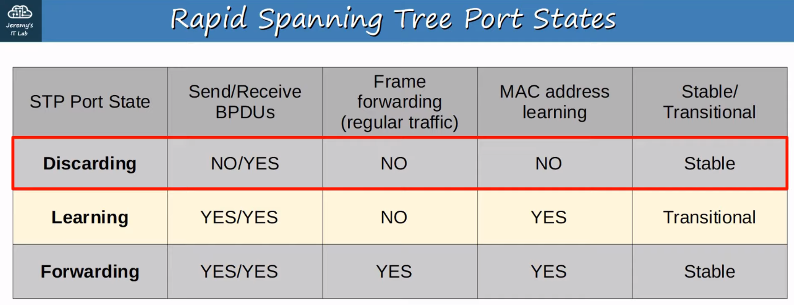

- If a PORT has been ADMINISTRATIVELY DISABLED (”shutdown” command) = DISCARDING STATE
- If a PORT is ENABLED but BLOCKING traffic to prevent LAYER 2 LOOPS = DISCARDING STATE

---

## Rstp Roles

- The ROOT PORT role remains unchanged in RSTP
    - The PORT that is closest to the ROOT BRIDGE becomes the ROOT PORT for the SWITCH
    - The ROOT BRIDGE is the only SWITCH that doesn’t have a ROOT PORT
- The DESIGNATED PORT role remains unchanged in RSTP
    - The PORT on a segment (Collision Domain) that sends the best BPDU is that segment’s DESIGNATED PORT (only one per segment!)
- **The Non-Designated Port Role Is Split Into Two Separate Roles in Rstp:**
    - The ALTERNATE PORT role
    - The BACKUP PORT role

## **Rstp : Alternate Port Role**

- The RSTP ALTERNATE PORT ROLE is a DISCARDING PORT that receives a superior BPDU from another SWITCH
- This is the same as what you’ve learned about BLOCKING PORTS in classic STP

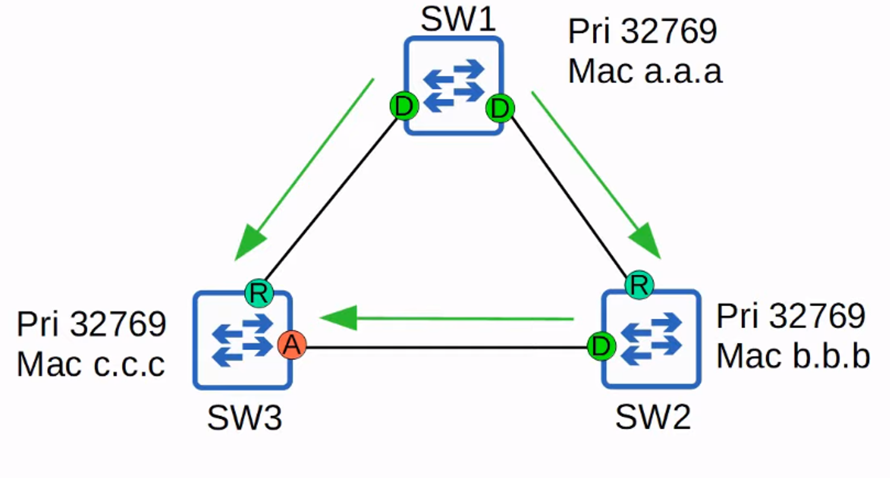

- An ALTERNATE PORT (labelled “A” above) functions as a backup to the ROOT PORT
- If the ROOT PORT fails, the SWITCH can immediately move it’s best alternate port to FORWARDING

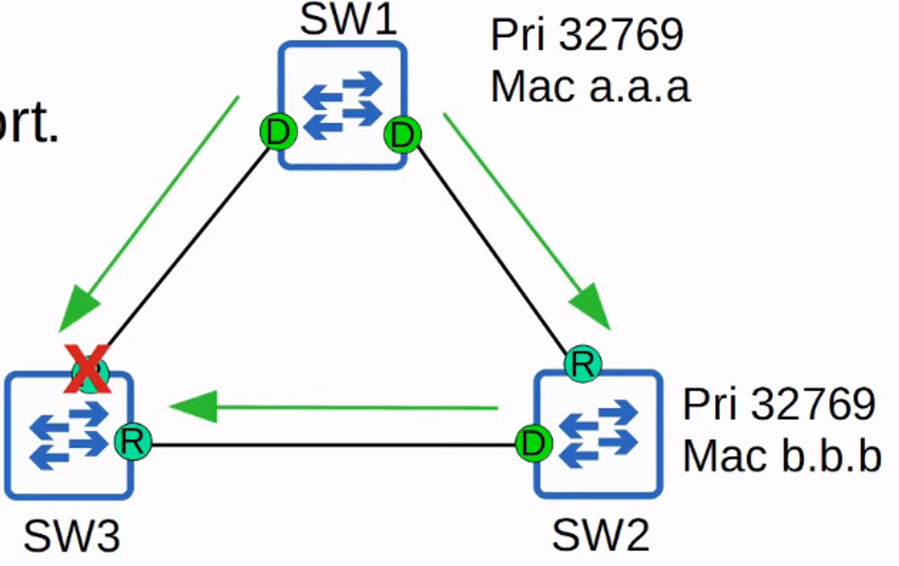

> **Note:** This immediate move to FORWARDING STATE functions like a classic STP optional feature called **UplinkFast.** Because it is built into RSTP, you do not need to activate UplinkFast when using RSTP/Rapid PVST+

One more STP optional feature that was built into RSTP is **BackboneFast**

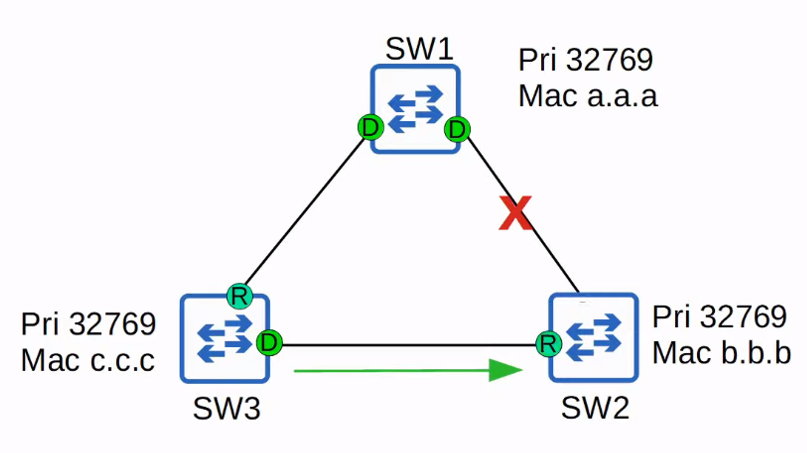

- **BackboneFast** allows SW3 to expire the MAX AGE TIMERS on it’s INTERFACE and rapidly FORWARD the superior BPDUs to SW2
- This FUNCTIONALITY is built into RSTP, so it does not need to be configured.

## Uplinkfast and Backbone Fast (Summary)

> **Note:** **UplinkFast** and **BackboneFast** are two optional features in Classic STP. They must be configured to operate on the SWITCH (not necessary to know for the CCNA)

- Both features are built into RSTP, so you do NOT have to configure them. They operate, by DEFAULT
- You do NOT need to have a detailed understanding of them for the CCNA. Know their names and their BASIC purpose (to help BLOCKING / DISCARDING PORTS rapidly move to FORWARDING)

---

## **Rstp : Backup Port Role**

- The RSTP BACKUP PORT role is a DISCARDING PORT that receives a superior BPDU from another INTERFACE on the same SWITCH
- This only happens when TWO INTERFACES are connected to the SAME COLLISION DOMAIN (via a HUB)
- Hubs are NOT used in modern networks, so you will probably NOT encounter an RSTP BACKUP PORT
- Hubs are NOT used in modern networks, so you will probably NOT encounter an RSTP BACKUP PORT.
- Functions as a BACKUP for a DESIGNATED PORT

> **Note:** The INTERFACE with the LOWERS PORT ID will be selected as the DESIGNATED PORT, and the other will be the BACKUP port.

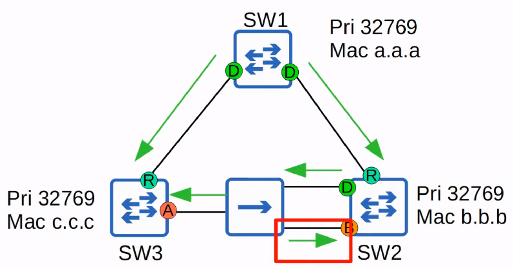

WHICH Switch will be ROOT BRIDGE?
What about the OTHER ports ?

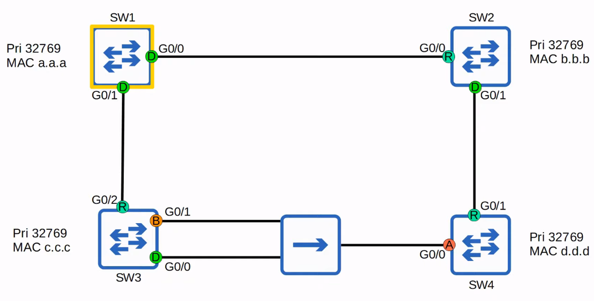

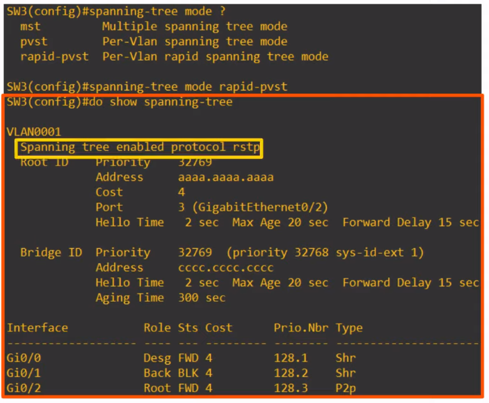

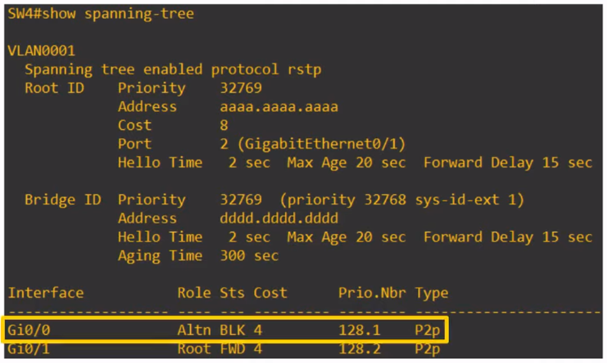

> **Note:** RAPID STP *is* compatible with CLASSIC STP.
> **Note:** The INTERFACE(S) on the RAPID STP-enabled SWITCH connected to the CLASSIC STP-enabled SWITCH will operate in CLASSIC STP MODE (Timers, BLOCKING >>> LISTENING >>> LEARNING >>> FORWARDING, etc.)

---

## Rapid Stp Bpdu

## Classic Rstp (Left) Vs Rapid Stp Bpdu (Right)

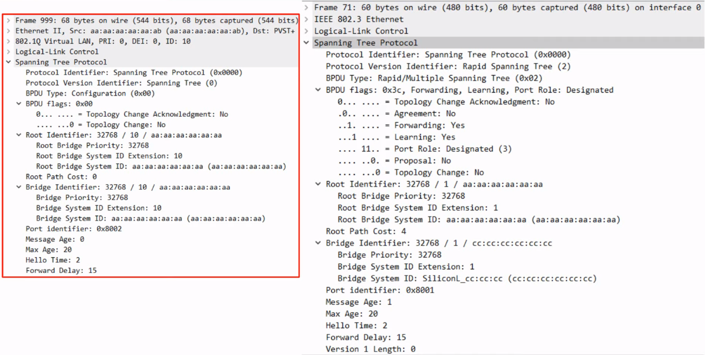

> **Note:** NOTE:

Classic STP BPDU has a “Protocol Version Identifier: Spanning Tree (0)

BPDU Type: Configuration (0x00)

BPDU flags: 0x00

RAPID STP BPDU has a “Protocol Version Identifier: Spanning Tree (2)

BPDU Type: Configuration (0x02)

BPDU flags: 0x3c

In CLASSIC STP, only the ROOT BRIDGE originated BPDUs, and other SWITCHES just FORWARDED the BPDUs they received. 

In RAPID STP, ALL SWITCHES originate and send their own BPDUs from their DESIGNATED PORTS

---

## Rapid Spanning Tree Protocol

- ALL SWITCHES running RAPID STP send their own BPDUs every “hello” time (2 Seconds)
- SWITCHES “age” the BPDU information much more quickly
    - In CLASSIC STP, a SWITCH waits 10 “hello” intervals (20 seconds)
    - In RAPID STP, a SWITCH considers a neighbour lost if it misses 3 BPDUs (6 seconds). It will then “flush” ALL MAC ADDRESSES learned on that interface

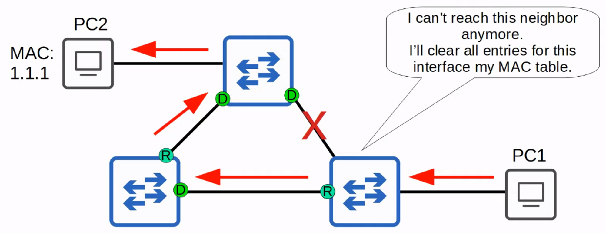

---

## Rstp Link Types

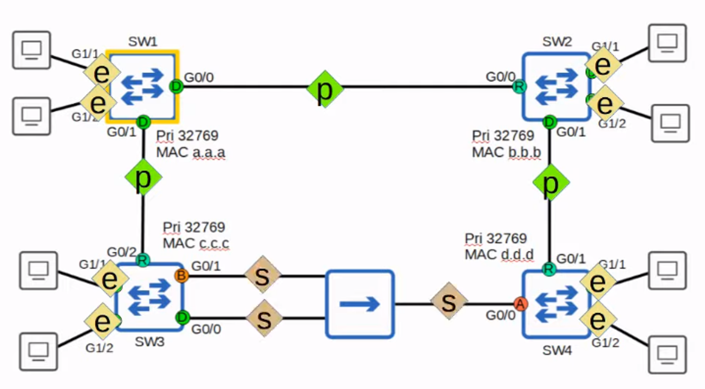

```
## <E> = Edge

## <P> = Point-to-Point

## <S> = Shared
```

RSTP distinguishes between THREE different “link types” : **EDGE**, **POINT-TO-POINT**, and **SHARED**

## Edge Ports

- Connected to END HOSTS
- Because there is NO RISK of creating a LOOP, they can move straight to the FORWARDING STATE without the negotiation process!
- They function like a CLASSIC STP PORT with PORTFAST ENABLED

> **Note:** SW1(config-if)# spanning-tree portfast

---

## Point-to-Point Ports

- Connect directly to another SWITCH
- They function in FULL-DUPLEX
- You don’t need to configure the INTERFACE as POINT-TO-POINT (it should be detected)

> **Note:** SW1(config-if)# spanning-tree link-type point-to-point

---

## Shared Ports

- Connect to another SWITCH (or SWITCHES) via a HUB
- They function in HALF-DUPLEX
- You don’t need to configure the INTERFACE as SHARED (it should be detected)

> **Note:** SW1(config-if)# spanning-tree link-type shared

---

### **Quiz**

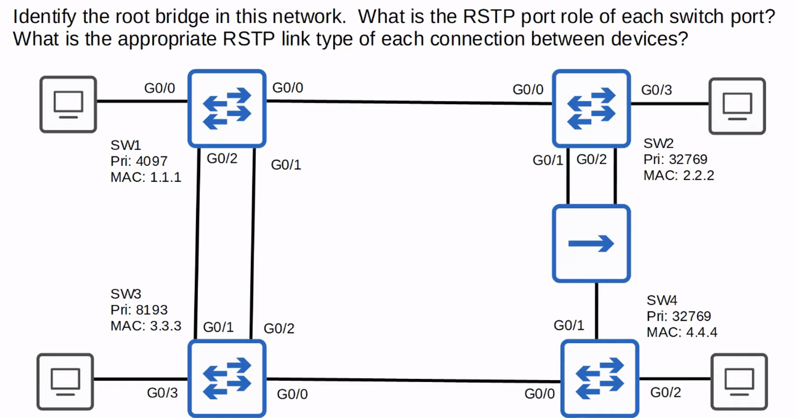

### **Sw1 **

- **ROOT BRIDGE**
- G0/0 - 0/3= DESIGNATED

## Sw2 : 

- G0/0 = ROOT PORT
- G0/1 = DESIGNATED PORT
- G0/2 = BACKUP PORT
- G0/3 = DESIGNATED PORT

### **Sw3 **

- G0/0 = DESIGNATED PORT
- G0/1 = ALTERNATE PORT
- G0/2 = ROOT PORT
- G0/3 = DESIGNATED PORT

### **Sw4**

- G0/0 = ROOT
- G0/1 = ALTERNATE PORT
- G0/2 = DESIGNATED PORT

Connection between SW1 G0/0 and SW2 G0/0 = POINT-TO-POINT

Connection between SW3 G0/0 and SW4 G0/0 = POINT-TO-POINT

Connection between SW1 G0/1 and G0/2 to SW3 G0/1 and G0/2 = POINT-TO-POINT

Connections to all the END HOSTS = EDGE 

Connection from SW4 to HUB = SHARED

Connections from SW2 to HUB = SHARED

## Answer

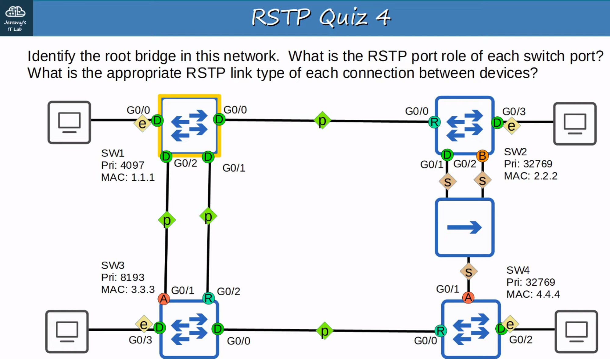
