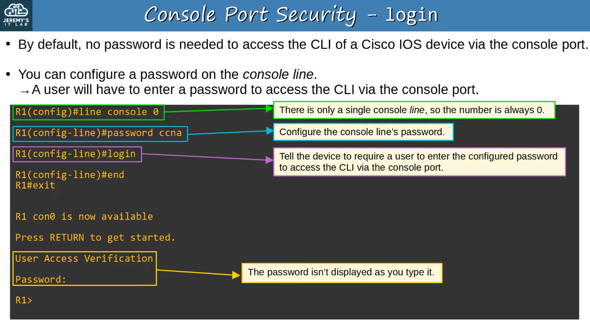
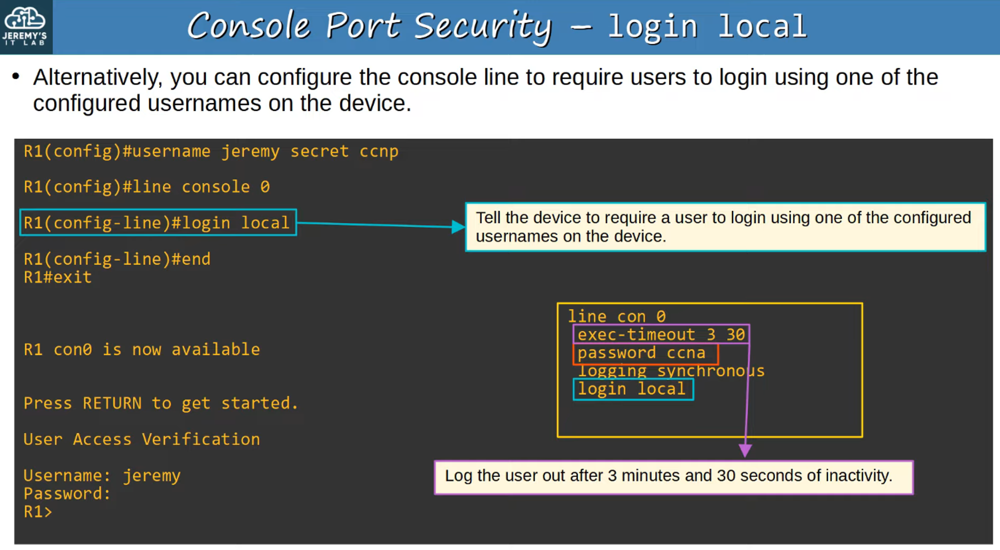
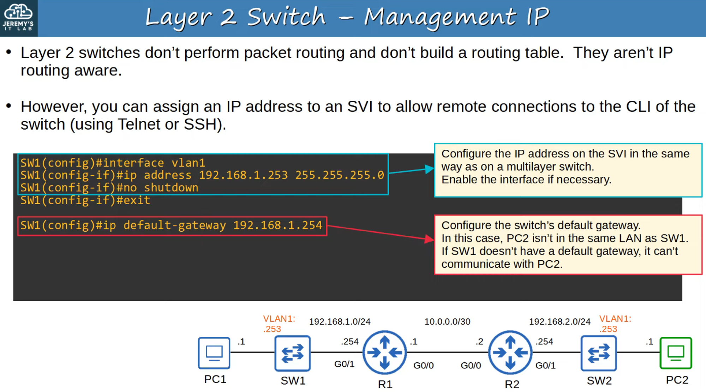
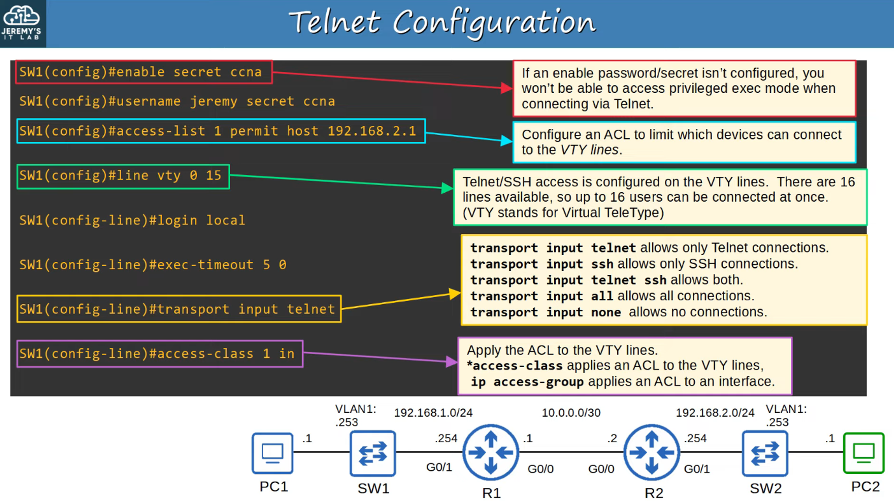
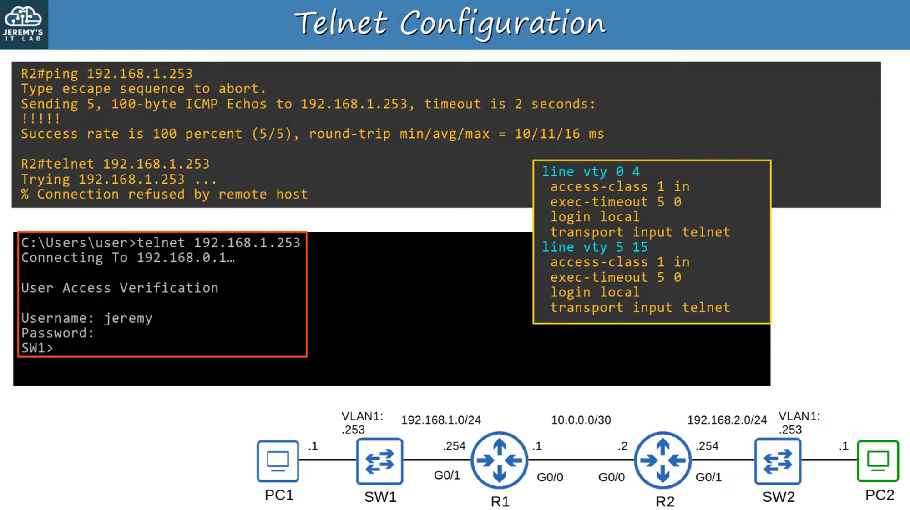
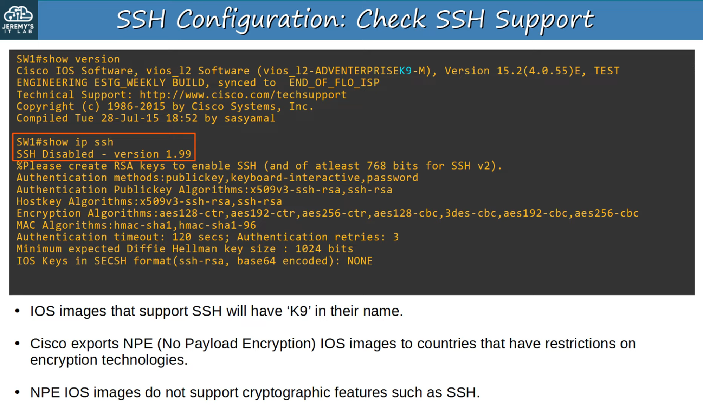
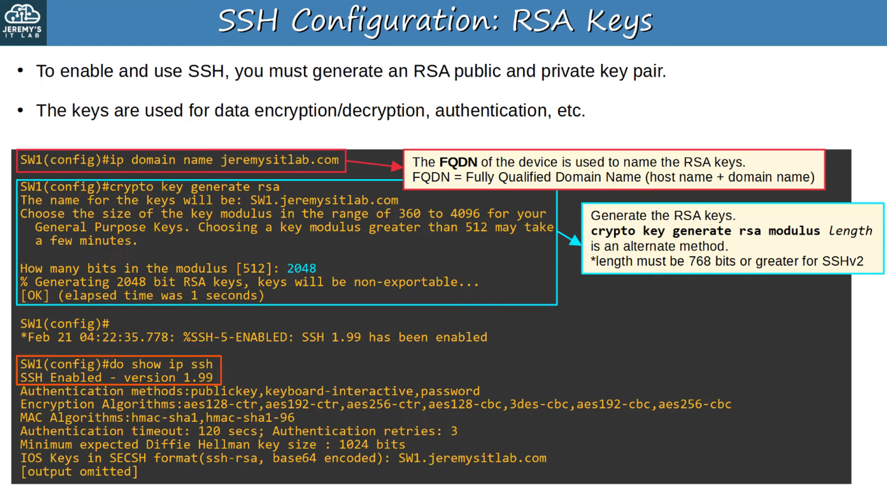
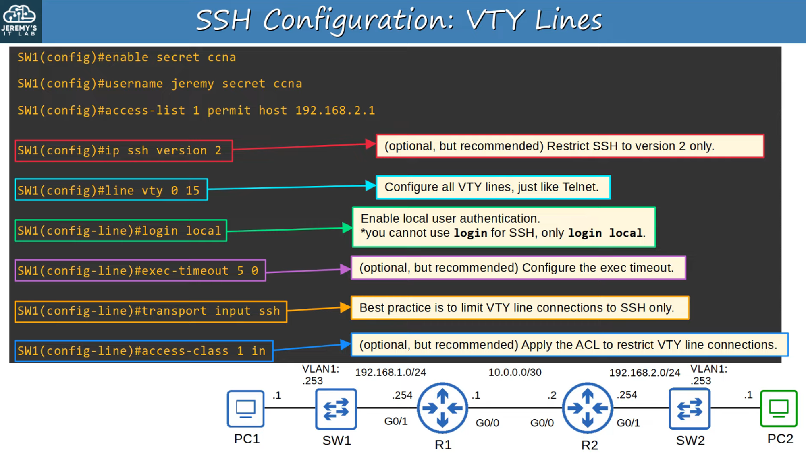
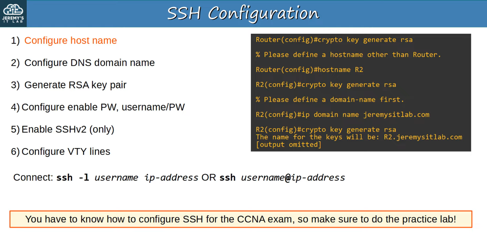
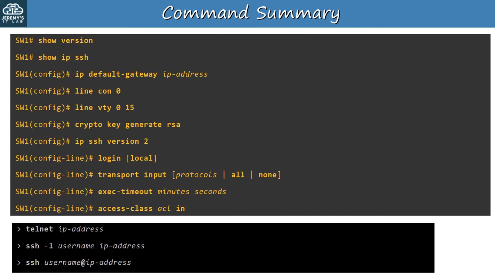

# 42. SSH (Secure Shell)

## Console Port Security

- By DEFAULT, no password us needed to access the CLI of a CISCO IOS DEVICE via the CONSOLE PORT
- You can CONFIGURE a PASSWORD on the *console line*
    - A USER will have to enter a PASSWORD to ACCESS the CLI via the CONSOLE PORT

- Alternatively, you can configure the CONSOLE LINE to require USERS to LOGIN using one of the configured USERNAMES on the DEVICE

---

## Layer 2 Switch Management IP

- LAYER 2 SWITCHES do not perform PACKET ROUTING and build a ROUTING TABLE. They are NOT IP ROUTING aware
- However, you CAN assign an IP ADDRESS to an SVI to allow REMOTE CONNECTIONS to the CLI of the SWITCH (using Telnet or SSH)

---

## Telnet

- TELNET (Teletype Network) is a PROTOCOL used to REMOTELY ACCESS the CLI of a REMOTE HOST
- TELNET was developed in 1969
- TELNET has been largely REPLACE by SSH, which is MORE Secure
- TELNET sends data in PLAIN TEXT. NO ENCRYPTION(!)

> **Note:** TELNET SERVERS listen for TELNET traffic on TCP PORT 23

---

## Verify Telnet Configuration

---

## SSH

- SSH (Secure Shell) was developed in 1995 to REPLACE LESS SECURE PROTOCOLS, like TELNET
- SSHv2, a major revision of SSHv1, was released in 2006
- If a DEVICE supports both v1 and v2, it is said to run ‘version 1.99’
- Provides SECURITY features; such as DATA ENCRYPTION and AUTHENTICATION

## Check SSH Support

## Rsa Keys

- To ENABLE and use SSH, you must first generate an RSA PUBLIC and PRIVATE KEY PAIR
- The KEYS are used for DATA ENCRYPTION / DECRYPTION, AUTHENTICATION, etc.

## Vty Lines

---

## Summary About SSH Configurations

