# 20. Spanning Tree Protocol (Stp) : Part 1

## Redundancy in Networks

- Essential in network design
- Modern networks are expected to run 24/7/265; even a short downtime can be disastrous for business.
- If one network component fails, you must ensure that other components will take over with little or no downtime.
- As much as possible, you must implement REDUNDANCY at every possible point in the network

## an Example of a Poorly Designed Network

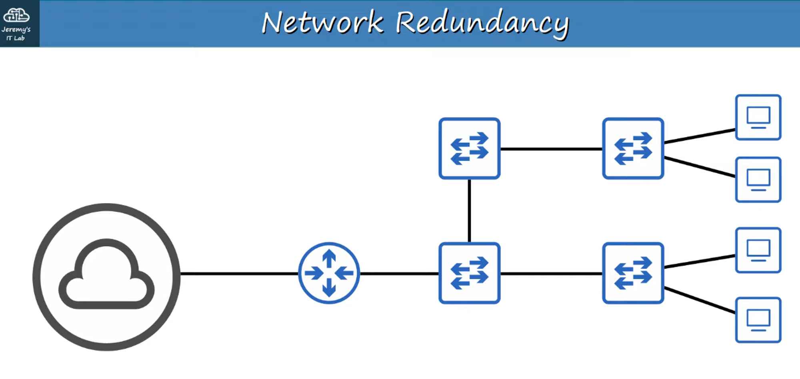

NOTE the many single-point failures that could occur (single connections)

## a Better Network Design

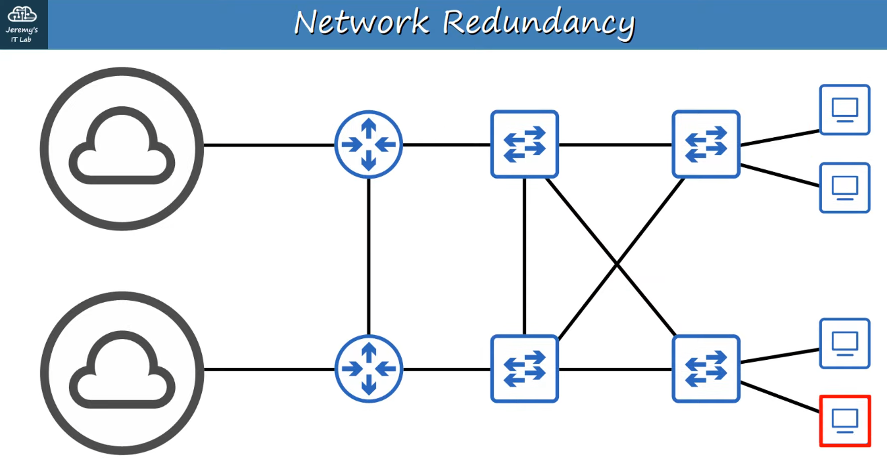

## Unfortunately : 

- Most PCS only have a single network interface card (NIC), so they can only be plugged into a single SWITCH. However, important SERVERS typically have multiple NICs, so they can be plugged into multiple SWITCHES for redundancy!

So HOW can all this redundancy be a BAD thing?

## Broadcast Storms

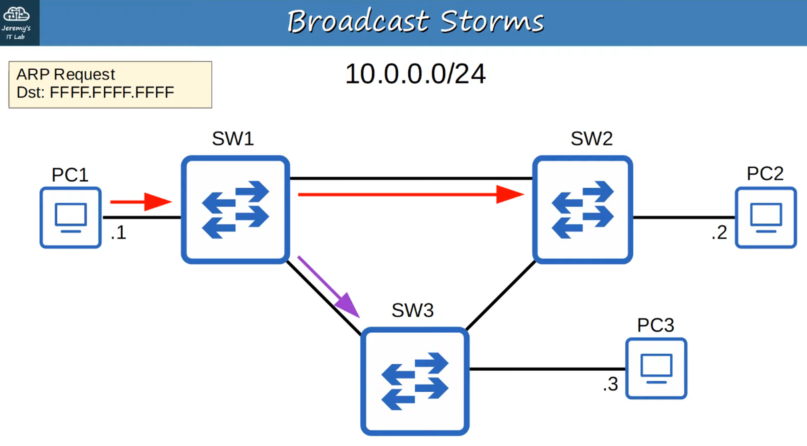

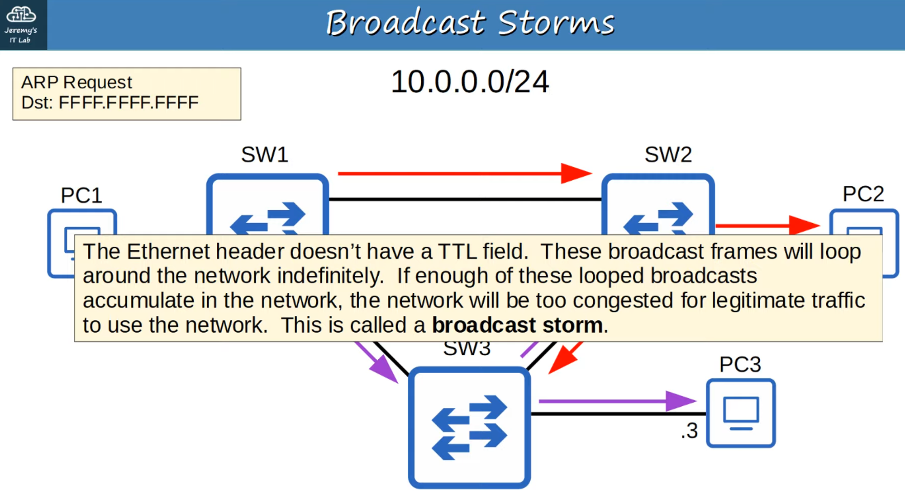

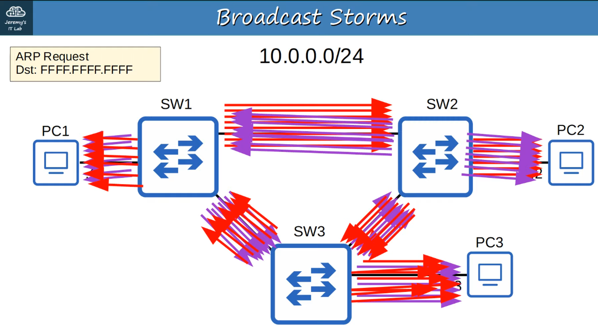

FLOODED WITH ARP REQUESTS (Red = Clockwise Loops // Purple = Counter-Clockwise Loops)

Network Congestion isn’t the only problem.

Each time a FRAME arrives on a SWITCHPORT, the SWITCH uses the SOURCE MAC ADDRESS field to “learn” the MAC ADDRESS and update it’s MAC ADDRESS TABLE.

When frames with the same SOURCE MAC ADDRESS repeatedly arrive on different interfaces, the SWITCH is continuously updating the interface in it’s MAC ADDRESS TABLE.

This is called MAC ADDRESS FLAPPING

So how we design a network, with redundant paths, that doesn’t result in LAYER 2 LOOPS.

SPANNING TREE PROTOCOL is one solution

---

## Stp (Spanning Tree Protocol) : 802.1d

- “Classic Spanning Tree Protocol” is IEEE **802.1D**
- SWITCHES from ALL vendors run STP by Default
- STP prevents LAYER 2 loops by placing redundant PORTS in a BLOCKING state, essentially disabling the INTERFACE
- These INTERFACES act as backups that can enter a FORWARDING state if an active (=currently forwarding) INTERFACE fails.
- INTERFACES in a BLOCKING state only send or receive STP messages (called BPDUs = Bridge Protocol Data Units)

> **Note:** SPANNING TREE PROTOCOL still uses the term “BRIDGE”. However, when use the term “BRIDGE”, we really mean “SWITCH”. BRIDGES are not used in modern networks.

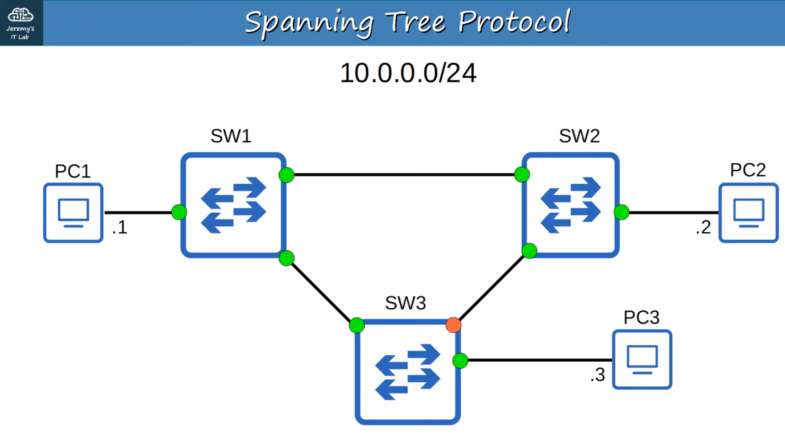

ORANGE INTERFACE is “BLOCKED” causing a break in the loops

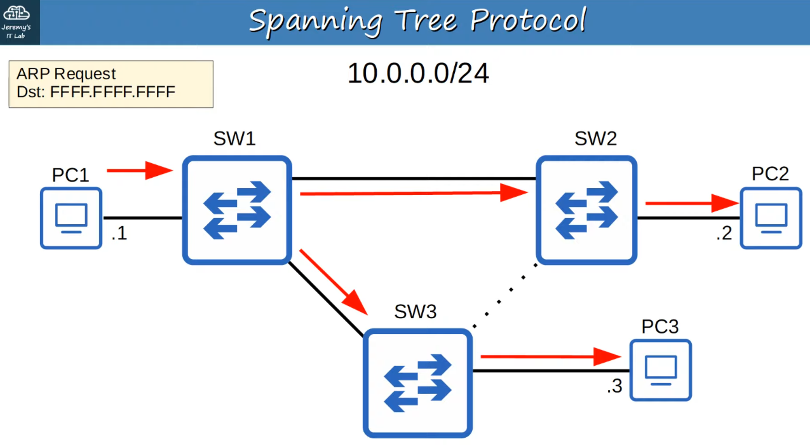

If changes occur in the connections, the traffic will adjust the topology.

- By selecting WHICH ports are FORWARDING and which ports are BLOCKING, STP creates a single path TO / FROM each point in the NETWORK. This prevents LAYER 2 Loops.
- There is a set process that STP uses to determine which ports should be FORWARDING and which should be BLOCKING
- STP-enabled SWITCHES send / receive “Hello BPDUs” out of all INTERFACES
    - The default timer is : ONCE every TWO seconds per INTERFACE!
- If a SWITCH receives a “Hello BPDU” on an INTERFACE, it knows that INTERFACE is connected to another SWITCH (ROUTERS, PCs, etc. do NOT use STP so do not send “Hello BPDUs”)

---

## What Are Bpdus Used for?

- SWITCHES use one field in the STP BPDU, the BRIDGE ID field, to elect a ROOT BRIDGE for the NETWORK
- The SWITCH with the lowest BRIDGE ID becomes the ROOT BRIDGE
- ALL PORTS on the ROOT BRIDGE are put in a FORWARDING state, and other SWITCHES in the topology must have a path to reach the ROOT BRIDGE

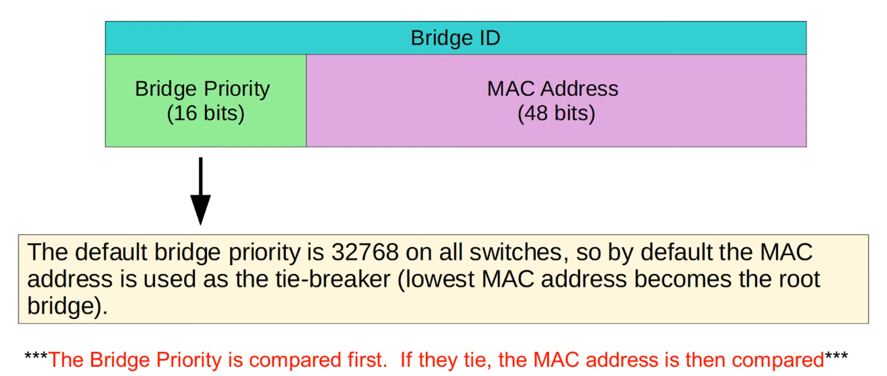

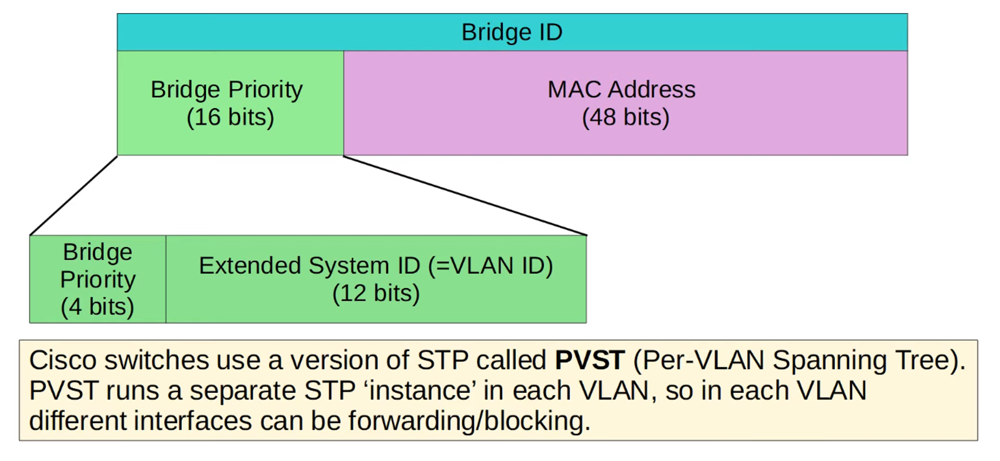

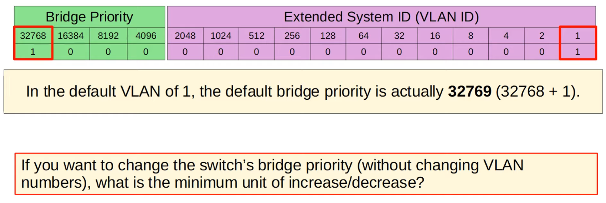

To REDUCE the BRIDGE PRIORITY, we can only change it in units of 4096 !

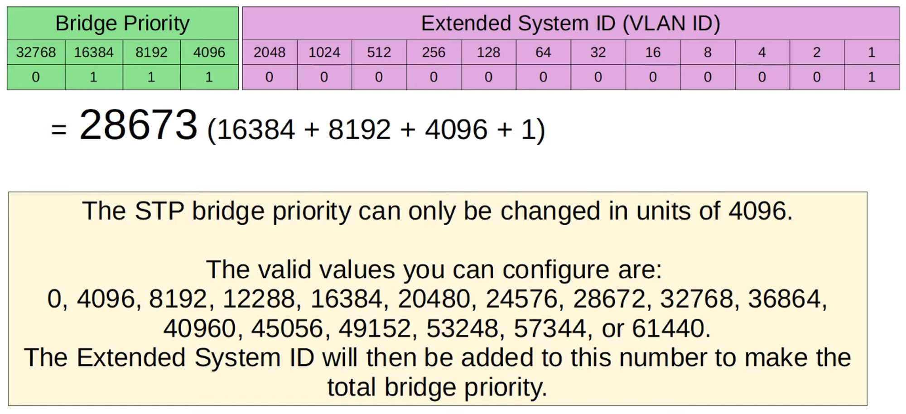

In THIS TOPOLOGY, SW1 becomes the ROOT BRIDGE due to it’s MAC ADDRESS being LOWEST

## (Hex “a” = 10)

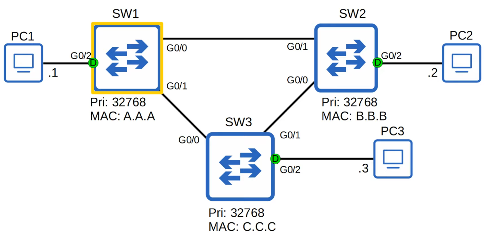

ALL INTERFACES on the ROOT BRIDGE are DESIGNATED PORTS.

## Designated Ports Are in a Forwarding State!

## Root Bridge

- When a SWITCH is powered on, it assumes it is the ROOT BRIDGE
- It will only give up its position if it receives a “SUPERIOR” BPDU (lower BRIDGE ID)
- Once the topology has converged and all SWITCHES agree on the ROOT BRIDGE, only the ROOT BRIDGE sends BPDUs
- Other SWITCHES in the network will forward these BPDUs, but will not generate their own original BPDUs

---

## Spanning Tree Protocol Steps

1) One SWITCH is elected as ROOT BRIDGE. All PORTS on the ROOT BRIDGE are DESIGNATED PORTS (FORWARDING STATE)

- **Root Bridge Selection Order:**
    - 1) Lowest BRIDGE ID
    - 2) Lowest MAC Address (in case of Bridge ID tie)

2) Each remaining SWITCH will select ONE of its INTERFACES to be it’s ROOT PORT (FORWARDING STATE). PORTS across from the ROOT PORT are always DESIGNATED PORTS.

- **Root Port Selection Order:**
    - 1) LOWEST ROOT COST (see STP COST CHART)
- 2) Lowest Neighbour Bridge Id
- 3) Lowest Neighbour Port Id

3) Each remaining COLLISION DOMAIN will select ONE INTERFACE to be a DESIGNATION PORT (FORWARDING STATE). The other PORT in the COLLISION DOMAIN will NON-DESIGNATED (BLOCKING)

- **Designated Port Selection:**
    - 1) INTERFACE on SWITCH with LOWEST ROOT COST
    - 2) INTERFACE on SWITCH with LOWEST BRIDGE ID

---

## Stp Cost Chart

> **Note:** Only OUTGOING INTERFACES toward the ROOT BRIDGE have a STP COST; not RECEIVING INTERFACES. Add up all the OUTGOING PORT costs until you reach the ROOT BRIDGE

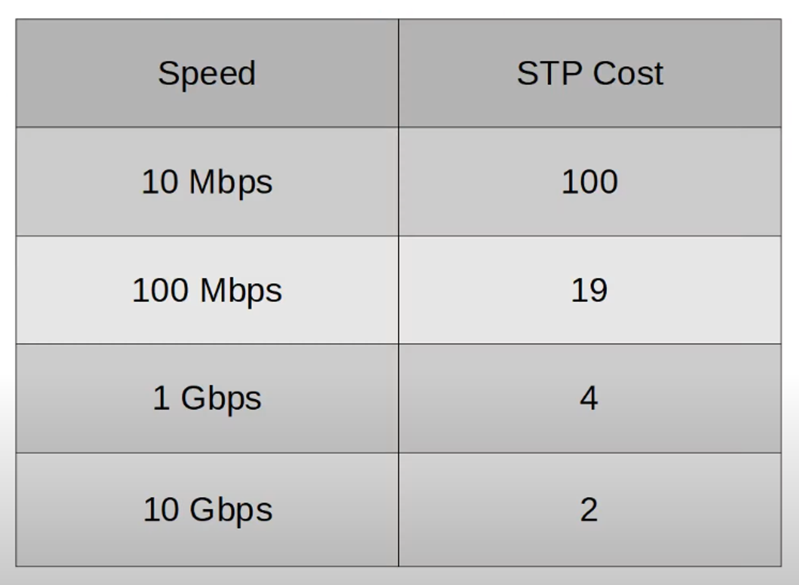

SW1 is the ROOT BRIDGE so has a STP COST of 0 on ALL INTERFACES

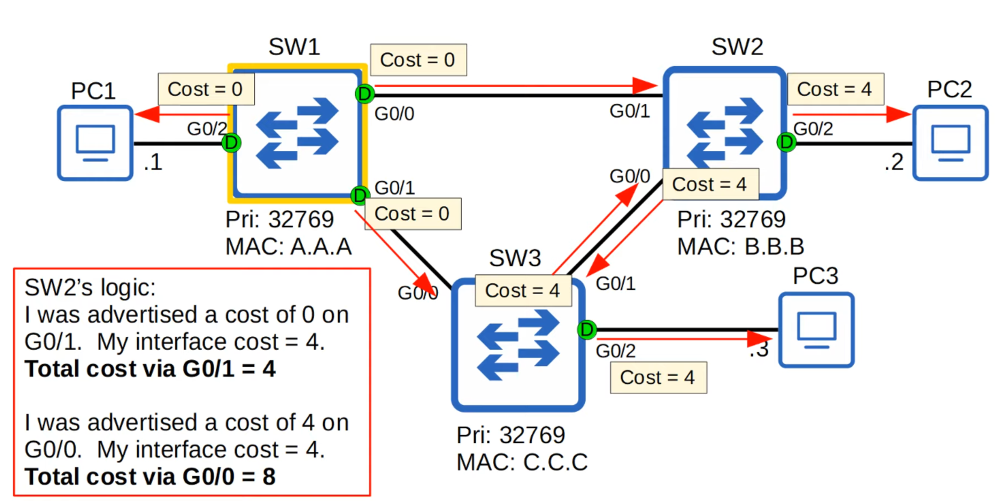

The PORTS connected to another SWITCH’s ROOT PORT MUST be DESIGNATED (D). 

Because the ROOT PORT Is the SWITCH’s path to the ROOT BRIDGE, another SWITCH must not block it.

STP PORT ID (in case of a tie-breaker)

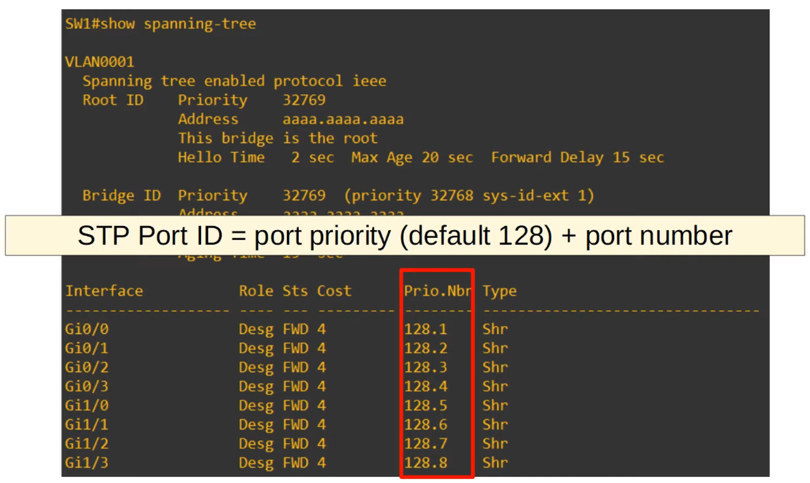

NEIGHBOUR SWITCH PORT ID (in case of a tie-breaker)

## (D) = Designated Port

## (R) = Root Port

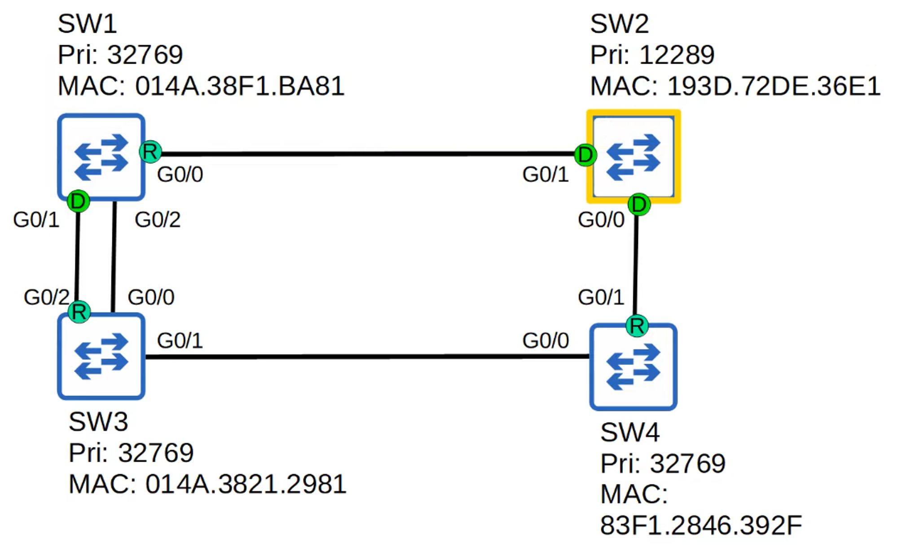

## How to Determine Which Port Will Be Blocked to Prevent Layer 2 Loops

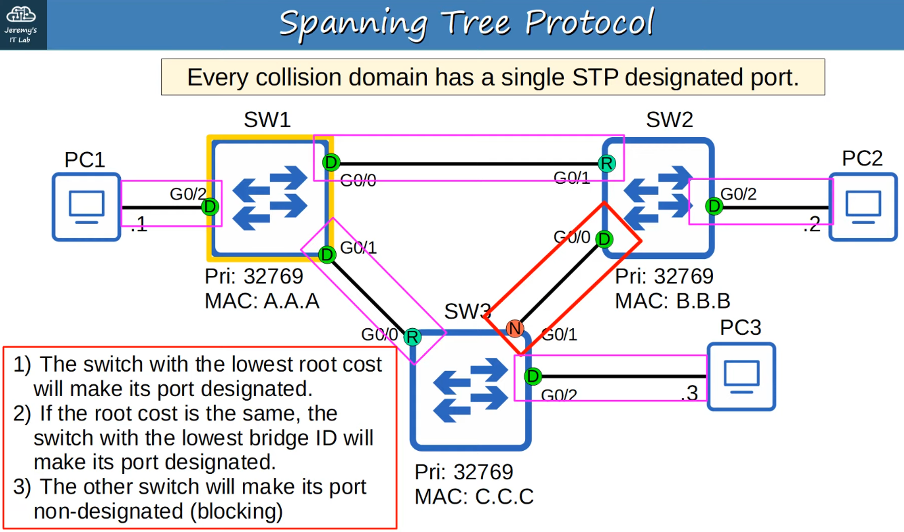

## Quiz

Identify the ROOT BRIDGE and the ROLE of EACH INTERFACE on the NETWORK (ROOT / DESIGNATED / NON-DESIGNATED)

#1

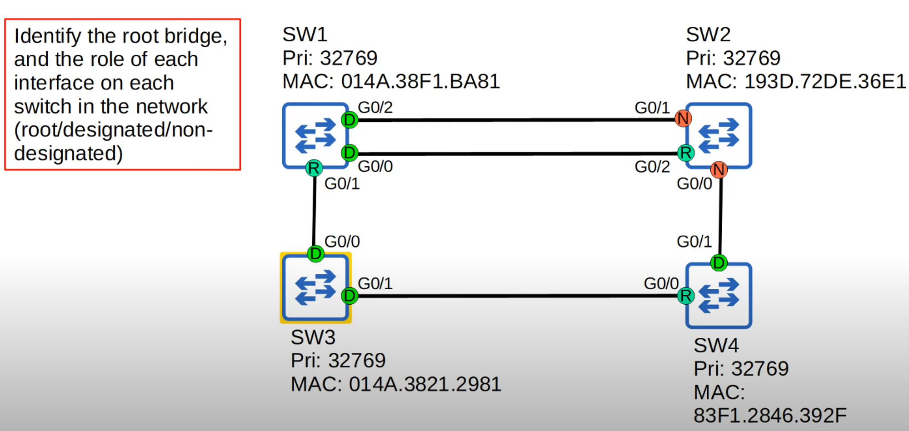

ALL SWITCHES have the same PRIORITY NUMBER (32769)

Tie-breaker goes to the LOWEST MAC ADDRESS

SW3 has the LOWEST so it’s the ROOT BRIDGE and ALL it’s INTERFACES become DESIGNATED

Connections from SW1 (G0/1) and S4 (G0/0) to SW3 become ROOT INTERFACES

Because SW2 has TWO connections to SW1, both of SW1’s INCOMING interfaces become DESIGNATED.

SW2 G0/2 INTERFACE becomes a ROOT INTERFACE because the G0/0 INTERFACE of SW1 is LOWER than it’s G0/2 INTERFACE

The remaining interfaces on SW2 become NON-DESIGNATED because it has the HIGHEST ROOT COST (12 = 4x 1 GB connection). INTERFACES they are attached to on other SWITCHES become DESIGNATED

#2

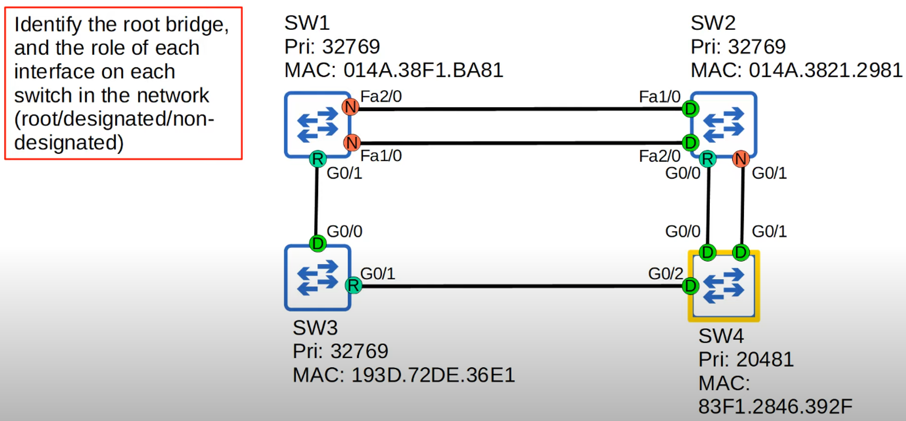

SW4 has the LOWEST Priority Number so it is designated ROOT BRIDGE

All of SW4 INTERFACES become DESIGNATED

SW2 G0/0 becomes ROOT PORT because SW4 G0/0 connection is a LOWER NUMBER than G0/1. 

SW3 G0/1 becomes ROOT PORT

SW1 G0/1 becomes ROOT PORT because G0/1 cost is LESS than Fa1/0 and 2/0

EACH remaining PORT will be either DESIGNATED or NON-DESIGNATED

SW1 Fa1/0 and 2/0 become NON-DESIGNATED since they have a HIGHER STP COST (38) than SW2 outbound ports (8) making SW2 Fa1/0 and 2/0 DESIGNATED

SW2 remaining connection, G0/1, NON-DESIGNATED
