# 21. Spanning Tree Protocol (Stp) : Part 2

## Stp States

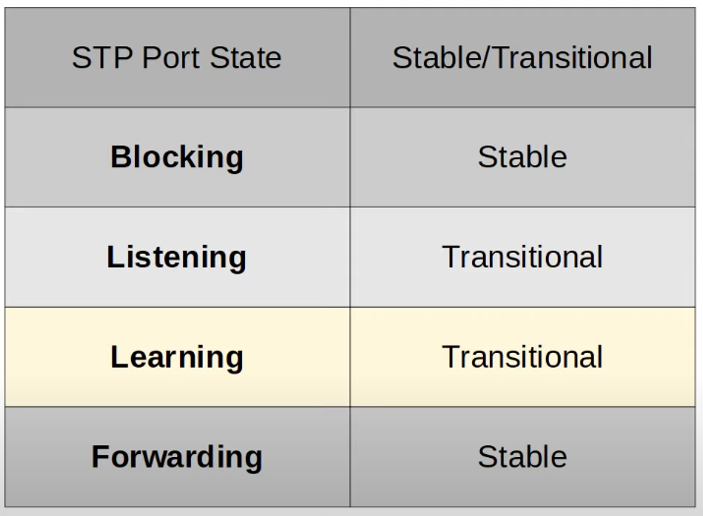

- ROOT / DESIGNATED PORTS remain STABLE in a FORWARDING state
- NON-DESIGNATED PORTS remain STABLE in a BLOCKING state
- LISTENING and LEARNING are TRANSITIONAL states which are passed through when an interface is activated, or when a BLOCKING PORT must transition to a FORWARDING state due to a change in network topology.

## **1) Blocking / Stable**

- NON-DESIGNATED PORTS are in a BLOCKING state
- Interfaces in a BLOCKING state are effectively disabled to prevent loops
- Interfaces in a BLOCKING state do NOT Send/Receive regular network traffic
- Interfaces in a BLOCKING state do NOT forward STP BPDUs
- Interfaces in a BLOCKING state do NOT learn MAC ADDRESSES

## **2) Listening / Transitional**

- After the BLOCKING state, interfaces with the DESIGNATED or ROOT role enter the LISTENING state
- ONLY DESIGNATED or ROOT PORTS enter the LISTENING state (NON-DESIGNATED PORTS are ALWAYS BLOCKING)
- The LISTENING state is 15 seconds long by Default. This is determined by the FORWARD DELAY TIMER
- Interfaces in a LISTENING state do NOT Send / Receive regular network traffic
- Interfaces in a LISTENING state ONLY Forward/Receive STP BPDUs
- Interfaces in a LISTENING state does NOT learn MAC ADDRESSES from regular traffic that arrives on the interface

## **3) Learning / Transitional**

- After the LISTENING state, a DESIGNATED or ROOT port will enter the LEARNING state
- The LEARNING state is 15 seconds long by Default. This is determined by the FORWARD DELAY TIMER (same one used for both LISTENING and LEARNING states)
- Interfaces in a LEARNING state do NOT Send / Receive regular network traffic
- Interfaces in a LEARNING state ONLY Sends/Receives STP BPDUs
- Interfaces in a LEARNING state **learns** MAC ADDRESSES from regular traffic that arrives on the interface

### **4) Forwarding / Stable**

- ROOT and DESIGNATED PORTS are in a FORWARDING state
- A PORT in the FORWARDING state operate as NORMAL
- A PORT in the FORWARDING state Sends/Receives regular network traffic
- A PORT in the FORWARDING state Sends/Receives STP BPDUs
- A PORT in the FORWARDING state **learns** MAC ADDRESSES

## Summary : 

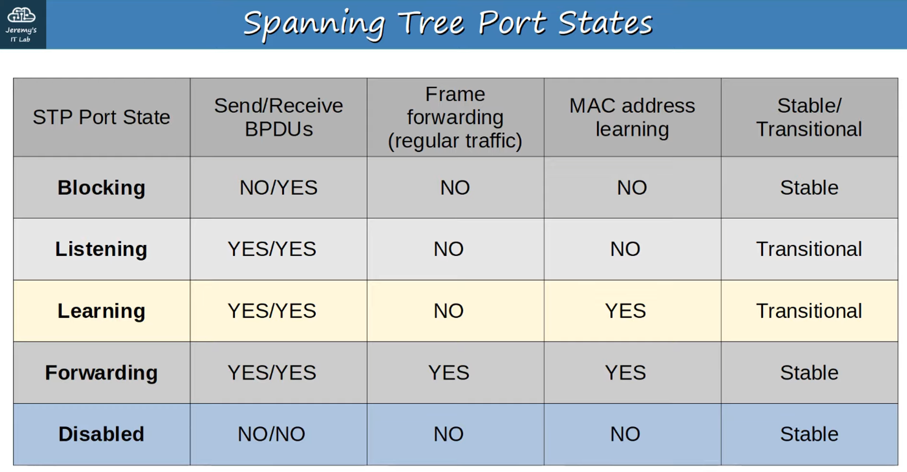

---

## Stp Timers

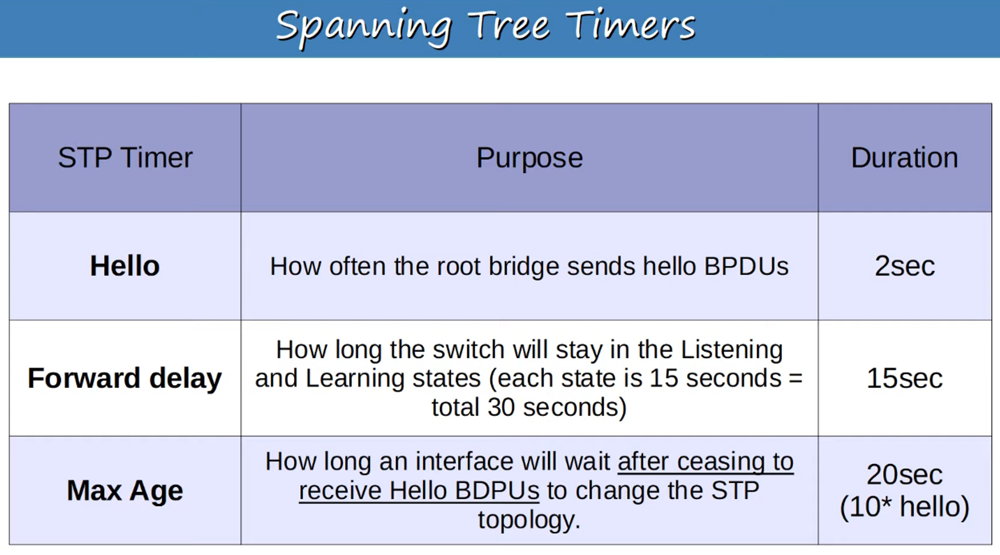

> **Note:** SWITCHES do NOT forward the BPDUs out of their ROOT PORTS and NON-DESIGNATED PORTS - ONLY their DESIGNATED PORTS !!!

### **Max Age Timer**

- If another BPDU is received BEFORE MAX AGE TIMER counts down to 0, the TIME will RESET to 20 Seconds and no changes will occur.
- If another BPDU is not received, the MAX AGE TIMER counts down to 0 and the SWITCH will re-evaluate it’s STP choices, including ROOT BRIDGE, LOCAL ROOT, DESIGNATED, and NON-DESIGNATED PORTS.
- If a NON-DESIGNATED PORT is selected to become a DESIGNATED or ROOT PORT, it will transition from the BLOCKING state to the LISTENING state (15 Seconds), LEARNING state (15 Seconds), and then finally the FORWARDING state.
    - So… it can take 50 Seconds for a BLOCKING interface to transition to FORWARDING! (MAX AGE TIMER  + (LISTENING + LEARNING 15 Second timers))
- These TIMERS and TRANSITIONAL STATES are to make sure that LOOPS are not accidentally created by an INTERFACE moving to FORWARDING STATE too soon

## However …

> **Note:** A FORWARDING interface can move DIRECTLY to a BLOCKING state (there is no worry about creating a loop)

> **Note:** A BLOCKING interface can NOT move DIRECTLY to a FORWARDING state. It MUST go through the LISTENING and LEARNING states first!

---

## Stp Bpdu (Bridge Protocol Data Unit)

Ethernet Header of a BPDU

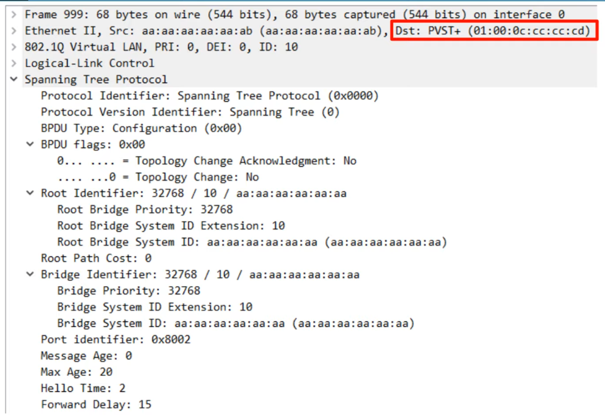

> **Note:** PVST+ uses the MAC ADDRESS : 

01 : 00 : 0c : cc : cc : cd

PVST = ONLY ISL Trunk Encapsulation

PVST+ = Supports 802.1Q

> **Note:** Regular STP (not Cisco’s PVST+) uses the MAC ADDRESS : 

01 : 80 : c2 : 00 : 00 : 00

> **Note:** The STP TIMERS on the ROOT BRIDGE determine ALL STP TIMERS for the entire network!

---

## Stp Optional Features (Stp Toolkit)

### **Portfast**

- Can be Enabled on INTERFACES which are connected to END HOSTS

> **Note:** PORTFAST allows a PORT to move immediately to the FORWARDING state, bypassing LISTENING and LEARNING

- If used, it MUST be ENABLED only on PORTS connected to END HOSTS
- If ENABLED on a PORT connected to another SWITCH, it could cause a LAYER 2 LOOP

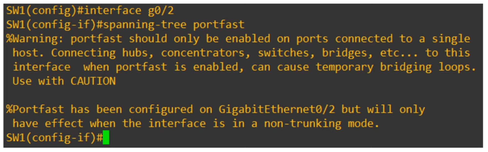

You can also ENABLE PORTFAST with the following command:

> **Note:** SW1(config)# spanning-tree portfast default

This ENABLES PORTFAST on ALL ACCESS PORTS (not TRUNK PORTS)

### **Bpdu Guard**

- If an INTERFACE with BPDU GUARD ENABLED receives a BPDU from another SWITCH, the INTERFACE will be SHUT DOWN to prevent loops from forming.

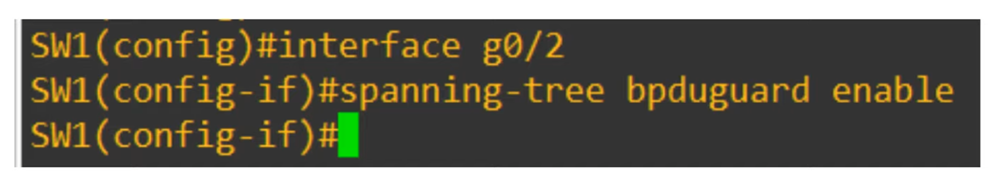

You can also ENABLE BPDU GUARD with the following command:

> **Note:** SW1(config)# spanning-tree portfast bpduguard default

This ENABLES BPDU GUARD on all PORTFAST-enabled INTERFACES

### **Root Guard / Loop Guard**

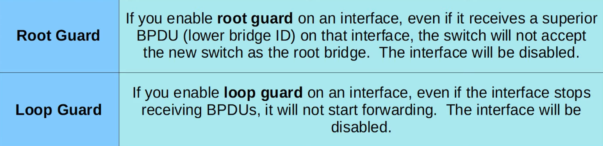

You probably do NOT have to know these STP optional features (or others such as UplinkFast, Backbone Fast, etcetera) for the CCNA. 

## But…

> **Note:** Make sure you know PORTFAST and BPDU GUARD.

---

## Stp Configuration

Command to CONFIGURE Spanning-Tree mode on a SWITCH

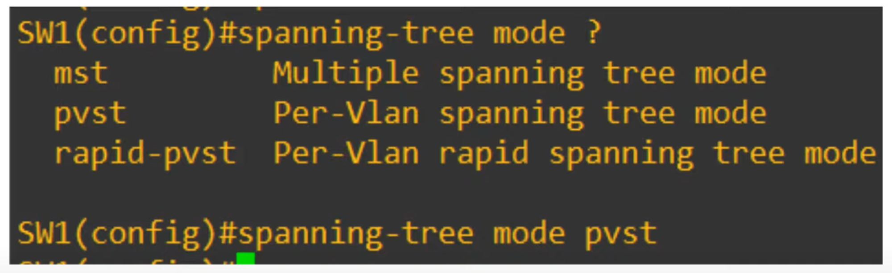

Modern Cisco SWITCHES run **rapid-pvst**, by default

---

## Configure The Primary Root Bridge

Command to CONFIGURE Spanning-Tree PRIMARY ROOT BRIDGE on a SWITCH

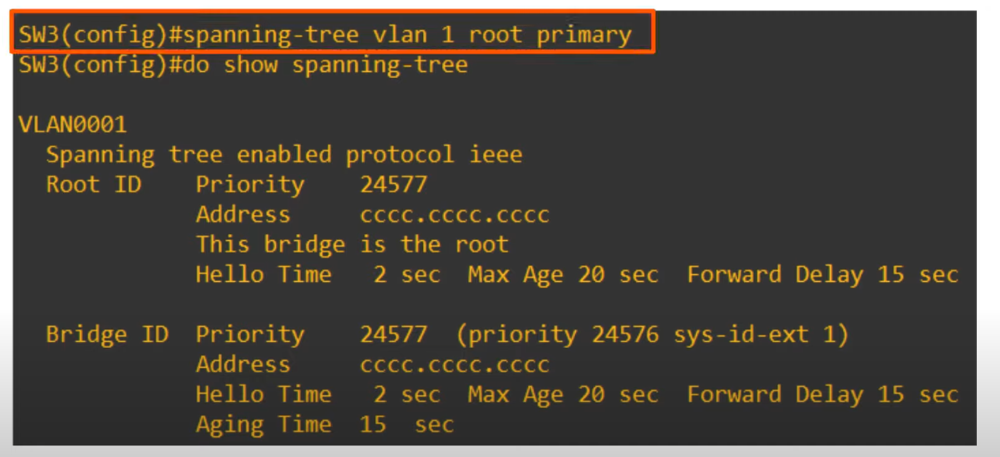

Confirm with “(do) show spanning-tree”

Can see in the above example, SW3 has become the “root”

- The “spanning-tree vlan <vlan-number> root primary” command sets the STP PRIORITY to 24576. If another SWITCH already has a priority number lower than 24576, it sets this SWITCH’s priority to 4096 LESS THAN the other SWITCH’s Priority (remember STP PART 1 lecture)

---

SECONDARY ROOT BRIGE (backup ROOT BRIDGE)

Command to CONFIGURE Spanning-Tree SECONDARY ROOT BRIDGE on a SWITCH

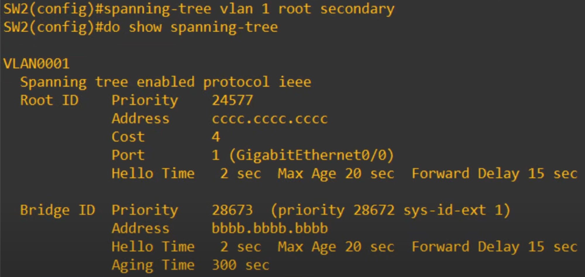

- The “spanning-tree vlan <vlan-number> root secondary” command sets the STP PRIORITY to 28672 (exactly 4096 higher than 24576).

---

VLAN 1 TOPOLOGY running PVST+

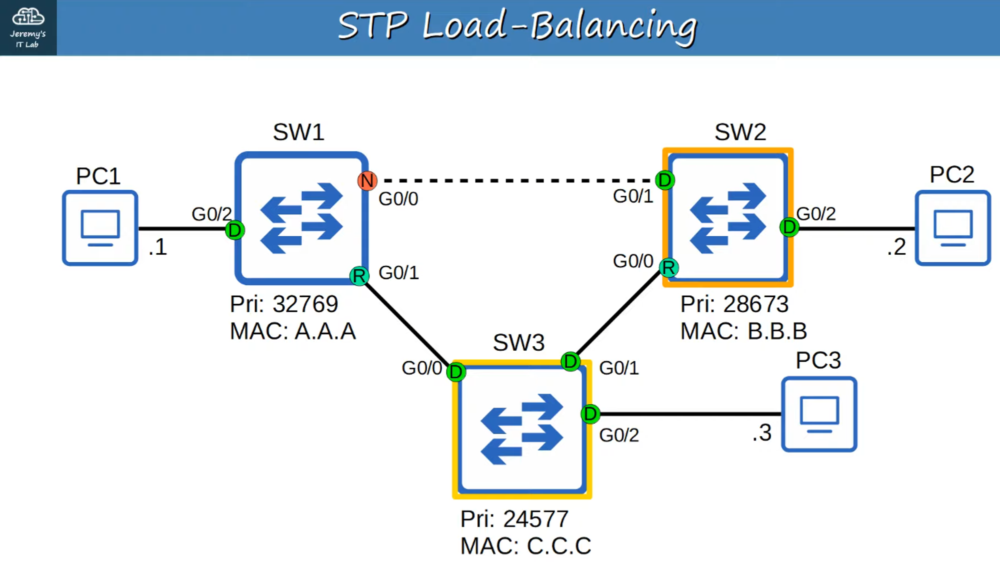

SW1 WAS the PRIMARY ROOT BRIDGE but : 

- We have configured SW3 to be the PRIMARY
- We have configured SW2 to be the SECONDARY

The TOPOLOGY for VLAN 2, however, won’t be the same. It will be the OLD Topology.

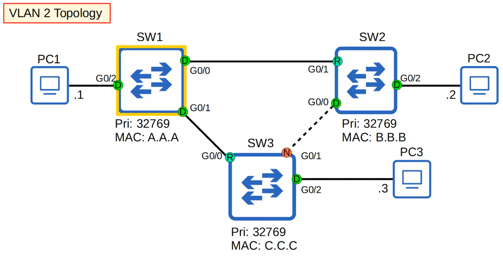

## Why?
Because we made changes ONLY to the TOPOLOGY found in VLAN 1 (see the commands we used)

---

## Configure Stp Port Settings

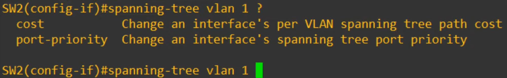

## “Cost” = “Root Cost”

“port-priority” = “PORT PRIORITY”
