# 34. Standard Access Control Lists (Acl)

## What Are Acls

- ACLs (Access Control Lists) have multiple uses
- In DAY 34 and DAY 35, we will focus on ACL’s from a security perspective
- ACLs function as a “packet filter” - instructing the ROUTER to ALLOW or DENY specific traffic
- **Acls Can Filter Traffic Based On:**
- Source / Destination Ip Addresses
- Source / Destination Layer 4 Ports
    - etc.

---

## How Acls Work

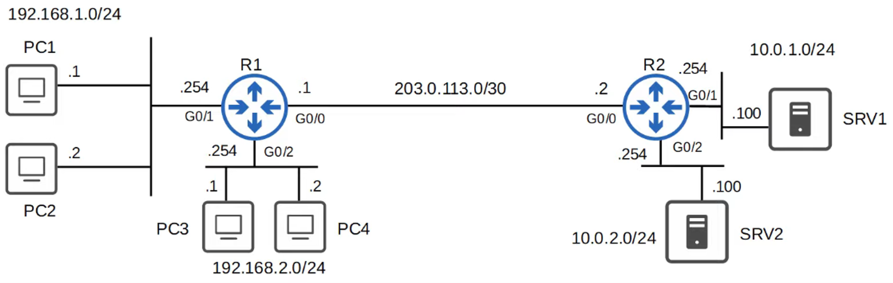

> **Note:** REQUIREMENTS:

- Hosts in 192.168.1.0/24 should have ACCESS to the 10.0.1.0/24 NETWORK
- Hosts in 192.168.2.0/24 should not have ACCESS to the 10.0.1.0/24 NETWORK

ACLs are configured GLOBALLY on the ROUTER (Global Config Mode)

- They are an ordered sequence of ACEs (Access Control Entries)

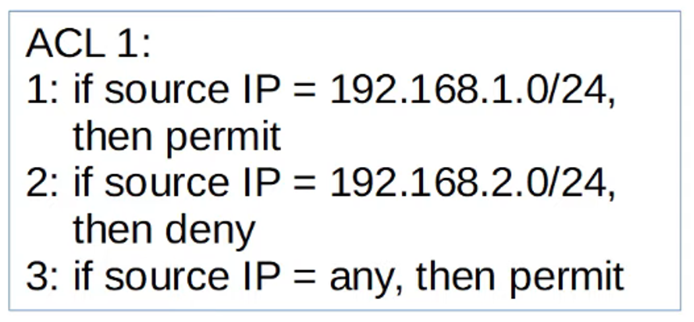

- Configuring an ACL in Global Config Mode will not make the ACL take effect
- The ACL must be applied to an interface
    - ACLs are applied either INBOUND or OUTBOUND
- ACLs are made up of one or more ACEs
- When a ROUTER checks a PACKET against the ACL, it processes the ACEs in order, from top to bottom
- If the PACKET matches one of the ACEs in the ACL, the ROUTER takes the action and stops processing the ACL. All entries below the matching entry will be ignored

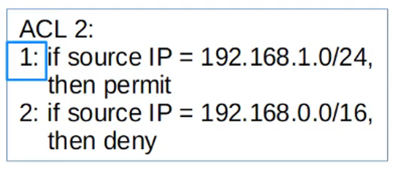

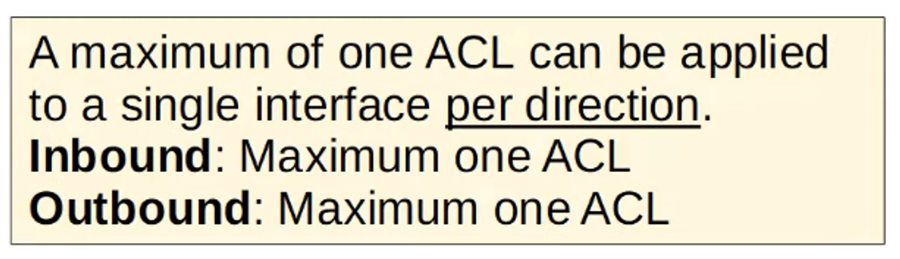

---

## Implicit Deny

- What will happen if a PACKET doesn’t match any of the entries in an ACL ?
- There is an INPLICIT DENY at the end of ALL ACL’s
- The IMPLICIT DENY tells the ROUTER to DENY ALL TRAFFIC that doesn’t match ANY of the configured entries in the ACL

---

## Acl Types

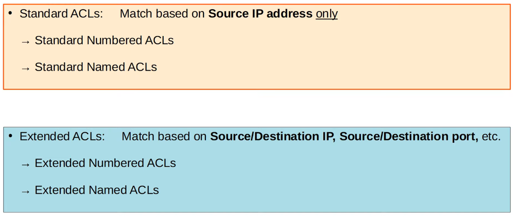

---

## Standard Numbered Acls

- Match traffic based only on the SOURCE IP ADDRESS of the PACKET
- Numbered ACLs are identified with a number (ie: ACL 1, ACL 2, etc.)
- Different TYPES of ACLs have a different range of numbers that can be used
    
    <aside>
> **Note:** STANDARD ACLs can use 1-99 and 1300-1999
    
    </aside>
    

- The basic command to configure a STANDARD NUMBERED ACL
    - `R1(config)# access-list *number* {deny | permit} *ip wildcard-mask*`
    
    This is an example of denying a SPECIFIC host’s traffic
    
    REMEMBER : 0.0.0.0 wildcard is the same as 255.255.255.255 or a /32 host
    
    - Example : `R1(config)# access-list 1 deny 1.1.1.1 0.0.0.0`
    - Example : `R1(config)# access-list 1 deny 1.1.1.1`(identical to the above)
    - Example : `R1(config)# access-list 1 deny host 1.1.1.1`
    
    If you want to permit ANY traffic from ANY source
    
    - Example : `R1(config)# access-list 1 permit any`
    - Example : `R1(config)# access-list 1 permit 0.0.0.0 255.255.255.255`
    
    If you want to make a description for a specific ACL
    
    - Example : `R1(config)# access-list 1 remark ## BLOCK BOB FROM ACCOUNTING ##`

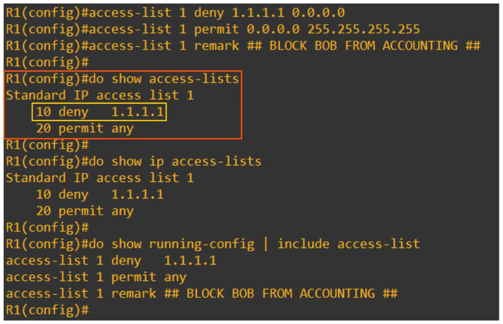

Order is important. Lower Numbers are processed FIRST

---
## to Apply an Acl to an Interface

`R1(config-if)# ip access-group *number* {in | out}`

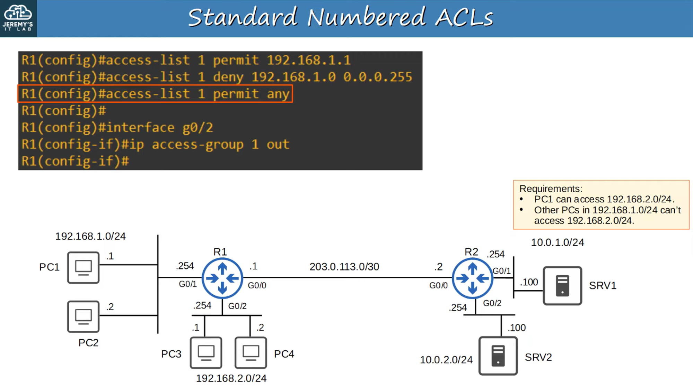

## Why Was This Rule Placed On G0/2 Out ? 

> **Note:** STANDARD ACLs should be applied as CLOSE to the DESTINATION as possible!

---

## Standard Named Acls

- Standard ACLs match traffic based only on the SOURCE IP ADDRESS of the PACKET
- NAMED ACLs are identified with a NAME (ie: ‘BLOCK_BOB’)
- STANDARD NAMED ACLs are configured by entering ‘standard named ACL config mode’ then configuring EACH entry within that config mode
    - `R1(config)# ip access-list standard *acl-name*`
    - `R1(config-std-nacl)# [*entry-number*] {deny | permit} *ip wildcard-mask*`

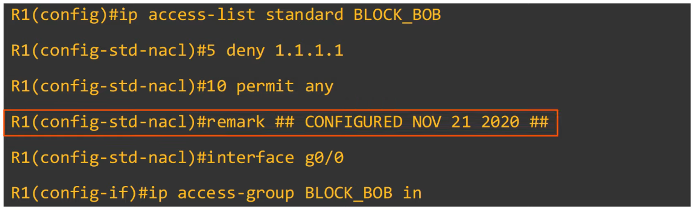

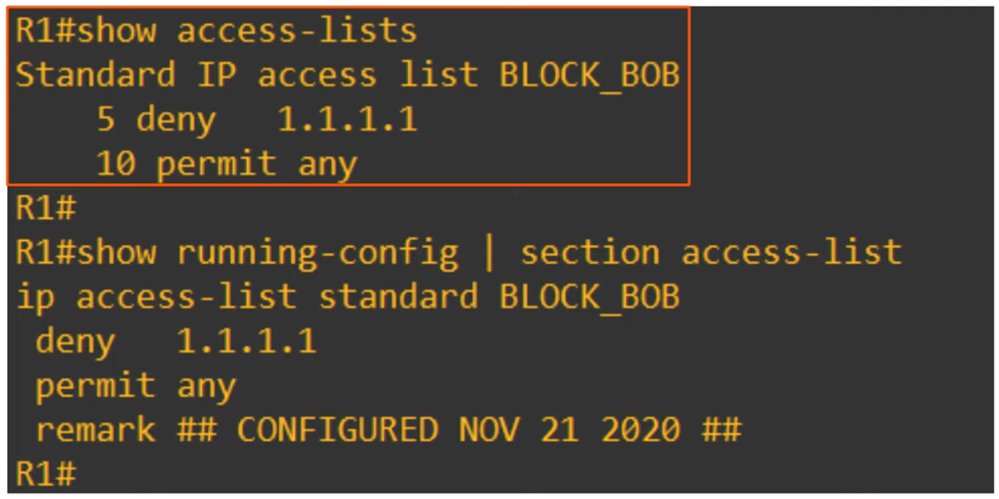

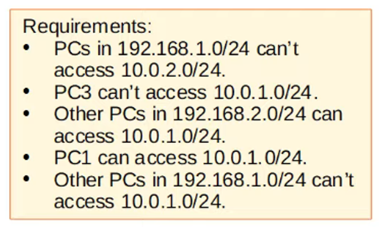

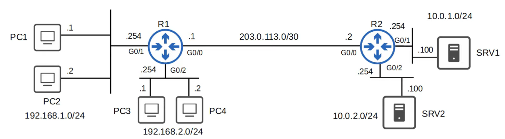

Here are the configurations for the above:

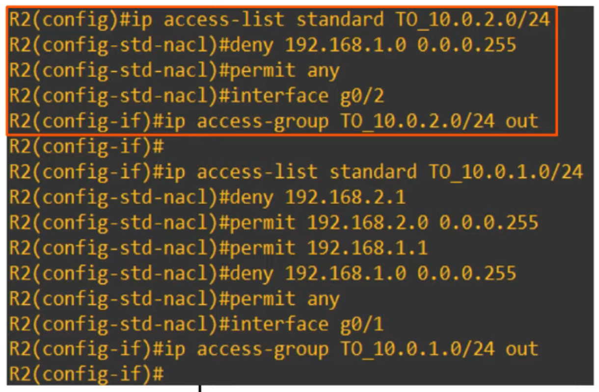

Note, however, how the order is when viewing the ACLs 

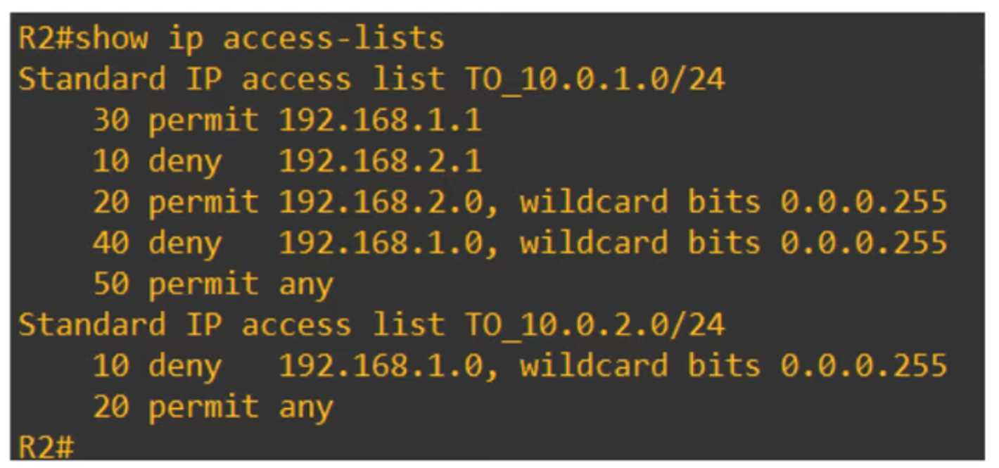

## Why The Reordering?

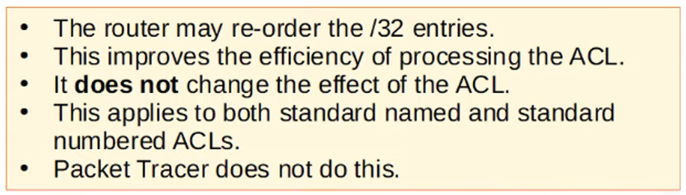

CISCOs PACKET TRACER does not reorder these, however.
