# 11. Static Routing : Part 2

### **Review**

SWITCHES forward traffic WITHIN LAN's
ROUTERS forward traffic BETWEEN LAN's

WAN (Wide Area Network)

- Network spread over a large area

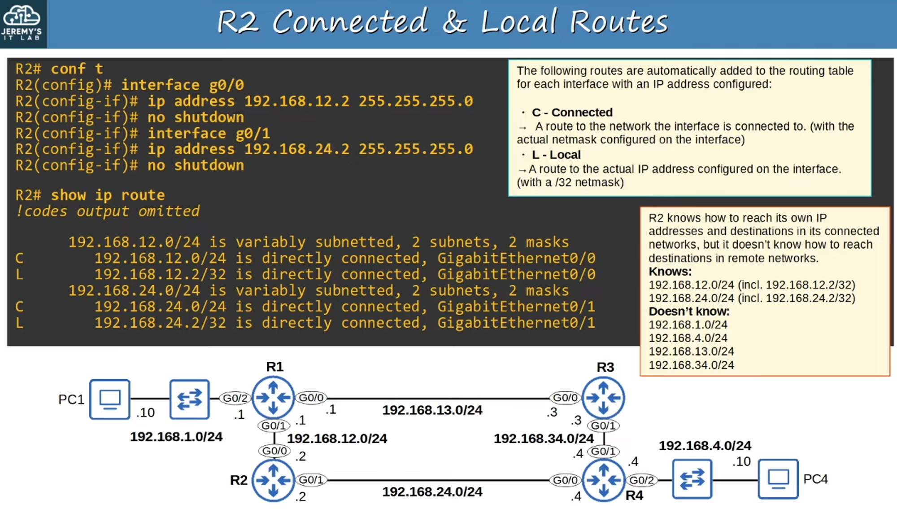

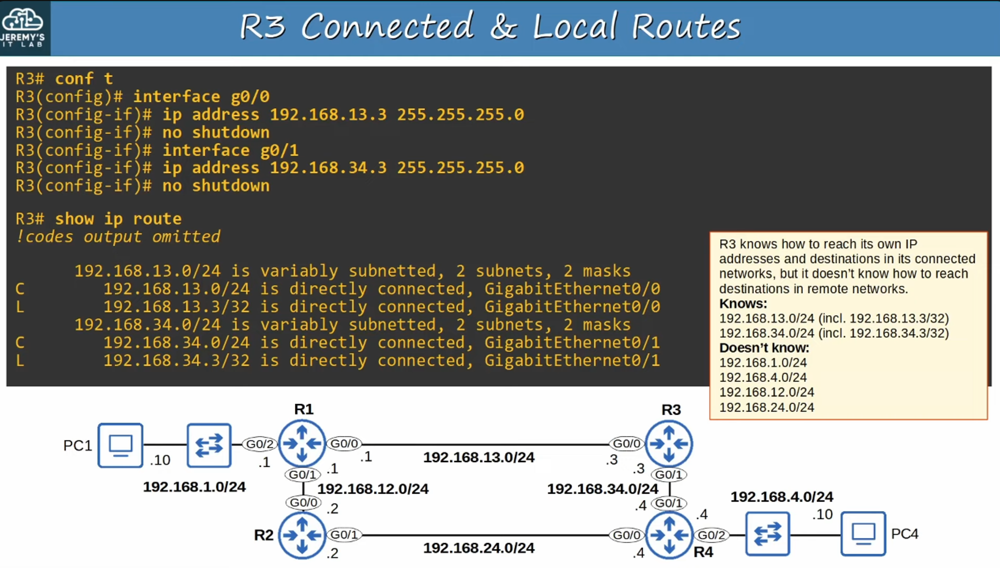

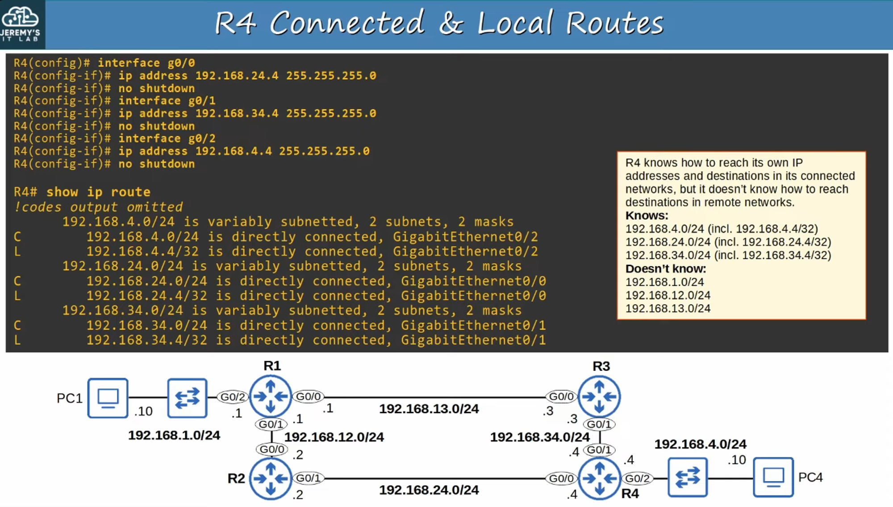

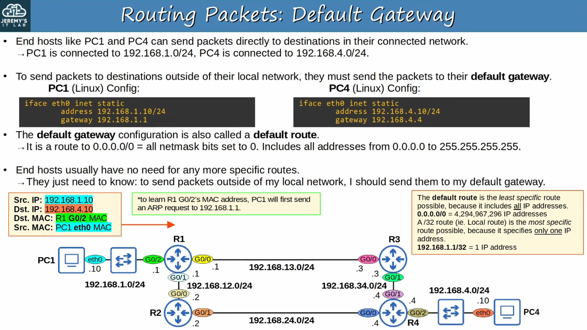

---

### **Static Routes**

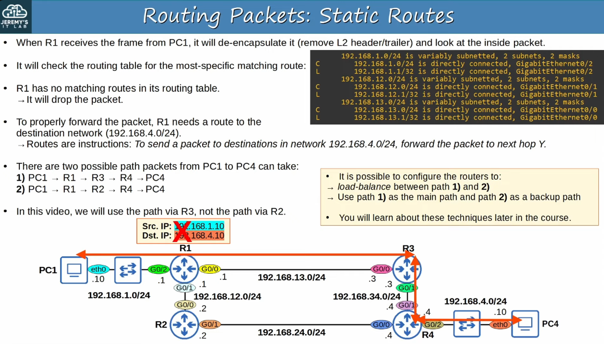

---

### **Static Route Configuration**

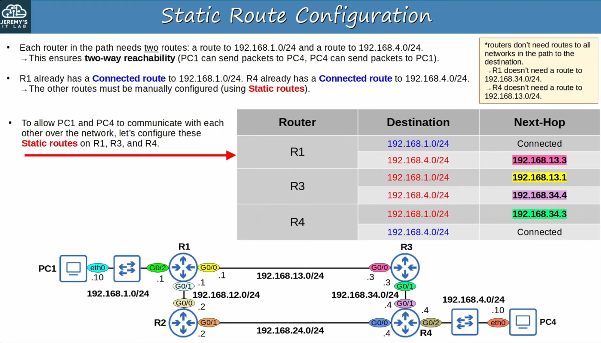

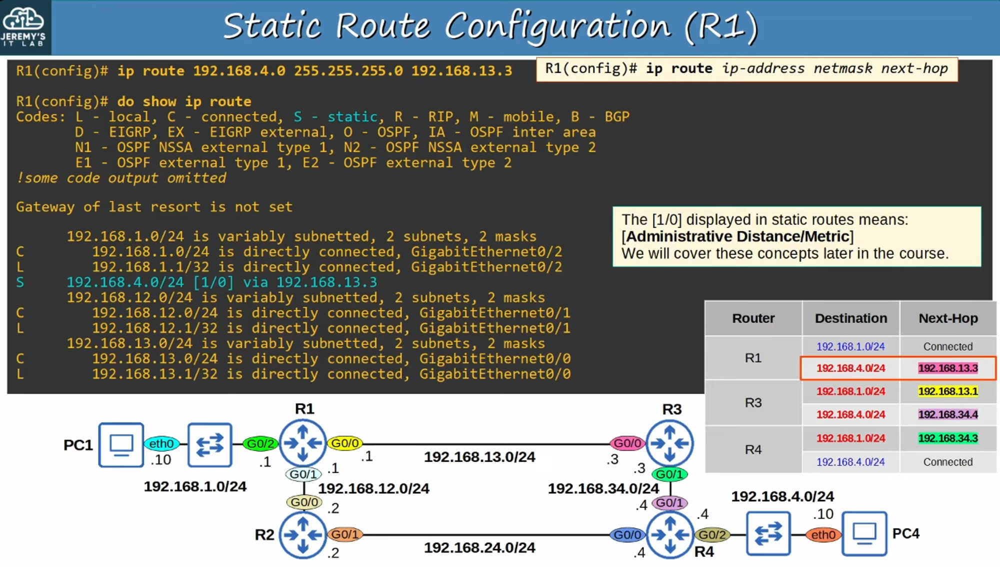

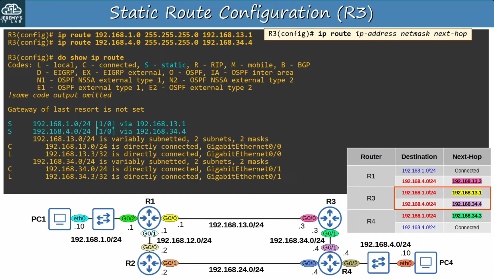

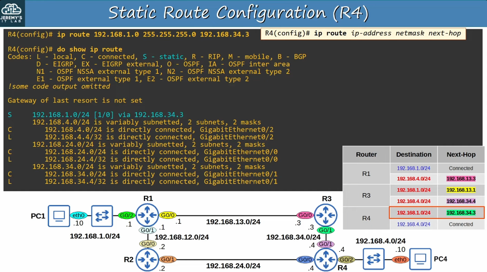

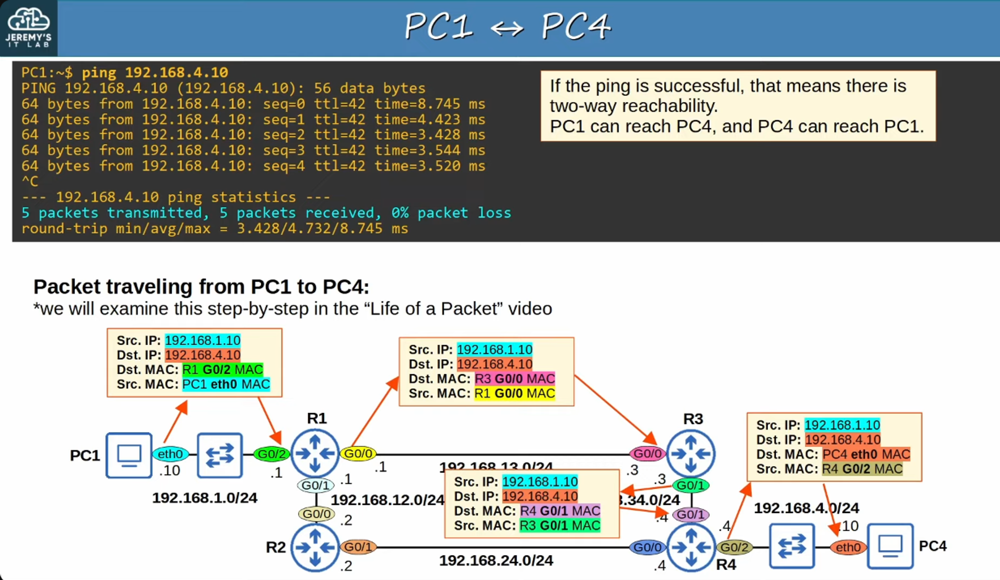

---

STATIC ROUTE CONFIGURATION with *exit-interface*

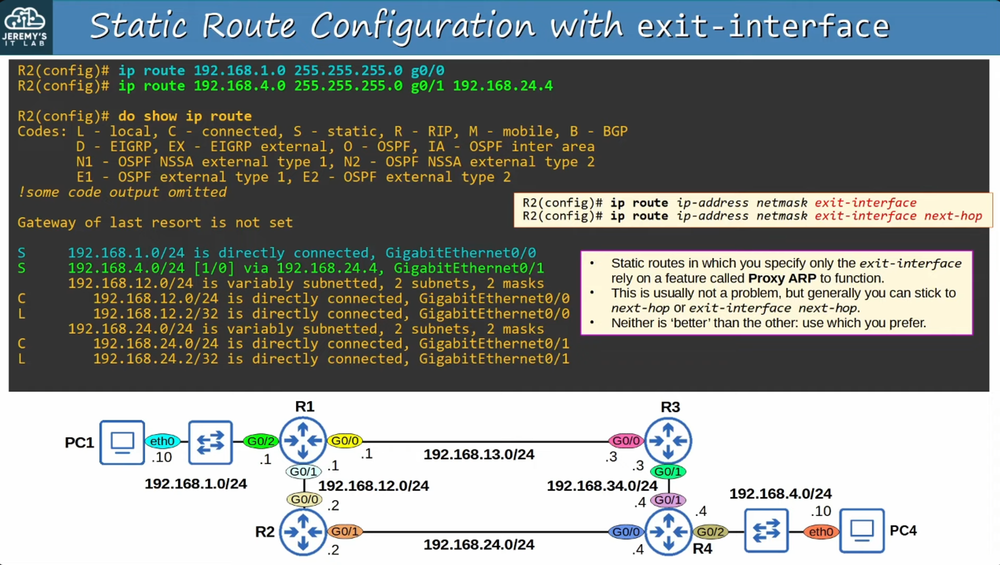

---

## Default Route

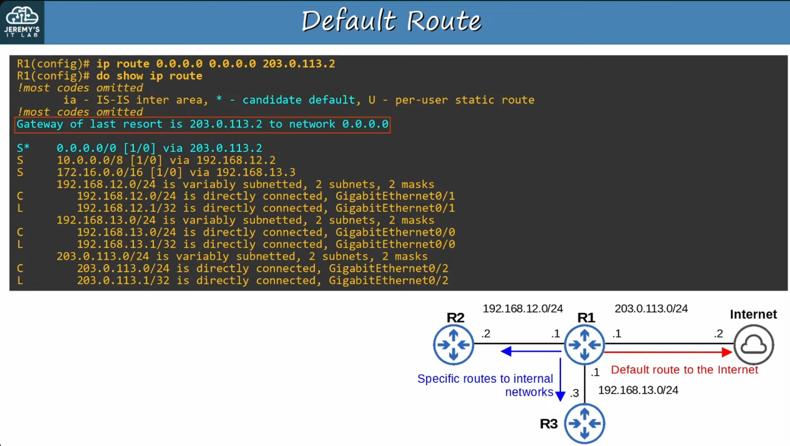
