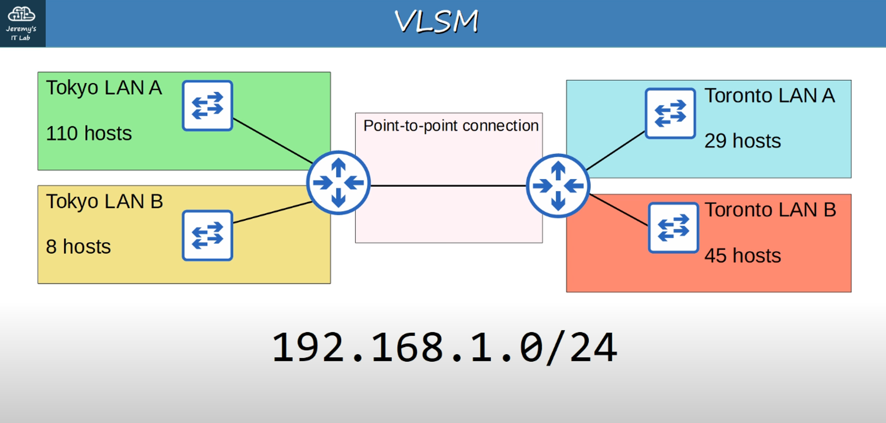
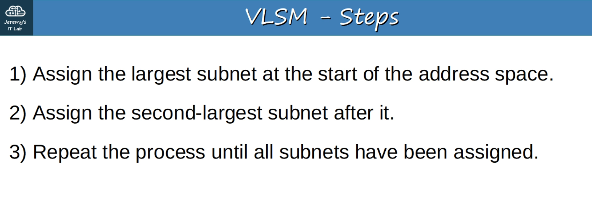
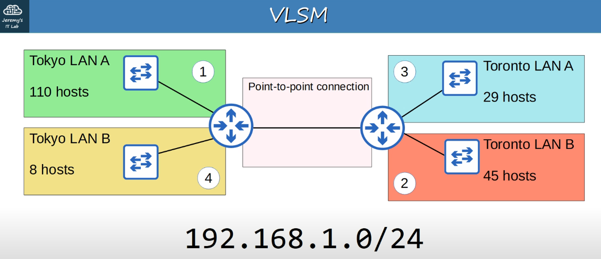

# 15. Subnetting (VLSM) : Part 3

The process of subnetting Class A, Class B, and Class C is identical.

## Subnetting Class a Networks

Given a 10.0.0.0/8 network, you must create 2000 subnets which will distributed to various enterprises. What prefix length must you use?

2^10 = 1024 so 2^11 = 2048. We have to "borrow" 11 bits (Left to Right) to get enough subnets

0000 1010 . 0000 0000 . 000 | 00000 . 0000 0000

8 bits + 8 bits + 3 = 19 bits

0000 1010 . 0000 0000 . 000 | 00000 . 0000 0000
1111 1111 . 1111 1111 . 111 | 00000 . 0000 0000

255.255.224.0 is the Subnet mask

The answer is /19 (/8 + /11 = /19)

How many hosts per subnet? There are 13 host bits remaining so:

2^13 - 2 = 8190 hosts per subnet

---

## Variable-Length Subnet Masks (VLSM)

- Until now, we have practiced subnetting using FLSM (Fixed-Length Subnet Masks).
- This means that all of the subnets use the same prefix length (ie: Subnetting a Class C network into 4 subnets using /26)
- VLSM (Variable-Length Subnet Masks) is the process of creating subnets of different sizes, to make your use of network addresses more efficient.
- VLSM is more complicated than FLSM, BUT it's easy if you follow the steps correctly.







So, in order:
```
## Tokyo LAN a (110 Hosts)
## Toronto LAN B (45 Hosts)
## Toronto LAN a (29 Hosts)
## Tokyo LAN B (8 Hosts)
and
THE POINT TO POINT CONNECTION (between the two ROUTERS)
```
192.168.1.0 / 24

1000 0000 . 1010 1000 . 0000 0001 | 0000 0000  (last is host octet = 254 usable hosts)

Shifting LEFT - we DOUBLE the # of hosts
Shifting RIGHT - we HALF the # of hosts

TOKYO LAN A (we need to borrow 1 host bits, to the RIGHT, to leave enough for 2^7 or 128 hosts. More than enough for TOKYO A)

so:
```
192.168.1.0/25 (Network Address)
1000 0000 . 1010 1000 . 0000 0001 . 0 | 000 0000

Converting remaining Host Bits to 1s:
0111 1111, we get 127 so

192.168.1.127/25 is the Broadcast Address
```
---
## Tokyo LAN a
```
## Network Address: 192.168.1.0/25
## Broadcast Address: 192.168.1.127/25
## First Usable: 192.168.1.1/25
## Last Usable: 192.168.1.126/25
## Total Number of Usable Hosts: 126 (2^7 -2)

Since TOKYO LAN A is 192.168.1.127, the next Subnet (TOKYO LAN B) starts at 192.168.1.128 (Network Address)
```
---
## Toronto LAN B
```
## Network Address: 192.168.1.128 / 26
## Broadcast Address: 192.168.1.191 / 26
## First Usable: 192.168.1.129 /26
## Last Usable: 192.168.1.190 / 26
## Total Number of Usable Hosts: 62 (2^6 -2)
```

We need to borrow to get enough for 45 hosts.

|128|64|32|16|8|4|2|1|
|---|--|--|--|-|-|-|-|
|x  |x | 0| 0|0|0|0|0|
```
1000 0000 . 1010 1000 . 0000 0001 . 10 | 00 0000

192 . 168 . 1 . 128

1000 0000 . 1010 1000 . 0000 0001 . 10 | 11 1111

192 . 168 . 1 . 191 (Broadcast Address)
```
---

## Toronto LAN a

We need to borrow to get enough for 29 hosts.

|128|64|32|16|8|4|2|1|
|---|--|--|--|-|-|-|-|
|x  |x | x| 0|0|0|0|0|
```
1000 0000 . 1010 1000 . 0000 0001 . 110 | 0 0000

192.168.1.192 (Net Address)

1000 0000 . 1010 1000 . 0000 0001 . 110 | 1 1111

192.168.1.224 (Broadcast address)

## Network Address: 192.168.1.192 / 27
## Broadcast Address: 192.168.1.223 / 27
## First Usable: 192.168.1.193 /27
## Last Usable: 192.168.1.222 / 27
## Total Number of Usable Hosts: 30 Hosts (2^5 - 2)
```
---

## Tokyo LAN B
We need to borrow to get enough for 8 hosts. Remember total usable hosts is equal to x - 2.

|128|64|32|16|8|4|2|1|
|---|--|--|--|-|-|-|-|
|x  |x | x| x|0|0|0|0|
```
1000 0000 . 1010 1000 . 0000 0001 . 1110 | 0000

192.168.1.224 (Net Address)

1000 0000 . 1010 1000 . 0000 0001 . 1110 | 1111

192.168.1.239 (Broadcast address)

## Network Address: 192.168.1.224 / 28
## Broadcast Address: 192.168.1.239 / 28
## First Usable: 192.168.1.225 /28
## Last Usable: 192.168.1.238 / 28
## Total Number of Usable Hosts: 14 Hosts (2^4 - 2)
```
---

## Point to Point Connections

We need to borrow to get enough for 4 hosts. Remember total usable hosts is equal to x - 2.
|128|64|32|16|8|4|2|1|
|---|--|--|--|-|-|-|-|
|x  |x | x| x|x|x|0|0|
```
1000 0000 . 1010 1000 . 0000 0001 . 1111 00 | 00

192.168.1.240 (Net Address)

1000 0000 . 1010 1000 . 0000 0001 . 1111 00 | 11

192.168.1.243 (Broadcast address)

## Network Address: 192.168.1.240 / 30
## Broadcast Address: 192.168.1.243 / 30
## First Usable: 192.168.1.241 / 30
## Last Usable: 192.168.1.242 / 30
## Total Number of Usable Hosts: 2 Hosts (2^2 - 2)
```
---

## Additional Practice for Subnetting

[http://www.subnettingquestions.com](http://www.subnettingquestions.com/)
[http://subnetting.org](http://subnetting.org/)
[https://subnettingpractice.com](https://subnettingpractice.com/) *** Preferred site ***
