# 56. Wireless Architectures

## 802.11 Message / Frame Format

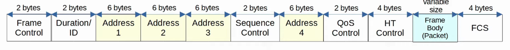

- 802.11 FRAMES have a different format than 802.3 ETHERNET FRAMES
- For the CCNA, you don’t have to learn it in as much detail as the ETHERNET and IP HEADERS
- Depending on the 802.11 VERSION and the MESSAGE TYPE, some of the fields might not be present in the FRAME
    - For example: Not ALL messages use all 4 ADDRESS FIELDS
- FRAME CONTROL
    - Provides information such as MESSAGE TYPE and SUBTYPE
    - Indicates if the FRAME is a MANAGEMENT frame
- DURATION / ID
    - Depending on the MESSAGE TYPE, this field can indicate:
        - The TIME (in microseconds) the CHANNEL will be dedicated to transmission of the FRAME
        - Identifier for the ASSOCIATION (the connection)
    
- ADDRESSES
    - Up to FOUR ADDRESSES can be present in an 802.11 FRAME.
    - Which ADDRESSES are present, and their ORDER, depends on the MESSAGE TYPE
        - DESTINATION ADDRESS (DA) : Final RECIPIENT of the FRAME
        - SOURCE ADDRESS (SA) : Original SENDER of the FRAME
        - RECEIVER ADDRESS (RA) : Immediate RECIPIENT of the FRAME
        - TRANSMITTER ADDRESS (TA) : Immediate SENDER of the FRAME
    
- SEQUENCE CONTROL
    - Used to reassemble FRAGMENTS and eliminate DUPLICATE FRAMES

- QoS CONTROL
    - Used in QoS to PRIORITIZE certain traffic
- HT (High Throughput) CONTROL
    - Added in 802.11n to ENABLE High Throughput operations
    - 802.11n is also known as “HIGH THROUGHPUT” (HT) WI-FI
    - 802.11ac is also know as “VERY HIGH THROUGHPUT” (VHT) WI-FI

- FCS (FRAME CHECK SEQUENCE)
    - Same as in an ETHERNET FRAME, used to check for errors

---

## 802.11 Association Process

- ACCESS POINTS bridge traffic between WIRELESS STATIONS and other DEVICES
- For a STATION to send traffic through the AP, it must be associated with the AP
- There are THREE 802.11 CONNECTION STATES:
- Not Authenticated, Not Associated
- Authenticated, Not Associated
    - AUTHENTICATED and ASSOCIATED

- The STATION must be AUTHENTICATED and ASSOCIATED with the AP to send traffic through it

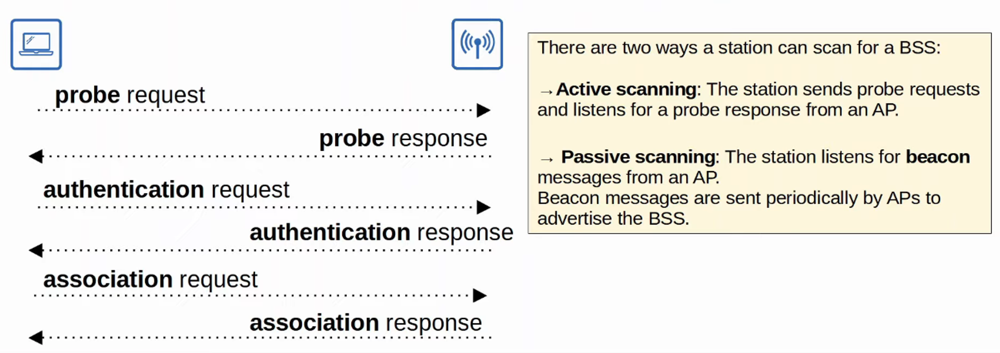

---

## 802.11 Message Types

- There are THREE 802.11 MESSAGE TYPES
- Management
- Control
- Data

- MANAGEMENT
    - Used to manage the BSS
- Beacon
- Probe Request / Probe Response
- Authentication
- Association Request / Association Response

- CONTROL
    - Used to control access to the medium (RADIO FREQUENCY)
    - Assists with delivery of MANAGEMENT and DATA FRAMES
- Rts (Request To Send)
- Cts (Clear To Send)
- Ack

- DATA
    - Used to send actual DATA PACKETS

 

---

## Autonomous APs

- AUTONOMOUS APs are self-contained SYSTEMS that do NOT RELY on a WLC
- AUTONOMOUS APs are configured individually
    - Can be configured by CONSOLE cable (CLI)
    - Can be configured by TELNET (CLI)
    - Can be configured by HTTP / HTTPS Web connection (GUI)
    - An IP ADDRESS for REMOTE MANAGEMENT should be configured
    - The RF PARAMETERS must be manually configured (Transmit Power, Channel, etc)
    - SECURITY POLICIES are handled individually by each AP
    - QoS RULES etc. are configured individually by each AP

 

- There is NO CENTRAL MONITORING or MANAGEMENT of APs

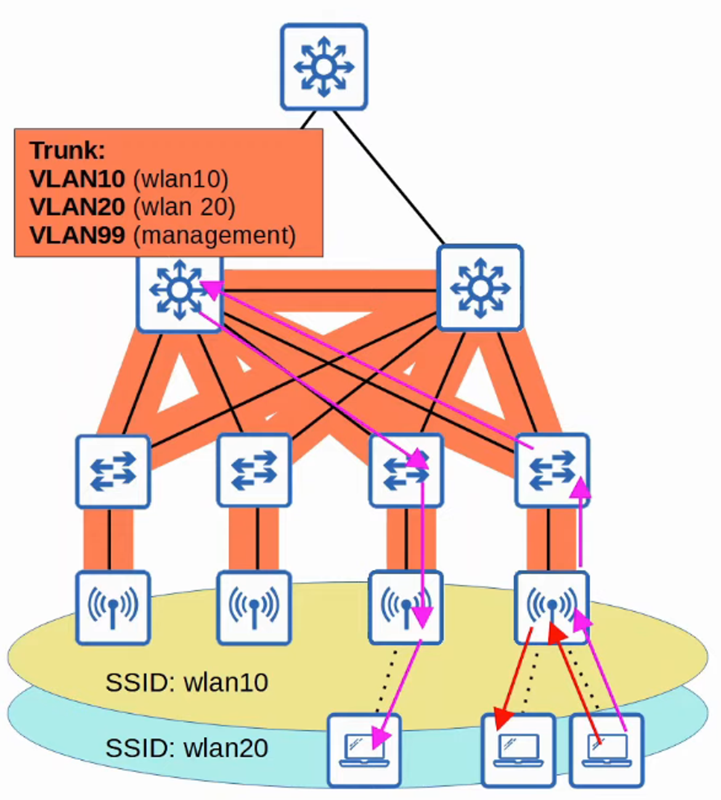

- AUTONOMOUS APs connect to the WIRED NETWORK with a TRUNK link
- DATA traffic from WIRELESS CLIENTS have a very direct PATH to the WIRED NETWORK or to other WIRELESS CLIENTS associated with the same AP
- Each VLAN has to STRETCH across the entire NETWORK. This is considered BAD practice
    - Large Broadcast Domains
    - Spanning Tree will disable links
    - Adding / Deleting VLANs is VERY labor-intensive
- AUTONOMOUS APs can be used in SMALL NETWORKS but they are not viable in MEDIUM to LARGE NETWORKS
    - LARGE NETWORKS can have thousands of APs

- **Autonomous APs Can Also Function in The Modes Covered in The Previous Video:**
- Repeater
- Outdoor Bridge
- Workgroup Bridge

---

## Lightweight APs

- The functions of an AP can be split between the AP and a WIRELESS LAN CONTROLLER (WLC)
- The is what is called SPLIT-MAC ARCHITECTURE

- LIGHTWEIGHT APs handle **“real-time”** operations like:
- Transmitting / Receiving Rf Traffic
- Encryption / Decryption Of Traffic
- Sending Out Beacons / Probes
- Packet Prioritization
    - Etc…
- WLC Functions (not time dependent)
- Rf Management
    - SECURITY / QoS MANAGEMENT
- Client Authentication
- Client Association / Roaming Management
- Resource Allocation
    - Etc…
    
- The WLC is also used to centrally configured the lightweight APs
- The WLC can be located in the same SUBNET / VLAN as the lightweight APs it manages OR in a different SUBNET / VLAN
- The WLC and the lightweight APs AUTHENTICATE each other using DIGITAL CERTIFICATES installed on each DEVICE ( X.509 STANDARD CERTIFICATES )
    - This ensures that only AUTHORIZED APs can join the NETWORK

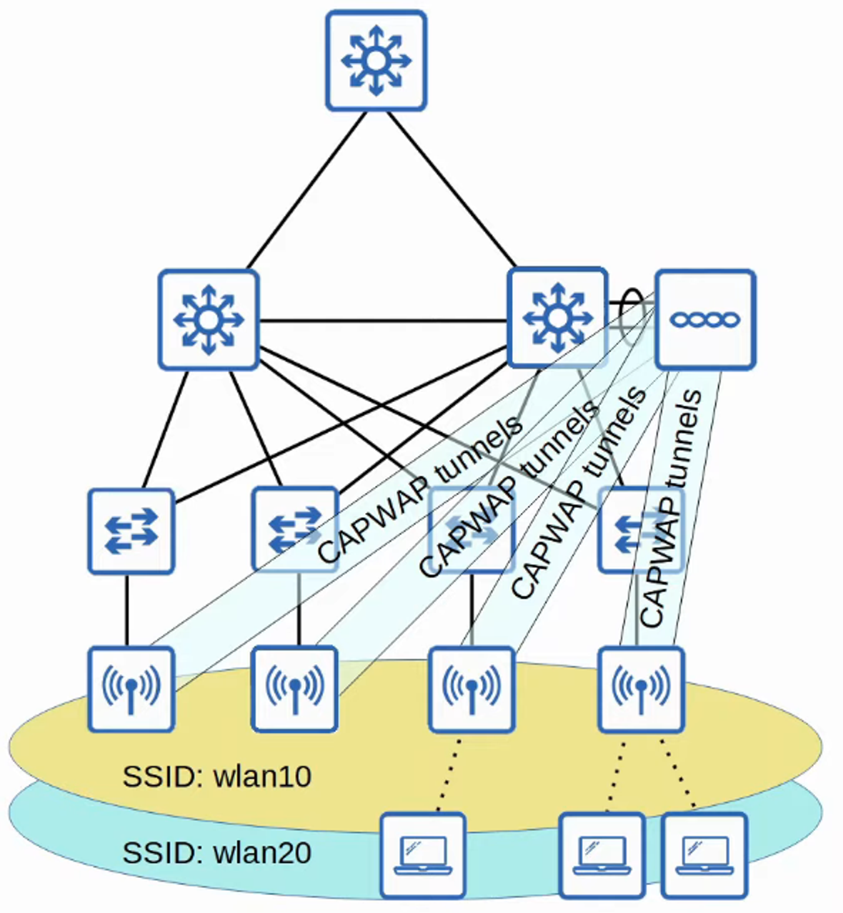

- THE WLC and lightweight APs use a PROTOCOL called CAPWAP (CONTROL AND PROVISIONING OF WIRELESS ACCESS POINTS) to communicate
    - Based on an older PROTOCOL called LWAPP (LIGHTWEIGHT ACCESS POINT PROTOCOL)

- **Two Tunnels Are Created Between Each AP and The WLC :**
    - CONTROL TUNNEL (UDP Port 5246)
        - This TUNNEL is used to configure the APs and control and manage operations
        - All traffic in this TUNNEL is ENCRYPTED, by default
    - DATA TUNNEL (UDP Port 5247)
        - All traffic from WIRELESS CLIENTS is sent through this TUNNEL to the WLC
- It Does Not Go Directly To The Wired Network !

- Traffic in this TUNNEL is not ENCRYPTED by default but you can configure it to be ENCRYPTED with DTLS (DATAGRAM TRANSPORT LAYER SECURITY)

- Because ALL traffic from WIRELSS CLIENTS is TUNNELED to the WLC with CAPWAP, APs connect to the SWITCH ACCESS PORTS - NOT TRUNK PORTS

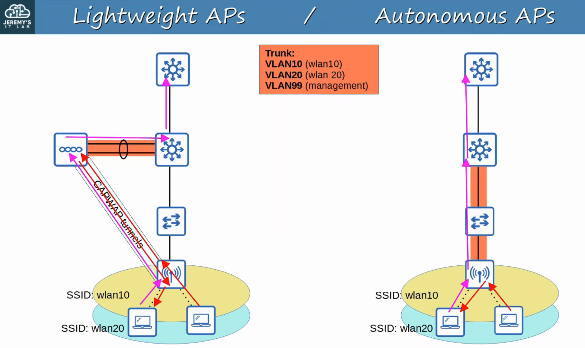

---

***  (Not necessary to MEMORIZE for CCNA) ***

There are some KEY BENEFITS to SPLIT-MAC ARCHITECTURE

- SCALABILITY
    - With a WLC (or multiple) it’s SIMPLER to build and support a NETWORK with thousands of APs
- DYNAMIC CHANNEL ASSIGNMENT
    - The WLC can automatically select which channel each AP should use
- TRANSMIT POWER OPTIMIZATION
    - The WLC can automatically set the appropriate transmit power for each AP
- SELF-HEALING WIRELESS COVERAGE
    - When an AP stops functioning, the WLC can increase the transmit power of nearby APs to avoid coverage holes
- SEAMLESS ROAMING
    - CLIENTS can roam between APs with no noticeable delay
- CLIENT LOAD BALANCING
    - If a CLIENT is in range of TWO APs, the WLC can associate the CLIENT with the least-used AP, to balance the load among APs
- SECURITY / QoS MANAGEMENT
    - Central management of SECURITY and QoS policies ensures consistency across the NETWORK

---

- **Lightweight APs Can Be Configured to Operate in Various Modes:**
- Local
        - This is the DEFAULT mode where the AP offers a BSS (more multiple BSSs) for CLIENTS to associate with
        
- Flexconnect
        - Like a LIGHTWEIGHT AP in LOCAL mode, it offers ONE or MORE BSSs for CLIENTS to associate with
        - HOWEVER, FLEXCONNECT allows the AP to locally SWITCH traffic between the WIRED (TRUNK) and WIRELESS NETWORKS (ACCESS) if the TUNNELS to the WLC go down
    
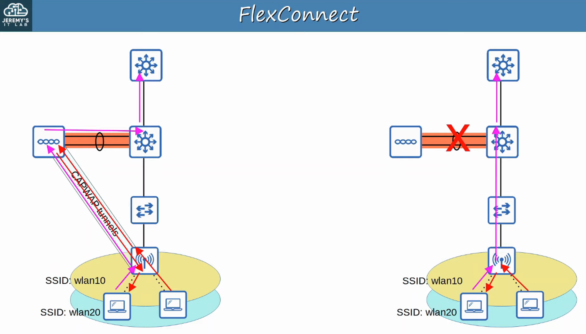
    

- SNIFFER
    - The AP does NOT OFFER a BSS for CLIENTS
    - Dedicated to CAPTURING 802.11 FRAMES and SENDING them to a DEVICE running software such as WIRESHARK

- MONITOR
    - The AP does NOT OFFER a BSS for CLIENTS
    - Dedicated to RECEIVING 802.11 FRAMES to detect ROGUE DEVICES
    - If a CLIENT is found to be a ROGUE DEVICE, an AP can send DE-AUTHENTICATION MESSAGES to disassociate the ROGUE DEVICE from the AP

- ROGUE DETECTOR
    - The AP does not even USE its RADIO
    - It LISTENS to traffic on the WIRED NETWORK only, but it receives a list of SUSPECTED ROGUE CLIENTS and AP MAC ADDRESSES from the WLC
    - By LISTENING to ARP MESSAGES on the WIRED NETWORK and correlating it with the information it receives from the WLC, it can DETECT ROGUE DEVICES

- SE-CONNECT (SPECTRUM EXPERT CONNECT)
    - The AP does NOT OFFER a BSS for CLIENTS
    - Dedicated to RF SPECTRUM ANALYSIS on ALL CHANNELS
    - It can send information to software such as Cisco Spectrum Expert on a PC to COLLECT and ANALYZE the DATA

- BRIDGE / MESH
    - Like the AUTONOMOUS APs *OUTDOOR BRIDGE* mode, the LIGHTWEIGHT AP can be a DEDICATED BRIDGE between SITES (Example:  over LONG distances)
    - A MESH can be made between the ACCESS POINTS

- FLEX PLUS BRIDGE
    - Adds FLEXCONNECT functionality to the BRIDGE / MESH mode
    - Allows WIRELESS ACCESS POINTS to locally forward traffic even if connectivity to the WLC is lost
    

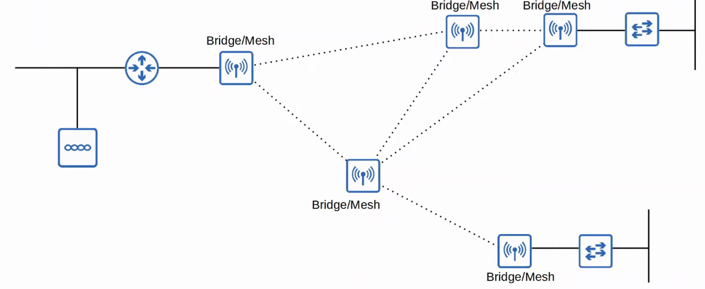

---

## Cloud-Based APs

- CLOUD-BASED AP architecture is between AUTONOMOUS AP and SPLIT-MAC ARCHITECTURE
    - AUTONOMOUS APs that are centrally managed in the CLOUD
- CISCO MERAKI is a popular CLOUD-BASED WI-FI solution
- The MERAKI dashboard can be used to configure APs, monitor the NETWORK, generate performance reports, etc.
    - MERAKI also tells each AP which CHANNEL to use, what transmit power, etc.
- However, DATA TRAFFIC is not sent to the CLOUD. It is sent directly to the WIRED NETWORK like when using AUTONOMOUS APs
    - Only management / control traffic is sent to the CLOUD

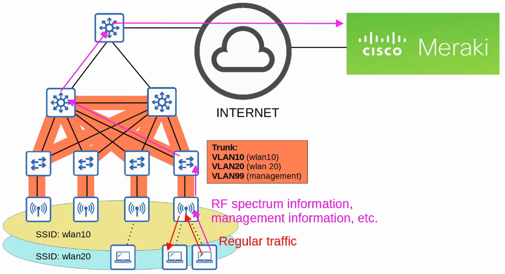

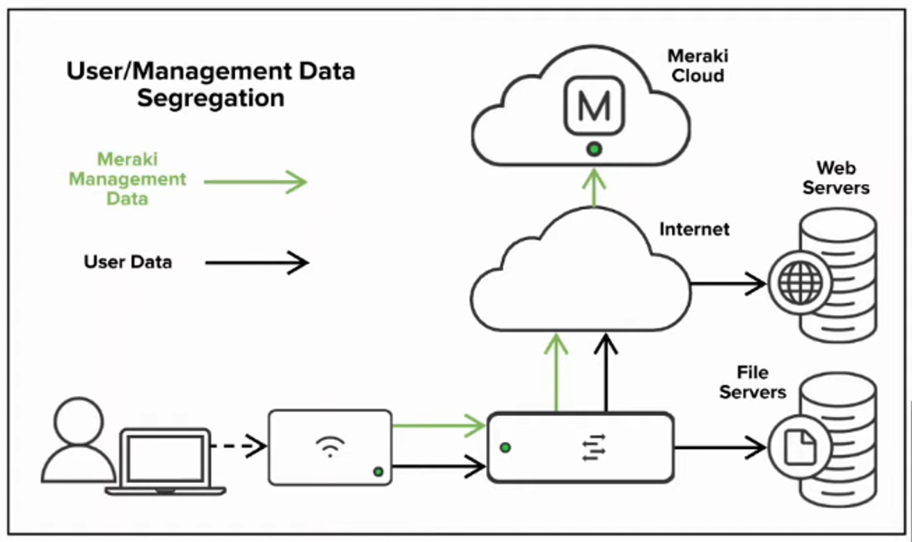

---

## Wireless LAN Controller (WLC) Deployments

- In a SPLIT-MAC ARCHITECTURE, there FOUR MAIN WLC DEPLOYMENT MODES:
- Unified
        - THE WLC is a HARDWARE APPLICANCE in a central location of the NETWORK
- Cloud-Based
        - The WLC is a VM running on a SERVER, usually in a PRIVATE CLOUD in a DATA CENTER
        - This is NOT the same as the CLOUD-BASED AP ARCHITECTURE discussed previously
- Embedded
        - The WLC is integrated within a SWITCH
- Mobility Express
        - THE WLC is integrated within an AP

---

## Unified WLC

- THE WLC is a HARDWARE APPLICANCE in a central location of the NETWORK
- A UNIFIED WLC can support up to about 6000 APs
- If more than 6000 APs are needed, additional WLCs can be added to the NETWORK

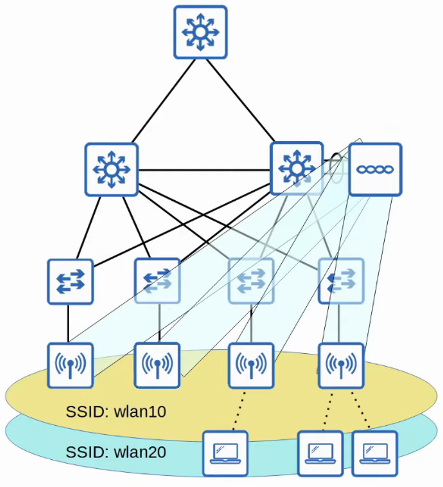

---

## Cloud-Based

- The WLC is a VM running on a SERVER, usually in a PRIVATE CLOUD in a DATA CENTER
- CLOUD-BASED WLCs can typically support up to about 3000 APs
- If more than 3000 APs are needed, more WLC VMs can be deployed

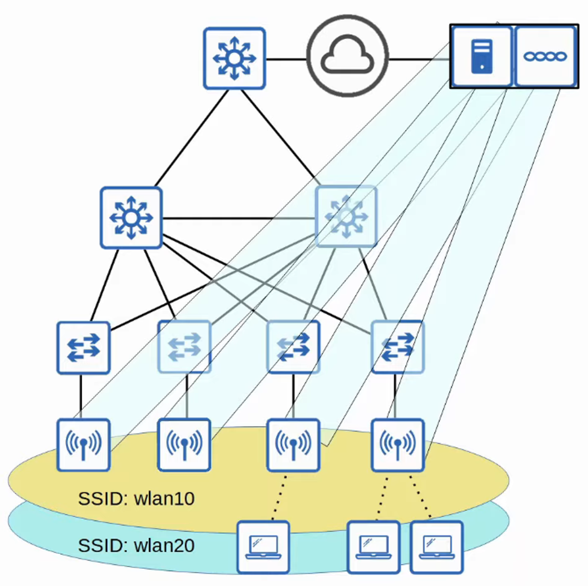

---

## Embedded WLC

- The WLC is embedded within a SWITCH
- An EMBEDDED WLC can support up to about 200 APs
- If more than 200 APs are needed, more SWITCHES with EMBEDDED WLCs can be added

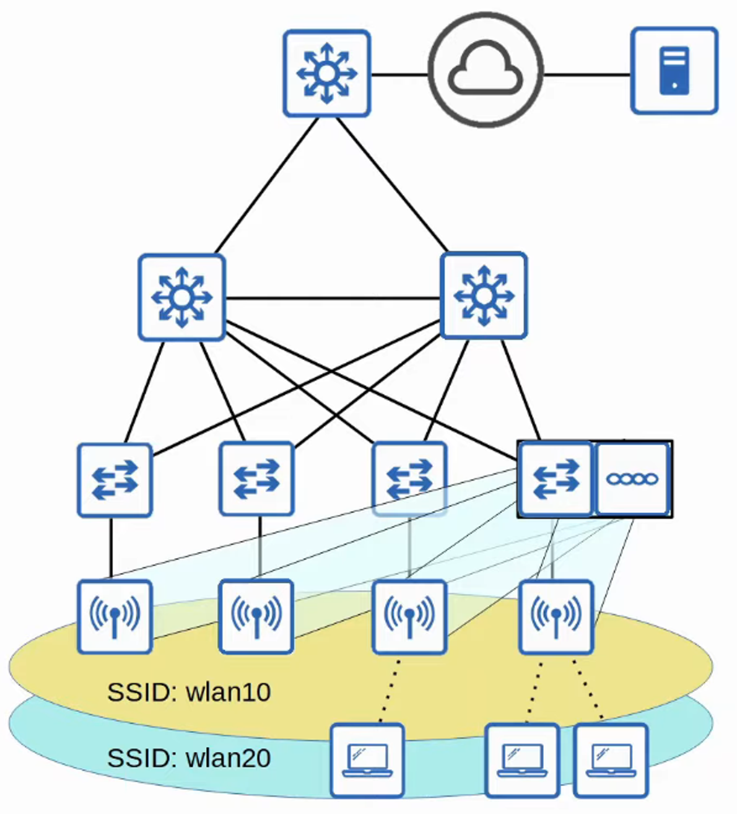

---

## Cisco Mobility Express WLC

- The WLC is embedded within an AP
- A MOBILITY EXPRESS WLC can support up to about 100 APs
- If more than 100 APs are needed, more APs with EMBEDDED MOBILITY  EXPRESS WLCs can be added

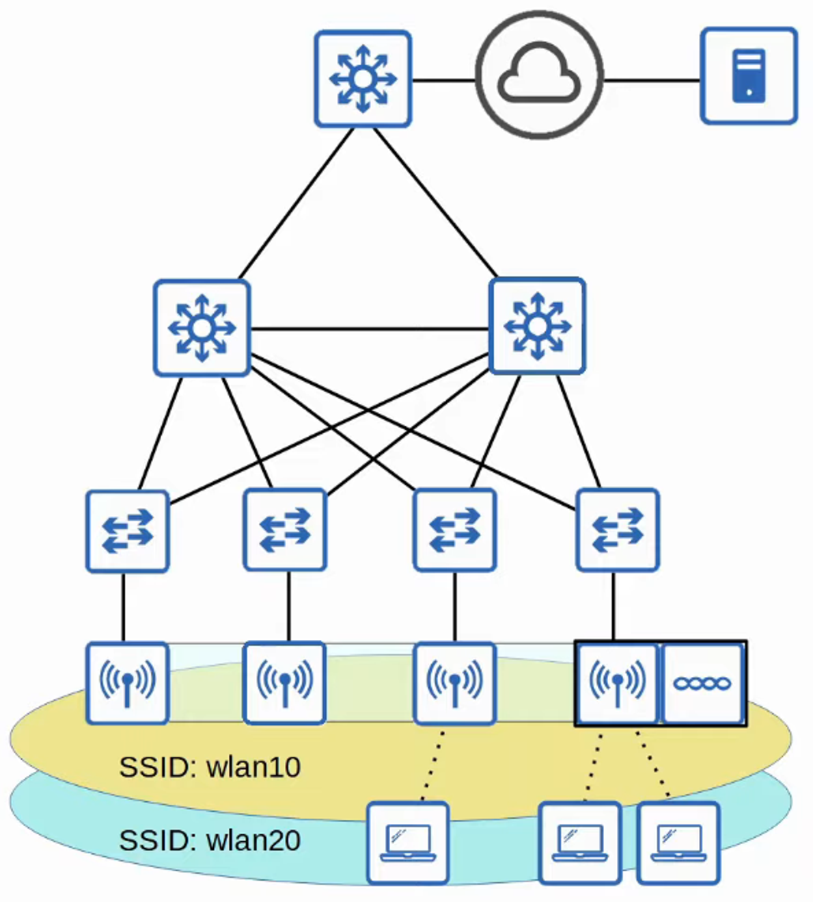
