# 55. Wireless Fundamentals

- Although we will briefly look at other types of WIRELESS NETWORKS, in this section of the course we will be focusing on WIRELESS LANs using WI-FI
- The STANDARDS we use for WIRELESS LANs are defined in IEEE 802.11
- The term WI-FI is a trademark of the WI-FI ALLIANCE, not directly connected to the IEEE
- The WI-FI ALLIANCE tests and certifies equipment for 802.11 standards compliance
- However, WI-FI has become the common term that people use to refer to 802.11 WIRELESS LANs and that term will be used through the course videos

## Wireless Networks

- WIRELESS NETWORKS have some issues that we need to deal with

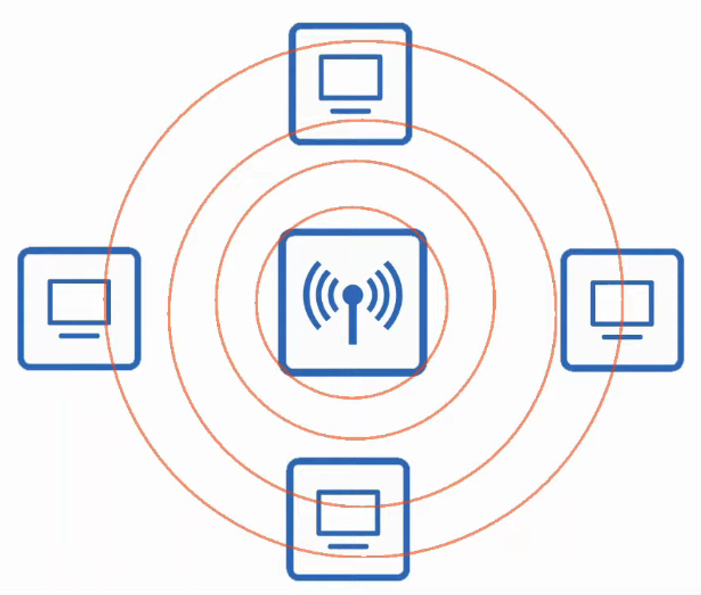

1)  ALL DEVICES within range receive ALL FRAMES, like DEVICES connected to an ETHERNET HUB

- Privacy of DATA within the LAN is a greater concern
- CSMA/CA (Carrier Sense Multiple Access with Collision Avoidance) is used to facilitate HALF-DUPLEX communications
- CSMA / CD is used in WIRED NETWORKS to detect and recover from COLLISIONS
- CSMA / CA is used in WIRELESS NETWORKS to avoid COLLISIONS

- When using CSMA / CA, a DEVICE will wait for other DEVICES to STOP TRANSMITTING before it TRANSMITS DATA itself.

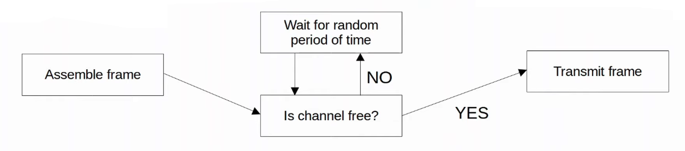

2)  WIRELESS COMMUNICATIONS are regulated by various INTERNATIONAL and NATIONAL bodies

3)  WIRELESS SIGNAL COVERAGE AREA must be considered

- Signal Range
- Signal ABSORPTION, REFLECTION, REFRACTION, DIFFRACTION, and SCATTERING

---

## Signal Absorption

- ABSOPTION happens when a WIRELESS SIGNAL PASSES THROUGH a material and is converted into HEAT, weakening the SIGNAL

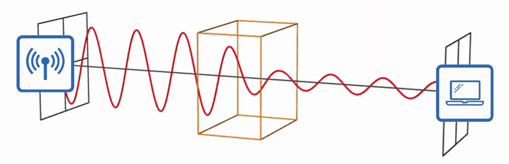

## Signal Reflection

- REFLECTION happens when a SIGNAL BOUNCES off a material (like metal)
    - This is why WI-FI reception is usually POOR in elevators. The SIGNAL bounces off the metal and very little penetrates into the elevator

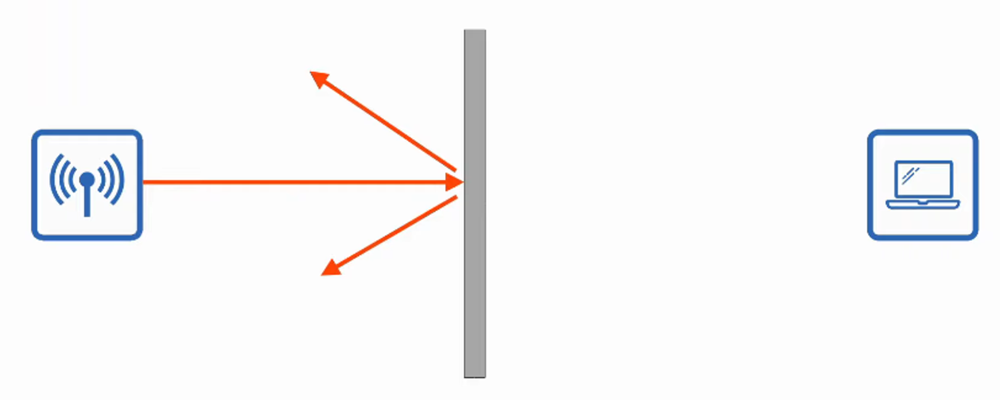

## Signal Refraction

- REFRACTION happens when a WAVE is BENT when entering a medium where the SIGNAL travels at a different speed
    - For example, glass and water can refract waves

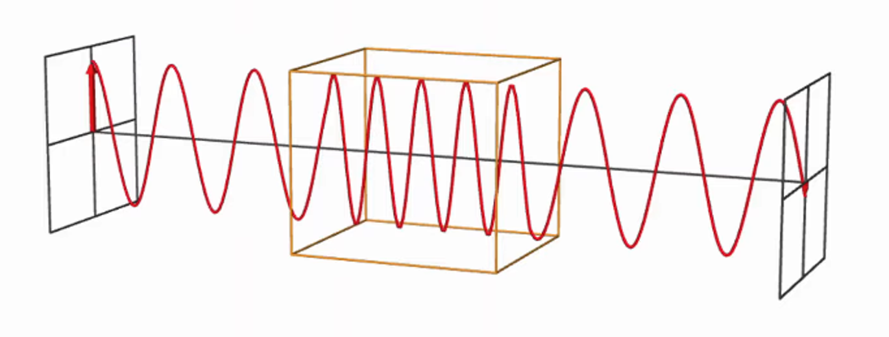

## Signal Diffraction

- DIFFRACTION happens when a WAVE encounters an OBSTACLE and travels AROUND it
    - This can result in “BLIND SPOTS” behind the obstacle

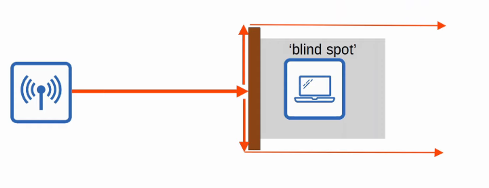

## Signal Scattering

- SCATTERING happens when a material causes a SIGNAL to SCATTER in all directions
    - Dust, smog, uneven surfaces, etc. can cause scattering

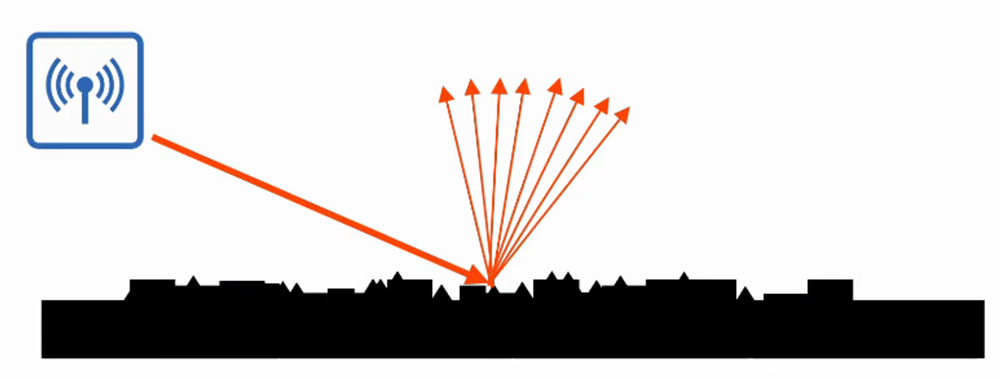

---

4) Other DEVICES using the SAME CHANNELS can cause INTERFERENCE

- For example, a WIRELESS LAN in your neighbor’s house / apartment

---

## Radio Frequency (RF)

- To send WIRELESS SIGNALS, the SENDER applies an ALTERNATING CURRENT to an antenna
    - This creates ELECTROMAGNETIC WAVES which propagate out as WAVES
- ELECTROMAGENETIC WAVES can be measured in multiple ways - for example AMPLITUDE and FREQUENCY
- AMPLITUDE is the MAXIMUM STRENGTH of the ELECTRIC and MAGNETIC FIELDS

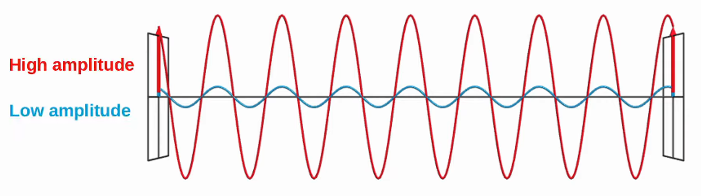

- FREQUENCY measures the number of UP / DOWN CYCLES per a GIVEN UNIT of TIME
- The most COMMON measurement of FREQUENCE is HERTZ
    - Hz (HERTZ) = cycles per second
    - kHz (KILOHERZ) = 1,000 cycles per second
    - MHz (MEGAHERZ) = 1,000,000 cycles per second
    - GHz (GIGAHERTZ) = 1,000,000,000 cycles per second
    - THz (TERAHERTZ) = 1,000,000,000,000 cycles per second
    

## 4 Cycles Per 1 Second = 4 Hertz

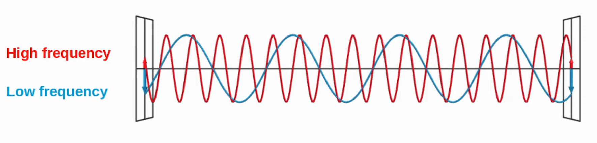

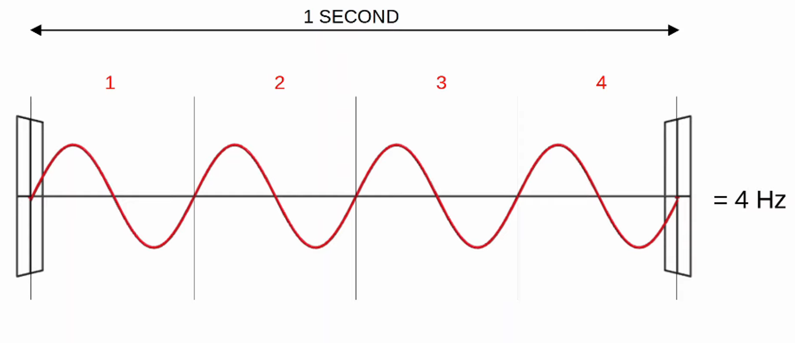

- Another important term is PERIOD, the amount of TIME of ONE CYCLE
    - If the FREQUENCY is 4 Hz, the PERIOD is 0.25 SECONDS

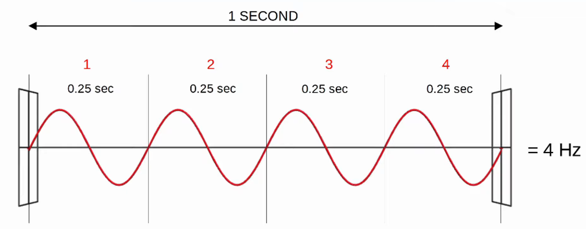

- The VISIBLE FREQUENCY RANGE is ~400 THz to 790 THz
- The RADIO FREQUENCY RANGE is 30 Hz to 300 GHz and is used for many purposes.

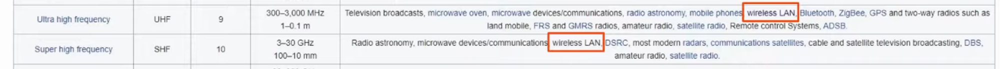

---

## Radio Frequency Bands 

- WI-FI uses TWO MAIN BANDS (FREQUENCY RANGES)
- 2.4 GHz band
    - Range is 2.400 - 2.4835 GHz
- 5 GHz band
    - Range is 5.150 - 5.825 GHz
    - **Divided Into Four Smaller Bands:**
        - 5.150 - 5.250 GHz
        - 5.250 - 5.350 GHz
        - 5.470 - 5.725 GHz
        - 5.725 - 5.825 GHz

- The 2.4 GHz band typically provides FURTHER REACH in open space and BETTER PENETRATION of obstacles such as walls.
    - HOWEVER, more DEVICES tend to use the 2.4 GHz BAND so INTERFERENCE can be a BIGGER PROBLEM compared to 5GHz

** WI-FI 6 (802.11ax) has EXPANDED the spectrum range to include a band in the 6 GHz RANGE

---

## Channels

- Each BAND is divided up into MULTIPLE “CHANNELS”
    - DEVICES are configured to TRANSMIT and RECEIVE traffic on one (or more) of these CHANNELS
- The 2.4 GHz BAND is divided into several CHANNELS, each with a 22 MHz RANGE
- In a SMALL WIRELESS LAN with only a single ACCESS POINT (AP), you can use ANY channel
- However, in larger WLANs with multiple APs, it’s important that adjacent APs don’t use OVERLAPPING CHANNELS. This helps avoid INTERFERENCE
- In the 2.4 GHz BAND, it is recommended to use CHANNELS 1, 6 and 11

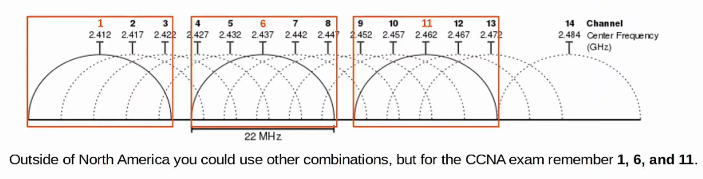

- The 5 GHz BAND consists of NON-OVERLAPPING channels so it’s much EASIER to avoid INTERFERENCE between adjacent APs

- Using CHANNELS 1, 6, 11, you can place APs in a “HONEYCOMB” pattern to provide COMPLETE coverage of an area without INTERFERENCE between CHANNELS

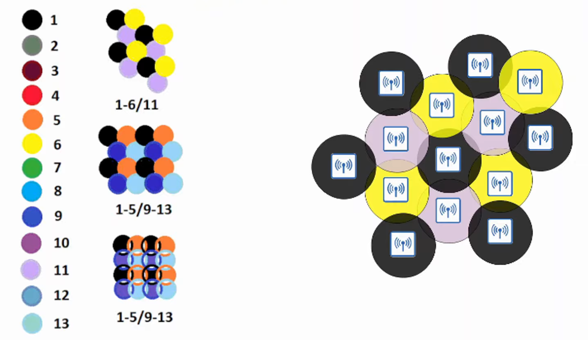

---

## Wi-Fi Standards (802.11)

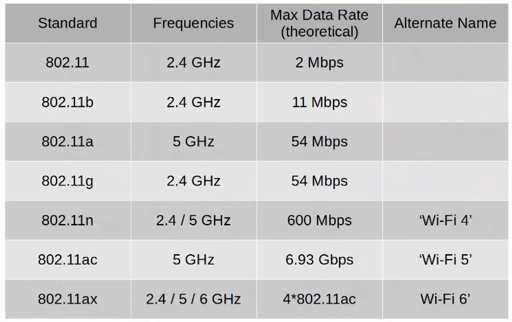

---

## Service Sets

- 802.11 defines different kinds of SERVICE SETS which are groups of WIRELESS NETWORK DEVICES
- **There Are Three Main Types:**
- Independent
- Infrastructure
- Mesh
- ALL DEVICES in a SERVICE SET share the same SSID (Service Set Identifier)
- The SSID is a HUMAN-READABLE NAME which identifies the SERVICE SET
- The SSID does NOT have to be UNQUE

## Service Sets : IBSS

- An IBSS (INDEPENDENT BASIC SERVICE SET) is a WIRELESS NETWORK in which TWO or MORE WIRELESS DEVICES connect directly without using an AP (ACCESS POINT)
- Also called an AD HOC NETWORK
- Can be used for FILE TRANSFER (ie: AirDrop)
- Not scalable beyond a few DEVICES

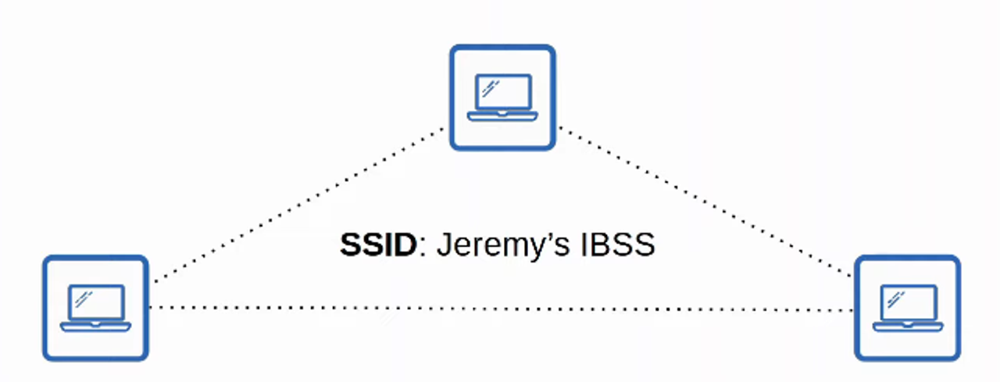

## Service Sets : BSS

- A BSS (BASIC SERVICE SET) is a kind of infrastructure SERVICE SET in which CLIENTS connect to each other via an AP (ACCESS POINT) but not DIRECTLY to each other
- A BSSID (BASIC SERVICE SET ID) is used to uniquely identify the AP
    - Other APs can use the SAME SSID but NOT THE SAME BSSID
    - The BSSID is the MAC ADDRESS of the APs RADIO
- WIRELESS DEVICES request to *associate* with the BSS
- WIRELESS DEVICES that have associated with the BSS are called “CLIENTS” or “STATIONS”
- The AREA around an AP where its SIGNAL is usable is called a BSA (BASIC SERVICE AREA)

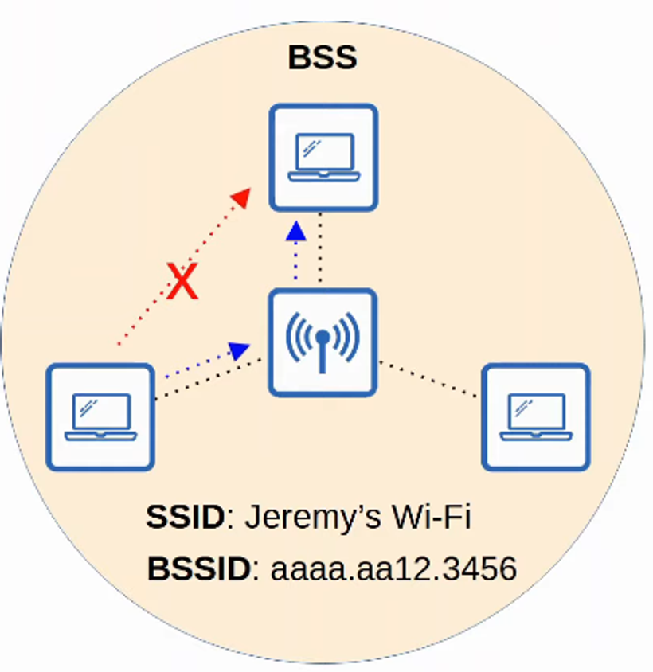

## Service Sets: ESS

- To create LARGER WIRELESS LANS beyond the range of a SINGLE AP, we use an ESS (EXTENDED SERVICE SET)
- APs with their own BSSs are connected by a WIRED NETWORK
    - Each BSS uses the SAME SSID
    - Each BSS has a UNIQUE BSSID
    - Each BSS uses a DIFFERENT channel to avoid INTERFERENCE
- CLIENTS can pass between APs without having to RECONNECT, providing a SEAMLESS WI-FI experience when moving between APs
    - This is called ROAMING
- The BSAs should overlap about 10-15%

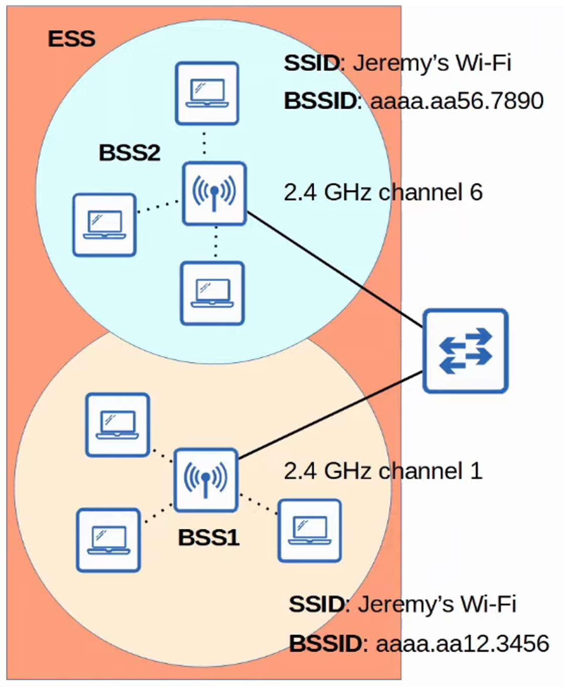

## Service Sets: MBSS

- An MBSS (MESH BASIC SERVICE SET) can be used in situations where it’s difficult to run an ETHERNET connection to every AP
- **Mesh APs Use Two Radios:**
    - ONE provides BSS to WIRELESS CLIENTS
    - ONE forms a “BACKHAUL NETWORK” which is used to BRIDGE traffic from AP to AP
- At least ONE AP is connected to the WIRED NETWORK and it is called the RAP (ROOT ACCESS POINT)
- The OTHER APs are called MAPs (MESH ACCESS POINTS)
- A PROTOCOL is used to determine the BEST PATH through the MESH (similar to how DYNAMIC ROUTING PROTOCOLS are used to determine the BEST PATH to a DESTINATION)

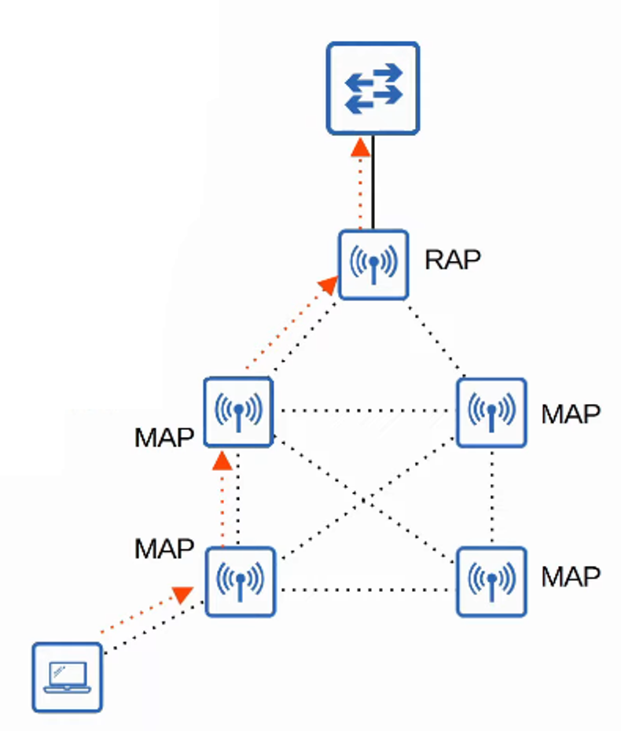

---

## Distribution System

- Most WIRELESS NETWORKS are not STANDALONE NETWORKS
    - Rather, they are a way for WIRELESS CLIENTS to connect to the WIRED NETWORK INFRASTRUCTURE
- In 802.11, the UPSTREAM WIRED NETWORK is called the DS (DISTRIBUTION SYSTEM)
- Each WIRELESS BSS or ESS is mapped to a VLAN in the WIRED NETWORK

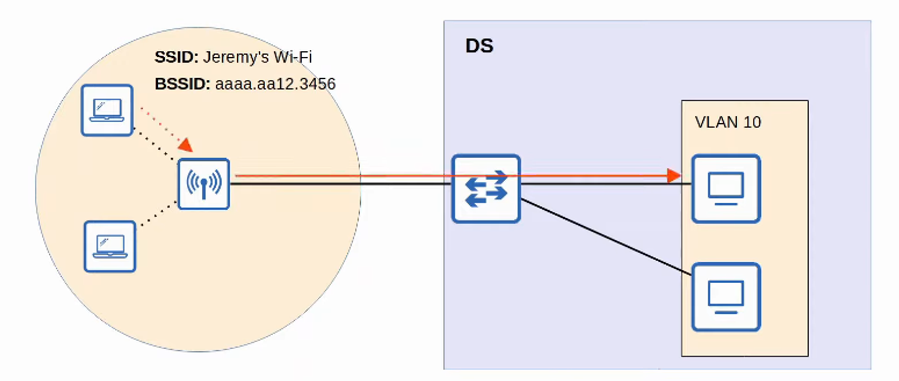

- It is possible for an AP to provide MULTIPLE WIRELESS LANs, each with a unique SSID
- Each WLAN is mapped to a separate VLAN and connected to the WIRED NETWORK via a TRUNK
- Each WLAN uses a UNIQUE BSSID, usually by INCREMENTING the LAST digit of the BBSID by one

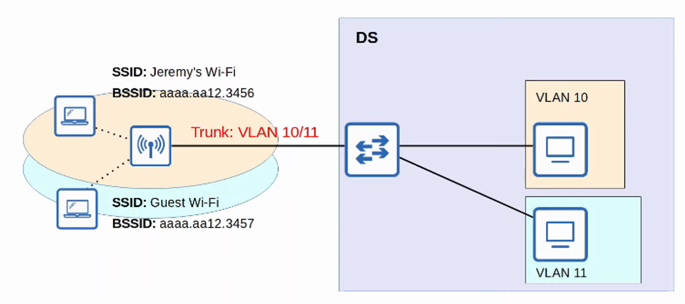

---

## Additional AP Operational Modes

- APs can operate in ADDITIONAL MODES beyond the ones we’ve introduced so far

- An AP in REPEATER MODE can be used to EXTEND the RANGE of a BSS

- The REPEATER will re-transmit ANY SIGNAL it receives from the AP
    - A REPEATER with a SINGLE RADIO must operate on the SAME CHANNEL as the AP, but this can drastically reduce the overall THROUGHPUT on the CHANNEL
    - A REPEATER with TWO RADIOS can receive on ONE CHANNEL and then retransmit on ANOTHER CHANNEL

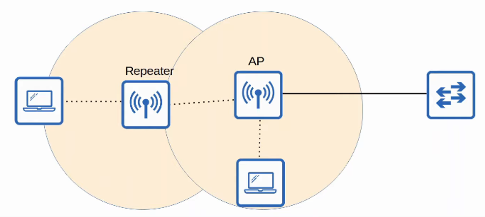

- A WORKGROUP BRIDGE (WGB) operates as a WIRELESS CLIENT of another AP and can be used to CONNECT WIRED DEVICES to the WIRELESS NETWORK
- In the example below, PC1 does NOT have WIRELESS CAPABILITIES, and also DOES NOT have ACCESS to WIRED CONNECTIONS to SW1
- PC1 has a WIRED CONNECTION to the WGB, which has a WIRELESS CONNECTION to the AP

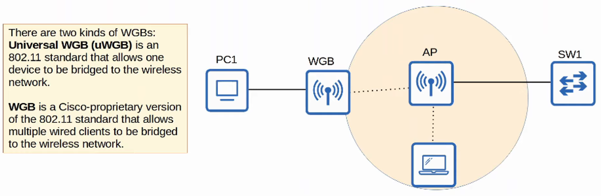

- AN OUTDOOR BRIDGE can be used to connect NETWORKS over LONG DISTANCES without a PHYSICAL CABLE connecting them
- The APs will use SPECIALIZED ANTENNAS that focus most of the SIGNAL POWER in one direction, which allows the WIRELESS CONNECTION to be made over LONGER DISTANCES than normally possible
- The CONNECTION can be POINT-TO-POINT as in the diagram below, or POINT-TO-MULTIPOINT in which MULTIPLE SITES connect to on CENTRAL SITE

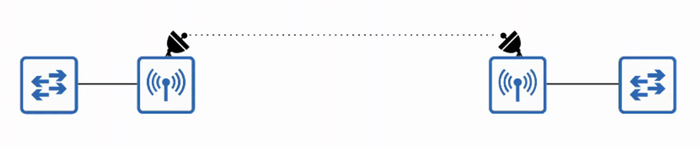

---

## Review
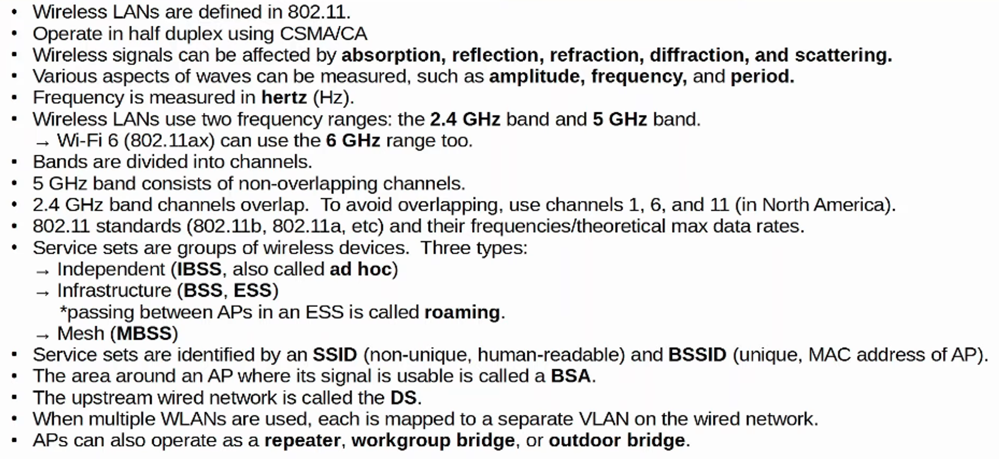

