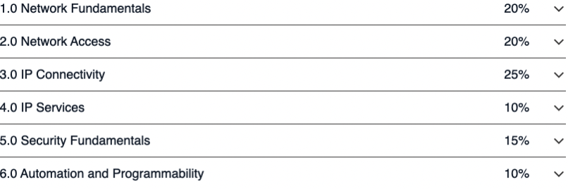

# Complete CCNA 200-301 Course Notes (v1.1)

This repository contains my personal notes from Jeremy's IT Lab for the **CCNA 200-301 v1.1** exam.
Each course day is broken into its own Markdown note file.

## Exam Objectives

[Cisco CCNA Exam Topics](https://learningnetwork.cisco.com/s/ccna-exam-topics)



## Copy These Notes with Git

Clone the repository:

```bash
git clone <repo-url>
```

Move into the project folder:

```bash
cd CCNA
```

Replace `<repo-url>` with your GitHub repository URL.

To get future updates later:

```bash
git pull
```

## Included Notes

- Notes are stored in [`Course_Notes`](Course_Notes).
- Images used by the notes are stored in [`Course_Notes/remote_assets`](Course_Notes/remote_assets).
- The notes are written in Markdown so they render well on GitHub and locally.

## Course Day Chapter Notes

- Day 1: [Networking Devices](Course_Notes/1%20Network_Devices.md)
- Day 2: [Interfaces and Cables](Course_Notes/2%20Interfaces_and_Cables.md)
